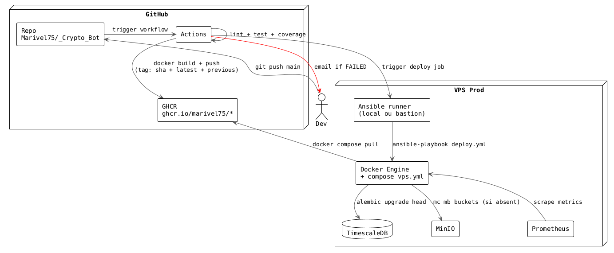
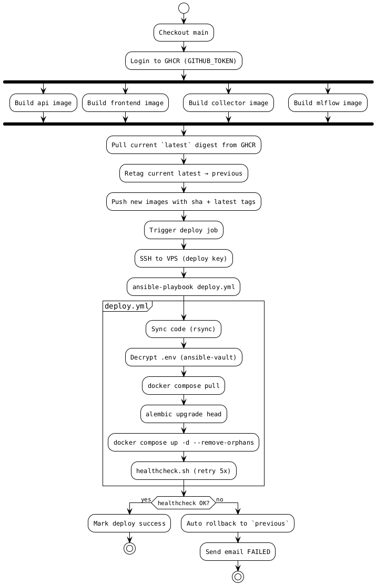

# Stratégie CI/CD — CryptoBot V2

**Statut** : proposition technique pour validation chef de projet
**Branche** : `docs/cicd-strategy`
**Cible** : déploiement V2 sur VPS prod (9 services : FastAPI, Streamlit, MLflow, Collector, ETL worker, ML worker, Nginx, TimescaleDB, MinIO, Prometheus, Grafana)
**Date** : 2026-05-11

---

## 0. TL;DR

| Décision | Choix retenu |
|---|---|
| Container registry | **GHCR** (`ghcr.io/marivel75/_crypto_bot/*`) |
| Staging | **Aucun** — `main` merge déclenche prod direct |
| Trigger CD | **Auto sur merge `main`** |
| Rollback | **Tag-based** — image `previous` toujours disponible |
| Migration DB | **Alembic** |
| Secrets prod | **ansible-vault** — `.env` chiffré dans le repo |
| Notifications | **Email** sur failure uniquement |
| Audience doc | Technique (dev / DevOps) |

**Phases** : 1 (bloquants V2, ~3-5 jours) → 2 (qualité & robustesse, ~1 sem) → 3 (long terme).

---

## 1. État actuel — Diagnostic factuel

### 1.1 CI

Un seul workflow `.github/workflows/tests.yml` (30 lignes) :
- Trigger : push + PR sur `main`/`dev`
- Pipeline : checkout → setup-python → `pip install -r requirements.txt` → `pytest tests/ -v`
- **Manquant** : lint, type-check, coverage gate, cache pip, build Docker, push registry, security scan, deploy

**Couverture pipeline réelle : 1/13 étapes** (tests unitaires).

### 1.2 CD

Existant : 4 playbooks Ansible (`_v1/infra/ansible/playbooks/`).

| Playbook | État |
|---|---|
| `provision.yml` (201l) | ✅ Solide, idempotent (swap, UFW, Fail2Ban, Docker, Nginx, Certbot, logrotate) |
| `deploy.yml` (54l) | 🔴 **CASSÉ** — appelle `scripts/deploy.sh` qui n'existe pas dans le repo |
| `ssl.yml` (37l) | ⚠️ Certbot standalone — downtime Nginx à chaque renewal |
| `backup.yml` (65l) | ⚠️ pg_dump + MinIO, mais `ignore_errors: true` masque les échecs upload |

### 1.3 Trous critiques

1. **Aucun build/push Docker** côté CI → VPS rebuild localement à chaque deploy
2. **Aucune migration DB outillée** (Makefile mentionne `migrate_to_postgres.py`, jamais branché)
3. **Aucun rollback** (ni Docker tag previous, ni Ansible revert)
4. **Secrets `.env` manuels sur VPS** — pas d'ansible-vault, pas de doc des variables
5. **Prometheus scrape 3 exporters absents** de `vps.yml` (node-exporter, postgres-exporter, cadvisor)
6. **Grafana sans provisioning** — dashboards JSON présents dans le repo, jamais chargés
7. **Pas de healthchecks Docker** dans `vps.yml`
8. **`docker_compose_dir` incohérent** : `/opt/crypto-bot` (production.ini.example) vs `/home/ubuntu/cryptobot` (vps.yml)

---

## 2. Architecture cible

### 2.1 Flux global



### 2.2 Tagging des images

Chaque build pousse **3 tags simultanément** :

| Tag | Usage | Mutable ? |
|---|---|---|
| `sha-${git_sha}` | Identification immuable du build | Non |
| `latest` | Pointer vers dernier build main | Oui |
| `previous` | **Pointer vers le build précédent `latest` au moment du push** | Oui |

→ Rollback = `docker compose pull` avec `IMAGE_TAG=previous`. Aucun build, aucun re-deploy de code, juste un re-pull.

### 2.3 Branches & promotion

```
feature/* ──PR──▶ main ──merge──▶ [CI build+push] ──▶ [CD deploy auto] ──▶ Prod
                                          │
                                          └──▶ tag `previous` mis à jour automatiquement
```

Pas de branche `dev`, pas de staging, pas de tag manuel requis. **Trunk-based, deploy on merge.**

---

## 3. Stratégie CI (qualité code)

### 3.1 Workflow `ci.yml` — déclenché sur PR + push main

| Job | Étapes | Gate |
|---|---|---|
| **lint** | ruff check + ruff format --check | Bloquant |
| **type-check** | pyright --strict src/ | Bloquant |
| **test** | pytest --cov=src --cov-fail-under=80 | Bloquant |
| **security** | trivy fs (deps) + secret-scan | Warn only Phase 1, bloquant Phase 2 |

**Cache** : `actions/setup-python@v5` avec `cache: 'pip'` + cache Docker layers via `docker/build-push-action` BuildKit cache. **Build incrémental : ~30s vs 3min sans cache.**

### 3.2 Matrix testing

Pas de matrix multi-Python (Python 3.11 fixé en prod). Matrix uniquement utile si on supporte plusieurs versions client → pas notre cas.

---

## 4. Stratégie CD (déploiement)

### 4.1 Workflow `build-and-deploy.yml` — déclenché sur merge `main`



### 4.2 Auto-rollback

`healthcheck.sh` retourne non-zero si un des 4 services KO après 5 retries × 10s = 50s window. Le workflow capture l'exit code et exécute :

```bash
ssh vps "cd /home/ubuntu/cryptobot && \
  IMAGE_TAG=previous docker compose -f vps.yml up -d && \
  ./scripts/healthcheck.sh"
```

Email envoyé via `dawidd6/action-send-mail` au commiter + chef de projet.

### 4.3 Migration DB (Alembic)

Position dans le flow :
1. `docker compose pull` (nouvelles images dispo)
2. `docker compose up -d timescaledb` (DB UP avant tout)
3. **`docker compose run --rm api alembic upgrade head`** ← migration AVANT démarrage app
4. `docker compose up -d` (reste des services)

**Règle** : migrations Alembic **forward-compatible** (ajout colonnes nullable, jamais de DROP destructif sans étape transitoire). Sinon rollback code seul = app en erreur sur schéma incompatible.

### 4.4 Secrets (ansible-vault)

```
_v1/infra/ansible/
├── group_vars/
│   ├── vps.yml          # non-secret (timezone, paths, etc.)
│   └── vps/
│       └── vault.yml    # CHIFFRÉ (POSTGRES_PASSWORD, MINIO_*, etc.)
└── .vault_password      # GITIGNORED, password en GitHub Secret VAULT_PASSWORD
```

CI exporte `VAULT_PASSWORD` → `ansible-vault decrypt` → `.env` rendu sur VPS via template Jinja2.

**Rotation** : `ansible-vault rekey vault.yml` + update GitHub Secret.

---

## 5. Plan phasé

### Phase 1 — Bloquants V2 (3-5 jours)

Objectif : premier deploy V2 fonctionnel, automatisé end-to-end.

| # | Tâche | Livrable |
|---|---|---|
| P1.1 | Créer `scripts/deploy.sh` | Script idempotent : pull, migrate, up, healthcheck |
| P1.2 | Aligner `prometheus.prod.yml` ↔ `vps.yml` | Ajouter node-exporter, postgres-exporter, cAdvisor à vps.yml |
| P1.3 | Healthchecks Docker dans `vps.yml` | Blocks `healthcheck:` sur api, db, mlflow, minio |
| P1.4 | `.env.production.example` | Toutes vars documentées avec commentaires |
| P1.5 | Fix `backup.yml` | Retirer `ignore_errors: true`, fail explicite |
| P1.6 | Aligner `docker_compose_dir` | Canonique `/home/ubuntu/cryptobot` partout |
| P1.7 | Workflow `ci.yml` avec cache + lint | ruff + pyright + pytest + coverage |
| P1.8 | Workflow `build-and-deploy.yml` | Build → push GHCR (sha+latest+previous) → SSH deploy |
| P1.9 | Setup Alembic | `alembic init`, snapshot initial du schéma, intégration deploy |
| P1.10 | Migration .env → ansible-vault | Chiffrement, CI integration, doc rotation |
| P1.11 | Provisioning Grafana | Mount `provisioning/{datasources,dashboards}/`, autoload JSON existants |
| P1.12 | Pré-création buckets MinIO | Ansible task : `mc mb cryptobot/{mlflow,backups,artifacts}` |

### Phase 2 — Qualité & robustesse (1 semaine)

| # | Tâche | Livrable |
|---|---|---|
| P2.1 | Coverage gate enforcé | Fail CI si < 80% (déjà la règle CLAUDE.md) |
| P2.2 | Lock file uv | Migration `requirements.txt` → `uv.lock` committé |
| P2.3 | Trivy bloquant | Fail CI sur CVE HIGH/CRITICAL |
| P2.4 | Smoke tests post-deploy | Étendre healthcheck.sh avec assertions métier |
| P2.5 | Snapshot DB pré-migration | `pg_dump` avant `alembic upgrade`, restore script prêt |
| P2.6 | Alerting Prometheus | `rules.yml` : disk full, container restart loop, API latency p99 |
| P2.7 | SSL renewal sans downtime | Certbot webroot mode au lieu de standalone (pas de stop Nginx) |
| P2.8 | Backup restore drill | Playbook `restore.yml` testé contre une copie de la prod |

### Phase 3 — Long terme

| # | Tâche | Livrable |
|---|---|---|
| P3.1 | Renovate ou Dependabot | PR auto sur deps Python + Docker + Actions |
| P3.2 | SBOM + signing | cosign, GHCR attestations |
| P3.3 | CD nightly backup restore | Workflow nightly qui restaure le dump dans un VPS éphémère |
| P3.4 | Logs centralisés | Loki + Promtail (optionnel) |
| P3.5 | Pré-prod éphémère sur PR | Si volume PR justifie (décision à reprendre) |

---

## 6. Risques & mitigation

| # | Risque | Proba | Impact | Mitigation Phase |
|---|---|---|---|---|
| R1 | `scripts/deploy.sh` manquant → playbook crash | Certain | Bloquant | P1.1 |
| R2 | TimescaleDB extension non créée au premier boot | Élevée | Bloquant | Image `timescale/timescaledb` la crée auto, vérifier au provisioning P1 |
| R3 | MinIO buckets non pré-créés → MLflow + backup KO | Élevée | Haut | P1.12 |
| R4 | Variables `.env` manquantes détectées au runtime | Élevée | Haut | P1.4 + validator pydantic-settings au startup |
| R5 | Ordre démarrage services (api avant db prête) | Moyenne | Moyen | `depends_on: condition: service_healthy` (P1.3) |
| R6 | Prometheus crashloop (3 exporters scrapés absents) | Certain | Moyen | P1.2 |
| R7 | Nginx 502 si api/frontend lent à démarrer | Moyenne | Moyen | `proxy_read_timeout` + retry upstream |
| R8 | Migration Alembic destructive sans rollback DB | Moyenne | Critique | P2.5 (snapshot pré-migration) + règle forward-compatible |
| R9 | Image `previous` inexistante au tout premier deploy | Certain | Faible | Phase 1 : seed manuel `previous=sha-init` ; les suivants auto |
| R10 | SSL renewal échoue → 0 traffic HTTPS | Faible | Bloquant | P2.7 (webroot mode) + monitoring expiration cert |
| R11 | Secrets en clair sur VPS (`.env` lisible par groupe docker) | Certain | Sécurité | P1.10 + `chmod 600 .env` |
| R12 | Backup non testé → restore cassé le jour J | Élevée | Critique | P2.8 + P3.3 |
| R13 | GitHub Actions outage → no deploy possible | Faible | Moyen | Fallback : `ansible-playbook deploy.yml` manuel depuis poste dev |
| R14 | Image GHCR > 500 MB (limite gratuit) | Faible | Faible | Multi-stage Dockerfile, slim base, prune layers |

---

## 7. Runbook opérationnel

### 7.1 Deploy normal

**Acteur** : dev. **Procédure** : `git push origin main`. Le reste est automatique.

Suivi : onglet Actions sur GitHub, ou email si failure.

### 7.2 Rollback manuel (si auto-rollback n'a pas suffi)

```bash
ssh ubuntu@vps
cd /home/ubuntu/cryptobot
IMAGE_TAG=previous docker compose -f vps.yml up -d --remove-orphans
./scripts/healthcheck.sh
```

Si la migration DB est cause du rollback :

```bash
docker compose run --rm api alembic downgrade -1
# OU pour cas critique :
docker compose exec timescaledb psql -U cryptobot -d cryptobot \
  -c "DROP SCHEMA public CASCADE; CREATE SCHEMA public;"
gunzip -c /home/ubuntu/cryptobot/backups/pre_deploy_$(date +%Y%m%d).dump.gz | \
  docker compose exec -T timescaledb pg_restore -U cryptobot -d cryptobot
```

### 7.3 Restore DB depuis backup MinIO

```bash
ssh ubuntu@vps
cd /home/ubuntu/cryptobot
mc cp cryptobot/backups/timescaledb_YYYYMMDD_HHMMSS.dump ./restore.dump
docker compose exec -T timescaledb pg_restore -U cryptobot -d cryptobot < restore.dump
```

### 7.4 Rotation secrets

```bash
cd _v1/infra/ansible
ansible-vault rekey group_vars/vps/vault.yml
# entrer ancien puis nouveau password
# Mettre à jour GitHub Secret VAULT_PASSWORD avec le nouveau
gh secret set VAULT_PASSWORD --body "$NEW_PASSWORD"
```

### 7.5 Incident : service down

1. `ssh ubuntu@vps`
2. `./scripts/healthcheck.sh` (identifier service KO)
3. `docker compose logs --tail=200 <service>`
4. Si transient → `docker compose restart <service>`
5. Si persistant → rollback (7.2)
6. Post-mortem : ouvrir issue GitHub avec template `incident.md`

### 7.6 Provisioning VPS neuf

```bash
cd _v1/infra/ansible
ansible-playbook -i inventory/production.ini playbooks/provision.yml
ansible-playbook -i inventory/production.ini playbooks/ssl.yml
ansible-playbook -i inventory/production.ini playbooks/deploy.yml \
  --vault-password-file ~/.vault_password
```

---

## 8. Annexe — Squelettes workflow

### 8.1 `.github/workflows/ci.yml`

```yaml
name: CI
on:
  pull_request:
  push:
    branches: [main]

jobs:
  lint:
    runs-on: ubuntu-latest
    steps:
      - uses: actions/checkout@v4
      - uses: actions/setup-python@v5
        with:
          python-version: '3.11'
          cache: 'pip'
      - run: pip install ruff pyright
      - run: ruff check src/ tests/
      - run: ruff format --check src/ tests/
      - run: pyright --strict src/

  test:
    runs-on: ubuntu-latest
    steps:
      - uses: actions/checkout@v4
      - uses: actions/setup-python@v5
        with:
          python-version: '3.11'
          cache: 'pip'
      - run: pip install -r requirements.txt
      - run: pytest --cov=src --cov-fail-under=80 --cov-report=xml
      - uses: codecov/codecov-action@v4
        if: always()
```

### 8.2 `.github/workflows/build-and-deploy.yml`

```yaml
name: Build & Deploy
on:
  push:
    branches: [main]

concurrency:
  group: deploy-prod
  cancel-in-progress: false  # ne JAMAIS interrompre un deploy en cours

jobs:
  build:
    runs-on: ubuntu-latest
    permissions:
      contents: read
      packages: write
    strategy:
      matrix:
        service: [api, frontend, collector, mlflow]
    steps:
      - uses: actions/checkout@v4
      - uses: docker/setup-buildx-action@v3
      - uses: docker/login-action@v3
        with:
          registry: ghcr.io
          username: ${{ github.actor }}
          password: ${{ secrets.GITHUB_TOKEN }}
      - name: Promote latest → previous
        run: |
          IMG=ghcr.io/${{ github.repository_owner }}/_crypto_bot/${{ matrix.service }}
          docker buildx imagetools create -t $IMG:previous $IMG:latest || true
      - uses: docker/build-push-action@v5
        with:
          context: .
          file: docker/${{ matrix.service }}/Dockerfile
          push: true
          tags: |
            ghcr.io/${{ github.repository_owner }}/_crypto_bot/${{ matrix.service }}:sha-${{ github.sha }}
            ghcr.io/${{ github.repository_owner }}/_crypto_bot/${{ matrix.service }}:latest
          cache-from: type=gha
          cache-to: type=gha,mode=max

  deploy:
    needs: build
    runs-on: ubuntu-latest
    steps:
      - uses: actions/checkout@v4
      - name: Install Ansible
        run: pip install ansible
      - name: Write SSH key
        run: |
          mkdir -p ~/.ssh
          echo "${{ secrets.VPS_SSH_KEY }}" > ~/.ssh/id_ed25519
          chmod 600 ~/.ssh/id_ed25519
          ssh-keyscan ${{ secrets.VPS_HOST }} >> ~/.ssh/known_hosts
      - name: Write vault password
        run: echo "${{ secrets.VAULT_PASSWORD }}" > ~/.vault_password
      - name: Deploy
        run: |
          ansible-playbook -i _v1/infra/ansible/inventory/production.ini \
            _v1/infra/ansible/playbooks/deploy.yml \
            --vault-password-file ~/.vault_password \
            -e "image_tag=sha-${{ github.sha }}"

  notify-failure:
    needs: [build, deploy]
    if: failure()
    runs-on: ubuntu-latest
    steps:
      - uses: dawidd6/action-send-mail@v3
        with:
          server_address: ${{ secrets.SMTP_HOST }}
          server_port: 587
          username: ${{ secrets.SMTP_USER }}
          password: ${{ secrets.SMTP_PASSWORD }}
          subject: "🔴 Deploy FAILED — ${{ github.sha }}"
          to: chef-projet@example.com,${{ github.event.head_commit.author.email }}
          from: CryptoBot CI
          body: |
            Deploy failed on commit ${{ github.sha }}
            By: ${{ github.event.head_commit.author.name }}
            Message: ${{ github.event.head_commit.message }}
            URL: ${{ github.server_url }}/${{ github.repository }}/actions/runs/${{ github.run_id }}
            Auto-rollback : déjà déclenché vers tag `previous`.
```

### 8.3 GitHub Secrets requis (à créer une fois)

| Secret | Usage |
|---|---|
| `VPS_SSH_KEY` | Clé privée SSH ed25519 du runner GH Actions vers VPS |
| `VPS_HOST` | IP ou FQDN du VPS |
| `VAULT_PASSWORD` | Password ansible-vault |
| `SMTP_HOST` / `SMTP_USER` / `SMTP_PASSWORD` | Compte SMTP pour notifications |

→ Tout le reste (creds DB, MinIO, etc.) est dans `vault.yml` chiffré.

---

## 9. Open questions

1. **Domain name** : déjà acquis ? Sinon → bloquant pour SSL Phase 1.
2. **Compte SMTP** pour notifications : Gmail SMTP + app password, ou Mailgun/SendGrid ?
3. **Adresse email chef de projet** à hardcoder dans `notify-failure` ou paramétrer en secret ?
4. **Limite GHCR 500 MB** : à vérifier après premier build (multi-stage attendu).

---

**Validation demandée** : signoff sur sections 2 (architecture) + 4 (CD) + 5 (plan phasé) avant démarrage Phase 1.
