# CryptoBot — Diagrammes UML

> 22 diagrammes PlantUML couvrant l'architecture Phase 1 (actuelle) et Phase 2 (planifiee).
> Build : `make diagrams` (plantuml-local-client + Java 21)

---

## A — Architecture Systeme

### C01 — Vue Globale

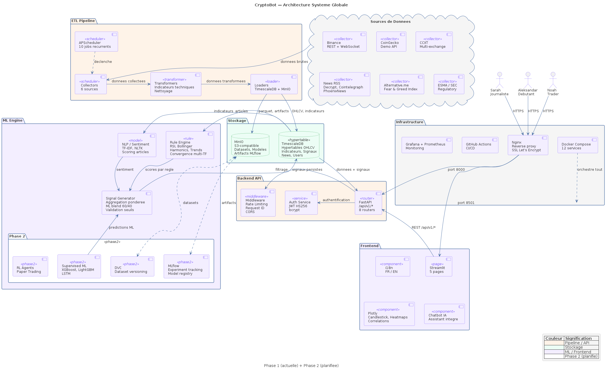

### C02 — Sous-systeme ETL


### C03 — Sous-systeme ML


### C04 — FastAPI Backend


### C05 — Frontend Streamlit


---

## B — Diagrammes de Classes

### CL01 — Modeles Pydantic


### CL02 — ORM SQLAlchemy


### CL03 — Schemas API

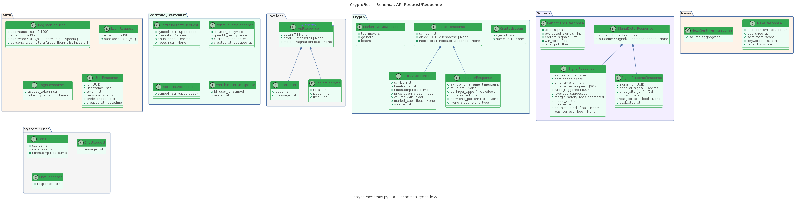

### CL04 — ML Rules Engine

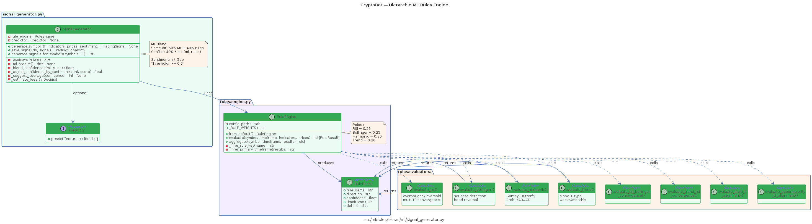

### CL05 — Arbre d'Exceptions


---

## C — Diagrammes de Sequence

### SQ01 — Authentification JWT

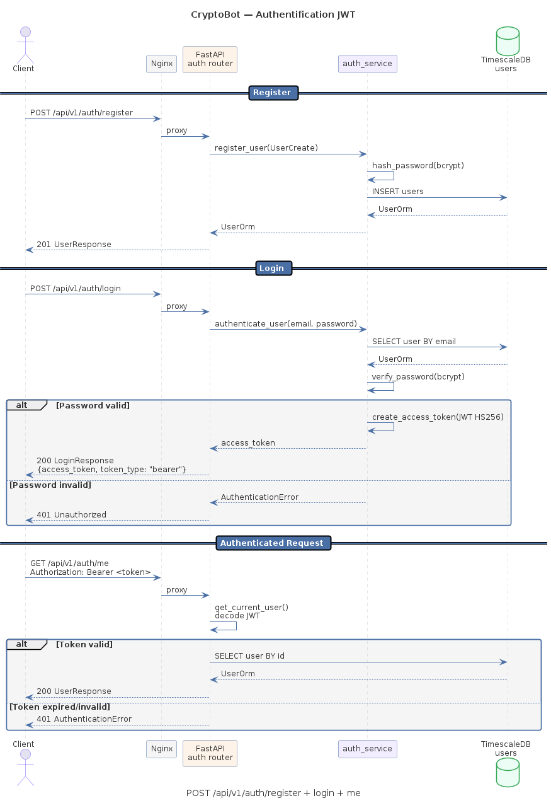

### SQ02 — Chargement Dashboard

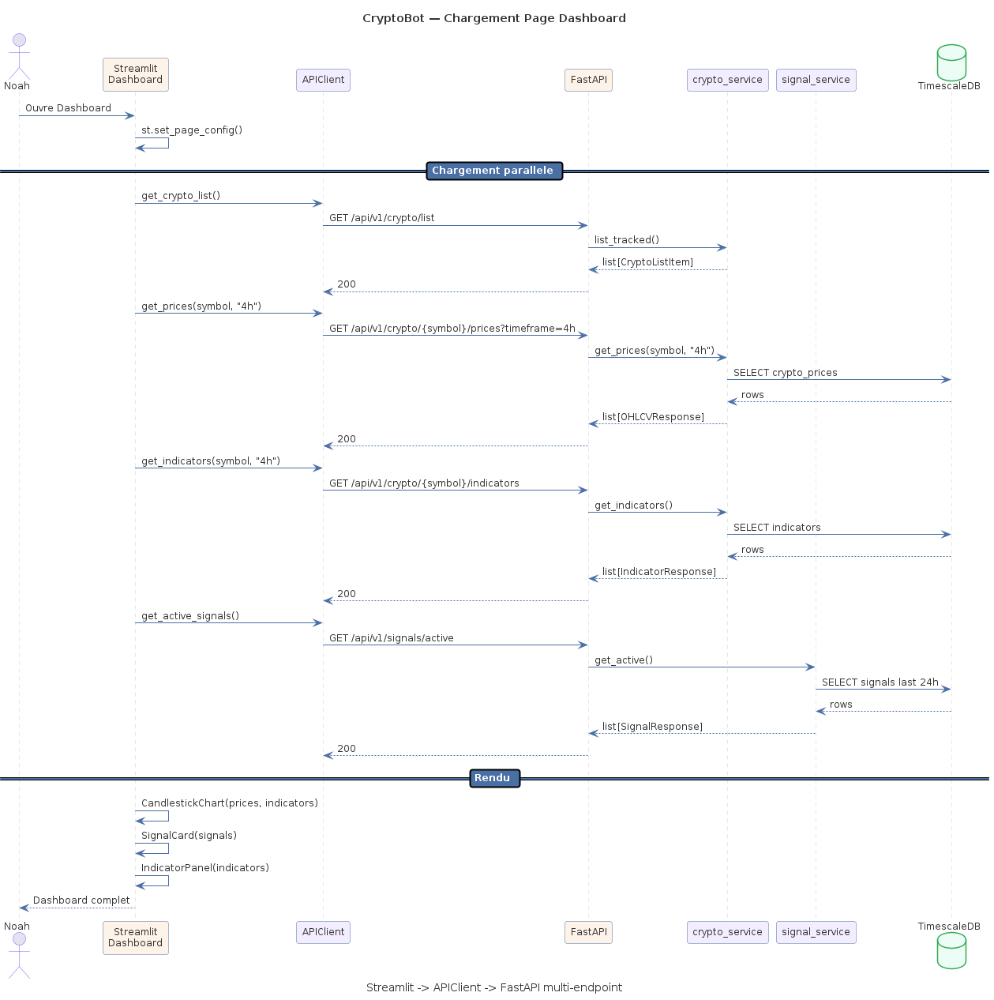

### SQ03 — Generation de Signaux

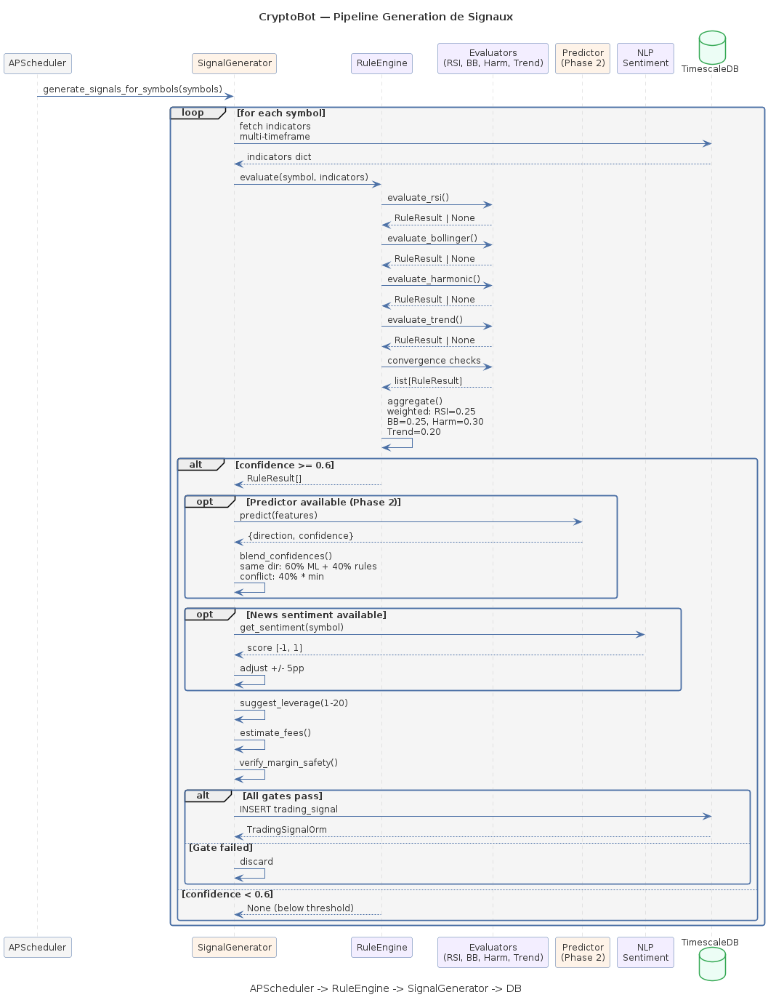

### SQ04 — Chatbot LLM

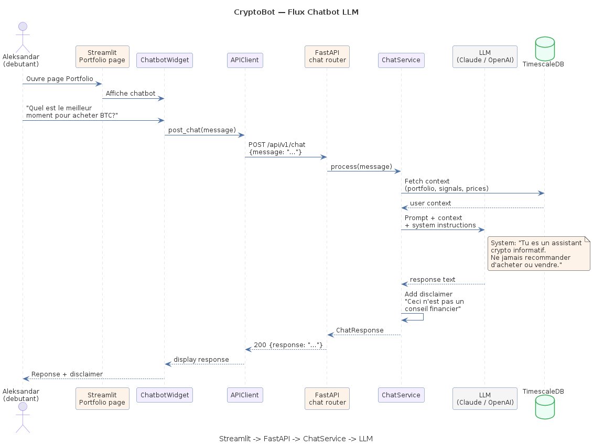

---

## D — Diagrammes d'Activite

### AC01 — Pipeline ETL


### AC02 — Cycle de Vie d'un Signal


---

## E — Deploiement

### DP01 — Infrastructure Docker Compose

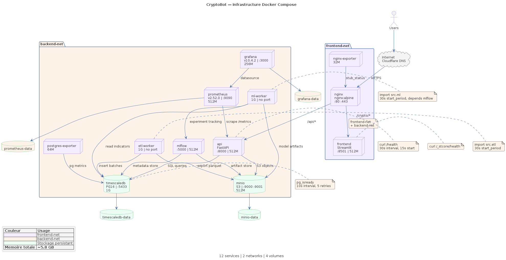

---

## F — Base de Donnees

### ER01 — Schema TimescaleDB


---

## G — Phase 2

### C06 — Pipeline ML Phase 2

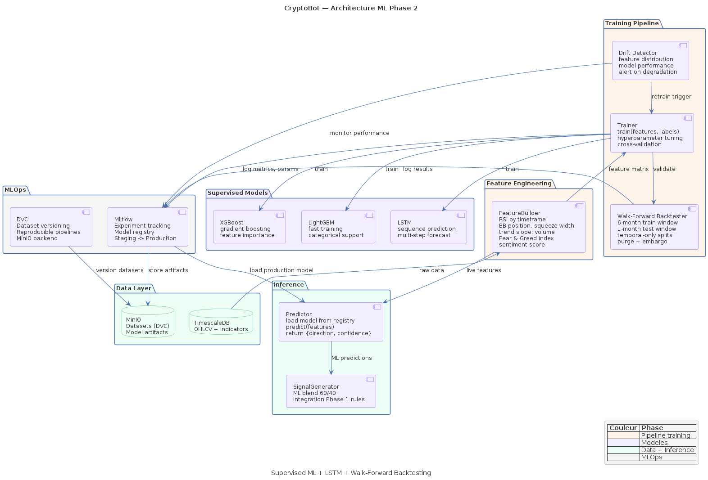

### C07 — Roadmap Features F1-F8

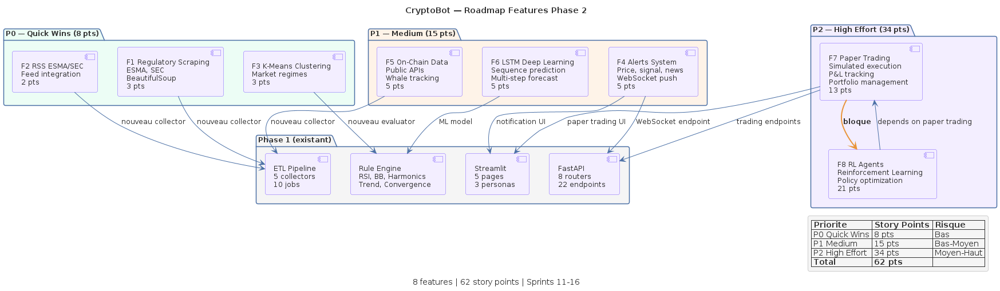

---

## H — Cas d'Utilisation et Etats

### UC01 — Personas

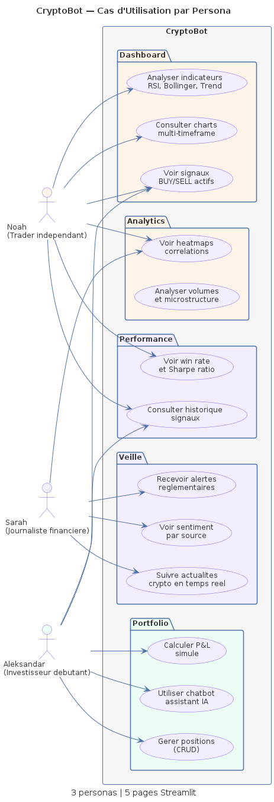

### ST01 — Machine a Etats Signal

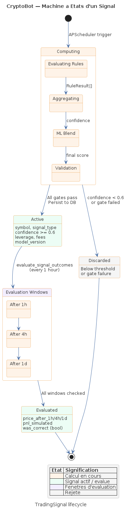

---

## Build

```bash
make diagrams        # .puml -> .svg + .png (22 diagrammes)
make diagrams-clean  # supprimer les fichiers generes
make diagrams-list   # lister les sources
```

Prerequis : `plantuml-local-client` (`uv tool install plantuml-local-client`) + Java 21
