# Catalogue UML CryptoBot — État réel main 2026-05-11

Snapshot figé du code `main` post-merge `dev-j → dev → main`. Référence :
- **V1** = `_v1/_all-diagrams.md` (archive historique, contient features fantômes : Auth JWT, Chatbot, TimescaleDB, Phase 2 LSTM/RL/Drift)
- **V2** = ce catalogue (4 services Docker Compose, SQLite, paper trading, ML backtest walk-forward)
- **V3** = cible prod, à décider (Ansible `_v1/infra/` documenté mais non câblé)

## Pivots V2 vs V1 (taxonomie stricte, sujet adapté)
- **SQ01** : V1 JWT Auth Flow → V2 **Healthcheck + Alerts Subscribe Flow**
- **SQ04** : V1 Chatbot LLM Integration → V2 **Paper Trading Order Flow**
- **C07** : V1 Phase 2 Roadmap → V2 **Backlog V3 (cible Ansible non câblée)**

## Rendus PNG

Les 22 PNGs générés sont dans `docs/diagrams/png/`. Régénération : `plantuml -tpng -o ../png parts/*.puml`.

## AC01-etl-pipeline

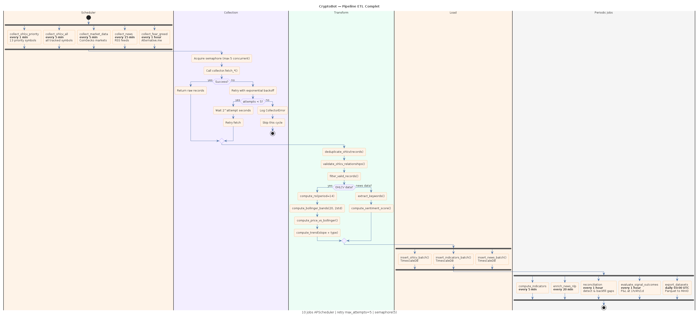

```plantuml
@startuml AC01-etl-pipeline
' ============================================================
' CryptoBot — PlantUML Shared Skin & Stereotypes
' ============================================================

' --- Theme clair (lisible GitHub) ---
skinparam backgroundColor white
skinparam defaultFontName "Segoe UI, Helvetica, Arial, sans-serif"
skinparam defaultFontSize 12
skinparam defaultFontColor #333333
skinparam shadowing false
skinparam roundCorner 6

' --- Palette ---
' Bleu:   #4A6FA5
' Orange: #FEF3E8 (fond) / #E8943A (bordure)
' Vert:   #ECFDF5 (fond) / #34A853 (bordure)
' Violet: #F3EEFF (fond) / #7C5CFC (bordure)
' Gris:   #F5F5F5 (fond) / #CCCCCC (bordure)

' --- Component ---
skinparam component {
  BackgroundColor #F3EEFF
  BorderColor #7C5CFC
  FontColor #333333
  ArrowColor #4A6FA5
  StereotypeFontColor #7C5CFC
}

' --- Package ---
skinparam package {
  BackgroundColor #F5F5F5
  BorderColor #4A6FA5
  FontColor #333333
}

' --- Class ---
skinparam class {
  BackgroundColor #ECFDF5
  BorderColor #34A853
  FontColor #333333
  HeaderBackgroundColor #34A853
  HeaderFontColor white
  ArrowColor #4A6FA5
  StereotypeFontColor #7C5CFC
  AttributeFontColor #555555
}

' --- Sequence ---
skinparam sequence {
  ArrowColor #4A6FA5
  ActorBorderColor #7C5CFC
  LifeLineBorderColor #CCCCCC
  LifeLineBackgroundColor #F5F5F5
  ParticipantBorderColor #4A6FA5
  ParticipantBackgroundColor #F3EEFF
  ParticipantFontColor #333333
  BoxBorderColor #CCCCCC
  BoxBackgroundColor #F5F5F5
  DividerBackgroundColor #4A6FA5
  DividerFontColor white
}

' --- Activity ---
skinparam activity {
  BackgroundColor #FEF3E8
  BorderColor #E8943A
  FontColor #333333
  ArrowColor #4A6FA5
  DiamondBackgroundColor #F3EEFF
  DiamondBorderColor #7C5CFC
}

' --- Node (deployment) ---
skinparam node {
  BackgroundColor #F3EEFF
  BorderColor #7C5CFC
  FontColor #333333
}

' --- Database ---
skinparam database {
  BackgroundColor #ECFDF5
  BorderColor #34A853
  FontColor #333333
}

' --- Entity (ER) ---
skinparam entity {
  BackgroundColor white
  BorderColor #4A6FA5
  FontColor #333333
  HeaderBackgroundColor #4A6FA5
  HeaderFontColor white
}

' --- State ---
skinparam state {
  BackgroundColor #FEF3E8
  BorderColor #E8943A
  FontColor #333333
  ArrowColor #4A6FA5
}

' --- Usecase ---
skinparam usecase {
  BackgroundColor #F3EEFF
  BorderColor #7C5CFC
  FontColor #333333
  ArrowColor #4A6FA5
  ActorBorderColor #E8943A
}

' --- Note ---
skinparam note {
  BackgroundColor #FEF3E8
  BorderColor #E8943A
  FontColor #333333
}

' --- Legend ---
skinparam legend {
  BackgroundColor #F5F5F5
  BorderColor #CCCCCC
  FontColor #333333
}

' --- Stereotypes ---
' <<collector>>   ETL data collectors
' <<transformer>> ETL data transformers
' <<loader>>      ETL data loaders
' <<scheduler>>   APScheduler jobs
' <<rule>>        ML rule evaluator
' <<model>>       ML model
' <<router>>      FastAPI router
' <<service>>     FastAPI service
' <<middleware>>   FastAPI middleware
' <<page>>        Streamlit page
' <<component>>   Streamlit/Plotly component
' <<hypertable>>  TimescaleDB hypertable
' <<phase2>>      Phase 2 planned feature


title CryptoBot — Pipeline ETL V2 (code main)
caption 4 flux schedule lib | SQLite SQLAlchemy ORM

note
  Scheduler library: **schedule** (not APScheduler).
  WS Binance daemon: thread persistant, reconnexion auto.
  OHLCV dedup: IntegrityError silently skipped (no max-volume dedup in V2 code).
end note

|#FEF3E8| Startup (main.py) |
start
fork
  |#4A6FA5| WS Binance Daemon |
  :start_ws_collector(symbols)\\n**thread daemon persistant**\\nwss://stream.binance.com:9443/stream\\nminiTicker multi-stream;
  :_watch() — boucle asyncio;
  repeat
    :receive miniTicker message;
    :parse JSON payload;
    if (symbol + price valides?) then (oui)
      :live_price_cache.update(symbol, price);
    else (non)
      :skip message malformé;
    endif
  repeat while (running?) is (oui)
  -[hidden]->
  :WS arrêté (CancelledError);

fork again
  |#FEF3E8| OHLCV Scheduler |
  :OHLCVScheduler.run_once()\\n**initial run au démarrage**;
  :puis schedule.every().day.at("09:00");
  repeat
    |#F3EEFF| OHLCV Collect |
    :OHLCVCollector(pairs, timeframes, exchange="binance");
    :ExchangeFactory.create_exchange("binance") → CCXT client;
    :ETLPipelineOHLCV.run_batch(pairs, timeframe);
    fork
      :OHLCVExtractor.extract(symbol, timeframe, limit=100)\\nCCXT fetch_ohlcv → raw List[List];
    fork again
      note right: pour chaque paire × timeframe
    end fork
    |#ECFDF5| OHLCV Transform |
    :OHLCVTransformer.transform(raw_data, symbol, timeframe);
    :_to_dataframe() → colonnes [timestamp, open, high, low, close, volume];
    :_add_metadata() → id UUID, symbol, timeframe, exchange;
    :_convert_timestamps() → ms → datetime;
    :DataValidator0HCLV.validate_ohlcv_values(df);
    if (validation OK?) then (oui)
      :_enrich_data()\\nprice_range, price_change, price_change_pct;
      :_normalize_data() → sort by timestamp;
    else (non)
      :raise TransformationError → PipelineResult.fail_transformation();
      :log erreur, continuer symbole suivant;
    endif
    |#ECFDF5| OHLCV Load |
    :OHLCVLoader.load(df)\\ndf.to_sql("ohlcv", engine, if_exists="append");
    if (IntegrityError?) then (oui)
      :log warning doublon, return 0;
    else (non)
      :rows_inserted confirmés;
    endif
    :PipelineResult.success = True;
    :OHLCVScheduler log summary\\n(total_symbols, successful, failed, total_raw_rows, total_loaded_rows);
  repeat while (running?) is (oui)

fork again
  |#FEF3E8| Ticker Scheduler |
  :TickerScheduler.start_collection()\\npour chaque exchange configuré;
  repeat
    |#F3EEFF| Ticker Collect |
    :TickerCollector._fetch_and_cache_tickers()\\nCCXT fetch_ticker(pair) pour chaque paire;
    :_normalize_ticker_data()\\nBinance: "last" → "price", quoteVolume → volume_24h;
    :TickerCache.add_ticker(symbol, normalized_ticker)\\nmax 100 entrées par symbole;
    if (datetime >= next_snapshot?) then (oui)
      :TickerCollector._save_snapshot()\\nINSERT INTO ticker_snapshots\\n(id, snapshot_time, symbol, exchange,\\nprice, volume_24h, high_24h, low_24h);
      :next_snapshot += snapshot_interval (5 min);
    endif
    if (minute % cache_cleanup_interval == 0?) then (oui)
      :TickerCache.clear_old_data(hours=24);
    endif
    :sleep(60s);
  repeat while (running?) is (oui)

fork again
  |#FEF3E8| Market Data Scheduler |
  :MarketDataScheduler.run_once()\\n**initial run au démarrage**;
  :puis schedule.every().day.at("10:00");
  repeat
    |#F3EEFF| Market Data Collect |
    :MarketDataCollector.fetch_and_store()\\nETLPipelineMarketData.run("global_market");
    :MarketDataExtractor.extract("global_market")\\nCoinGecko API — rate_limit_delay=2.5s;
    :MarketDataTransformer.transform()\\n→ snapshot, caps, volumes, dominance;
    :MarketDataLoader.load(snapshot, caps, volumes, dominance)\\n→ SQLite via SQLAlchemy;
    :fetch_top_cryptos(limit=50, vs_currency="usd")\\nCoinGecko /coins/markets;
    :fetch_crypto_details(crypto_ids=["bitcoin","ethereum","solana","cardano","binancecoin"]);
  repeat while (running?) is (oui)

end fork

|#F5F5F5| On-demand |
note
  FearGreedCollector et NewsCollector
  sont invoqués à la demande (pas de scheduler dédié en V2).
end note
fork
  |#F5F5F5| News (on-demand) |
  :NewsCollector.fetch_and_store(db, sources)\\n3 RSS feeds:\\n- decrypt.co/feed\\n- cointelegraph.com/rss\\n- cryptonews.com/news/feed/;
  :httpx.Client.get(url) → feedparser.parse();
  :pour chaque entry: _parse_entry();
  :VADER _analyse_sentiment(title+content[:500])\\n→ compound [-1,+1], label (positive/negative/neutral);
  :extract_keywords(text, top_n=8) — TF-IDF unigrammes+bigrammes;
  :extract_entities(), detect_topics();
  if (url déjà en DB?) then (oui)
    :skip (doublon);
  else (non)
    :db.add(NewsArticle(...));
  endif
  :db.commit() → table news_articles;

fork again
  |#F5F5F5| Fear & Greed (on-demand) |
  :FearGreedCollector.fetch()\\nGET https://api.alternative.me/fng/?limit=1;
  :_parse(response.json())\\n→ FearGreedResult(value 0-100, classification, timestamp UTC);
  :retourner résultat à l'appelant;
end fork

stop

@enduml
```

## AC02-signal-lifecycle

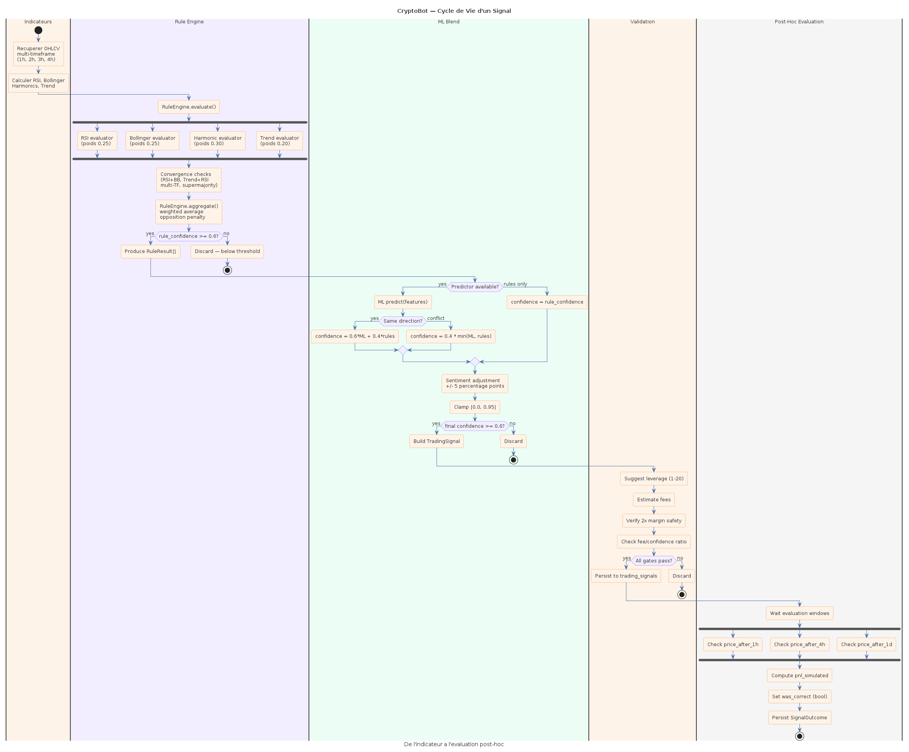

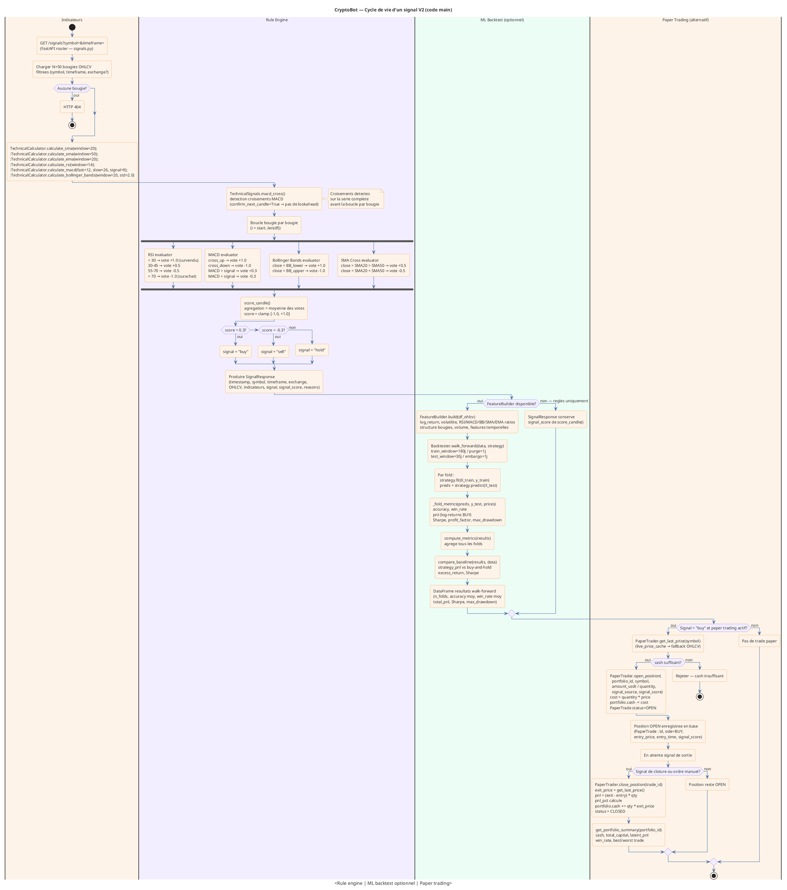
```plantuml
@startuml AC02-signal-lifecycle
' ============================================================
' CryptoBot — PlantUML Shared Skin & Stereotypes
' ============================================================

' --- Theme clair (lisible GitHub) ---
skinparam backgroundColor white
skinparam defaultFontName "Segoe UI, Helvetica, Arial, sans-serif"
skinparam defaultFontSize 12
skinparam defaultFontColor #333333
skinparam shadowing false
skinparam roundCorner 6

' --- Palette ---
' Bleu:   #4A6FA5
' Orange: #FEF3E8 (fond) / #E8943A (bordure)
' Vert:   #ECFDF5 (fond) / #34A853 (bordure)
' Violet: #F3EEFF (fond) / #7C5CFC (bordure)
' Gris:   #F5F5F5 (fond) / #CCCCCC (bordure)

' --- Component ---
skinparam component {
  BackgroundColor #F3EEFF
  BorderColor #7C5CFC
  FontColor #333333
  ArrowColor #4A6FA5
  StereotypeFontColor #7C5CFC
}

' --- Package ---
skinparam package {
  BackgroundColor #F5F5F5
  BorderColor #4A6FA5
  FontColor #333333
}

' --- Class ---
skinparam class {
  BackgroundColor #ECFDF5
  BorderColor #34A853
  FontColor #333333
  HeaderBackgroundColor #34A853
  HeaderFontColor white
  ArrowColor #4A6FA5
  StereotypeFontColor #7C5CFC
  AttributeFontColor #555555
}

' --- Sequence ---
skinparam sequence {
  ArrowColor #4A6FA5
  ActorBorderColor #7C5CFC
  LifeLineBorderColor #CCCCCC
  LifeLineBackgroundColor #F5F5F5
  ParticipantBorderColor #4A6FA5
  ParticipantBackgroundColor #F3EEFF
  ParticipantFontColor #333333
  BoxBorderColor #CCCCCC
  BoxBackgroundColor #F5F5F5
  DividerBackgroundColor #4A6FA5
  DividerFontColor white
}

' --- Activity ---
skinparam activity {
  BackgroundColor #FEF3E8
  BorderColor #E8943A
  FontColor #333333
  ArrowColor #4A6FA5
  DiamondBackgroundColor #F3EEFF
  DiamondBorderColor #7C5CFC
}

' --- Node (deployment) ---
skinparam node {
  BackgroundColor #F3EEFF
  BorderColor #7C5CFC
  FontColor #333333
}

' --- Database ---
skinparam database {
  BackgroundColor #ECFDF5
  BorderColor #34A853
  FontColor #333333
}

' --- Entity (ER) ---
skinparam entity {
  BackgroundColor white
  BorderColor #4A6FA5
  FontColor #333333
  HeaderBackgroundColor #4A6FA5
  HeaderFontColor white
}

' --- State ---
skinparam state {
  BackgroundColor #FEF3E8
  BorderColor #E8943A
  FontColor #333333
  ArrowColor #4A6FA5
}

' --- Usecase ---
skinparam usecase {
  BackgroundColor #F3EEFF
  BorderColor #7C5CFC
  FontColor #333333
  ArrowColor #4A6FA5
  ActorBorderColor #E8943A
}

' --- Note ---
skinparam note {
  BackgroundColor #FEF3E8
  BorderColor #E8943A
  FontColor #333333
}

' --- Legend ---
skinparam legend {
  BackgroundColor #F5F5F5
  BorderColor #CCCCCC
  FontColor #333333
}

' --- Stereotypes ---
' <<collector>>   ETL data collectors
' <<transformer>> ETL data transformers
' <<loader>>      ETL data loaders
' <<scheduler>>   APScheduler jobs
' <<rule>>        ML rule evaluator
' <<model>>       ML model
' <<router>>      FastAPI router
' <<service>>     FastAPI service
' <<middleware>>   FastAPI middleware
' <<page>>        Streamlit page
' <<component>>   Streamlit/Plotly component
' <<hypertable>>  TimescaleDB hypertable
' <<phase2>>      Phase 2 planned feature


title CryptoBot — Cycle de vie d'un signal V2 (code main)
caption <Rule engine | ML backtest optionnel | Paper trading>

|#FEF3E8| Indicateurs |
start
:GET /signals?symbol=&timeframe=\n(FastAPI router — signals.py);
:Charger N+50 bougies OHLCV\nfiltrees (symbol, timeframe, exchange?);

if (Aucune bougie?) then (oui)
  :HTTP 404;
  stop
endif

:TechnicalCalculator.calculate_sma(window=20);\n:TechnicalCalculator.calculate_sma(window=50);\n:TechnicalCalculator.calculate_ema(window=20);\n:TechnicalCalculator.calculate_rsi(window=14);\n:TechnicalCalculator.calculate_macd(fast=12, slow=26, signal=9);\n:TechnicalCalculator.calculate_bollinger_bands(window=20, std=2.0);

|#F3EEFF| Rule Engine |
:TechnicalSignals.macd_cross()\ndetection croisements MACD\n(confirm_next_candle=True → pas de lookahead);

note right
  Croisements detectes
  sur la serie complete
  avant la boucle par bougie
end note

:Boucle bougie par bougie\n(i = start..len(df));

fork
  :RSI evaluator\n< 30 → vote +1.0 (survendu)\n30-45 → vote +0.5\n55-70 → vote -0.5\n> 70 → vote -1.0 (surachat);
fork again
  :MACD evaluator\ncross_up → vote +1.0\ncross_down → vote -1.0\nMACD > signal → vote +0.3\nMACD < signal → vote -0.3;
fork again
  :Bollinger Bands evaluator\nclose < BB_lower → vote +1.0\nclose > BB_upper → vote -1.0;
fork again
  :SMA Cross evaluator\nclose > SMA20 > SMA50 → vote +0.5\nclose < SMA20 < SMA50 → vote -0.5;
end fork

:score_candle()\nagregation = moyenne des votes\nscore = clamp [-1.0, +1.0];

if (score > 0.3?) then (oui)
  :signal = "buy";
else if (score < -0.3?) then (oui)
  :signal = "sell";
else (non)
  :signal = "hold";
endif

:Produire SignalResponse\n(timestamp, symbol, timeframe, exchange,\nOHLCV, indicateurs, signal, signal_score, reasons);

|#ECFDF5| ML Backtest (optionnel) |
if (FeatureBuilder disponible?) then (oui)
  :FeatureBuilder.build(df_ohlcv)\nlog_return, volatilite, RSI/MACD/BB/SMA/EMA ratios\nstructure bougies, volume, features temporelles;

  :Backtester.walk_forward(data, strategy)\ntrain_window=180j / purge=1j\ntest_window=30j / embargo=1j;

  :Par fold :\n  strategy.fit(X_train, y_train)\n  preds = strategy.predict(X_test);

  :_fold_metrics(preds, y_test, prices)\naccuracy, win_rate\npnl (log-returns BUY)\nSharpe, profit_factor, max_drawdown;

  :compute_metrics(results)\nagrege tous les folds;

  :compare_baseline(results, data)\nstrategy_pnl vs buy-and-hold\nexcess_return, Sharpe;

  :DataFrame resultats walk-forward\n(n_folds, accuracy moy, win_rate moy\ntotal_pnl, Sharpe, max_drawdown);
else (non — regles uniquement)
  :SignalResponse conserve\nsignal_score de score_candle();
endif

|#FEF3E8| Paper Trading (alternatif) |
if (Signal = "buy" et paper trading actif?) then (oui)
  :PaperTrader.get_last_price(symbol)\n(live_price_cache → fallback OHLCV);

  if (cash suffisant?) then (oui)
    :PaperTrader.open_position(\n  portfolio_id, symbol,\n  amount_usdt / quantity,\n  signal_source, signal_score)\ncost = quantity * price\nportfolio.cash -= cost\nPaperTrade status=OPEN;
  else (non)
    :Rejeter — cash insuffisant;
    stop
  endif

  :Position OPEN enregistree en base\n(PaperTrade : id, side=BUY,\nentry_price, entry_time, signal_score);

  :En attente signal de sortie;

  if (Signal de cloture ou ordre manuel?) then (oui)
    :PaperTrader.close_position(trade_id)\nexit_price = get_last_price()\npnl = (exit - entry) * qty\npnl_pct calcule\nportfolio.cash += qty * exit_price\nstatus = CLOSED;

    :get_portfolio_summary(portfolio_id)\ncash, total_capital, latent_pnl\nwin_rate, best/worst trade;
  else (non)
    :Position reste OPEN;
  endif
else (non)
  :Pas de trade paper;
endif

stop

@enduml
```

## C01-macro-architecture

```plantuml
@startuml C01-macro-architecture
' ============================================================
' CryptoBot — PlantUML Shared Skin & Stereotypes
' ============================================================

' --- Theme clair (lisible GitHub) ---
skinparam backgroundColor white
skinparam defaultFontName "Segoe UI, Helvetica, Arial, sans-serif"
skinparam defaultFontSize 12
skinparam defaultFontColor #333333
skinparam shadowing false
skinparam roundCorner 6

' --- Palette ---
' Bleu:   #4A6FA5
' Orange: #FEF3E8 (fond) / #E8943A (bordure)
' Vert:   #ECFDF5 (fond) / #34A853 (bordure)
' Violet: #F3EEFF (fond) / #7C5CFC (bordure)
' Gris:   #F5F5F5 (fond) / #CCCCCC (bordure)

' --- Component ---
skinparam component {
  BackgroundColor #F3EEFF
  BorderColor #7C5CFC
  FontColor #333333
  ArrowColor #4A6FA5
  StereotypeFontColor #7C5CFC
}

' --- Package ---
skinparam package {
  BackgroundColor #F5F5F5
  BorderColor #4A6FA5
  FontColor #333333
}

' --- Class ---
skinparam class {
  BackgroundColor #ECFDF5
  BorderColor #34A853
  FontColor #333333
  HeaderBackgroundColor #34A853
  HeaderFontColor white
  ArrowColor #4A6FA5
  StereotypeFontColor #7C5CFC
  AttributeFontColor #555555
}

' --- Sequence ---
skinparam sequence {
  ArrowColor #4A6FA5
  ActorBorderColor #7C5CFC
  LifeLineBorderColor #CCCCCC
  LifeLineBackgroundColor #F5F5F5
  ParticipantBorderColor #4A6FA5
  ParticipantBackgroundColor #F3EEFF
  ParticipantFontColor #333333
  BoxBorderColor #CCCCCC
  BoxBackgroundColor #F5F5F5
  DividerBackgroundColor #4A6FA5
  DividerFontColor white
}

' --- Activity ---
skinparam activity {
  BackgroundColor #FEF3E8
  BorderColor #E8943A
  FontColor #333333
  ArrowColor #4A6FA5
  DiamondBackgroundColor #F3EEFF
  DiamondBorderColor #7C5CFC
}

' --- Node (deployment) ---
skinparam node {
  BackgroundColor #F3EEFF
  BorderColor #7C5CFC
  FontColor #333333
}

' --- Database ---
skinparam database {
  BackgroundColor #ECFDF5
  BorderColor #34A853
  FontColor #333333
}

' --- Entity (ER) ---
skinparam entity {
  BackgroundColor white
  BorderColor #4A6FA5
  FontColor #333333
  HeaderBackgroundColor #4A6FA5
  HeaderFontColor white
}

' --- State ---
skinparam state {
  BackgroundColor #FEF3E8
  BorderColor #E8943A
  FontColor #333333
  ArrowColor #4A6FA5
}

' --- Usecase ---
skinparam usecase {
  BackgroundColor #F3EEFF
  BorderColor #7C5CFC
  FontColor #333333
  ArrowColor #4A6FA5
  ActorBorderColor #E8943A
}

' --- Note ---
skinparam note {
  BackgroundColor #FEF3E8
  BorderColor #E8943A
  FontColor #333333
}

' --- Legend ---
skinparam legend {
  BackgroundColor #F5F5F5
  BorderColor #CCCCCC
  FontColor #333333
}

' --- Stereotypes ---
' <<collector>>   ETL data collectors
' <<transformer>> ETL data transformers
' <<loader>>      ETL data loaders
' <<scheduler>>   APScheduler jobs
' <<rule>>        ML rule evaluator
' <<model>>       ML model
' <<router>>      FastAPI router
' <<service>>     FastAPI service
' <<middleware>>   FastAPI middleware
' <<page>>        Streamlit page
' <<component>>   Streamlit/Plotly component
' <<hypertable>>  TimescaleDB hypertable
' <<phase2>>      Phase 2 planned feature


title CryptoBot — Architecture Macro V2 (code main)
caption 4 services Docker Compose | SQLite | crypto-net bridge

' ============================================================
' External APIs
' ============================================================
cloud "APIs Externes" as external #F5F5F5 {
  [Binance\nREST + WebSocket] as binance <<collector>>
  [CoinGecko\nDemo API] as coingecko <<collector>>
  [Alternative.me\nFear & Greed Index] as fng <<collector>>
  [RSS Feeds\ndecrypt.co\ncointelegraph.com\ncryptonews.com] as rss <<collector>>
}

' ============================================================
' Docker Compose — crypto-net bridge
' ============================================================
package "Docker Compose  |  crypto-net bridge" as compose #FEF3E8 {

  ' --- Collector daemon ---
  package "collector  (daemon, pas de port externe)" as pkg_collector #ECFDF5 {
    [OHLCVScheduler\nTickerScheduler\nMarketDataScheduler] as ohlcv_sched <<scheduler>>
    [WSPriceCollector\nBinance WebSocket] as ws_col <<collector>>
    [NewsCollector\nRSS feedparser] as news_col <<collector>>
    [FearGreedCollector\nalternative.me] as fg_col <<collector>>
    [Notifier\nemail alertes collecte] as notifier
  }

  ' --- MLflow tracking server ---
  package "mlflow  :5001->5000" as pkg_mlflow #F3EEFF {
    [MLflow Tracking\nExperiment registry\nSQLite mlflow.db] as mlflow_svc
  }

  ' --- FastAPI backend ---
  package "api  :8000" as pkg_api #FEF3E8 {
    [FastAPI\n/health /ohlcv /market\n/signals /news /ml\n/alerts /paper-trading] as fastapi <<router>>
    [WSPriceCollector\n(thread daemon)\nBinance WS temps reel] as ws_api <<collector>>
    [CORSMiddleware] as cors <<middleware>>
  }

  ' --- Streamlit frontend ---
  package "frontend  :8501" as pkg_frontend #F3EEFF {
    [Streamlit\n6 pages\n(dashboard, market, signals\nveille, ml, paper_trading)] as streamlit <<page>>
    [APIClient\nHTTP -> api:8000] as apiclient
    [i18n FR/EN] as i18n <<component>>
  }

}

' ============================================================
' Storage volumes
' ============================================================
package "Stockage" as storage #ECFDF5 {
  database "crypto_data.db\n(SQLite)\nbind ./data" as crypto_db
  database "mlflow.db\n(SQLite)\nvolume mlflow-data" as mlflow_db
}

' ============================================================
' Utilisateur
' ============================================================
actor "Utilisateur\nNavigateur" as user

' ============================================================
' depends_on chain (Docker)
' ============================================================
pkg_mlflow -[#CCCCCC,dashed]right-> pkg_api : depends_on
pkg_api -[#CCCCCC,dashed]right-> pkg_frontend : depends_on\n(service_healthy)

' ============================================================
' Data flow — Collector
' ============================================================
binance -down-> ohlcv_sched : REST OHLCV\n+ ccxt
binance -down-> ws_col : WebSocket\nprix temps reel
coingecko -down-> ohlcv_sched : market data
fng -down-> fg_col : Fear & Greed
rss -down-> news_col : articles RSS

ohlcv_sched -down-> crypto_db : OHLCV, ticker\nmarket_data
ws_col -down-> crypto_db : prix tick
news_col -down-> crypto_db : news_articles
fg_col -down-> crypto_db : fear_greed

' ============================================================
' Data flow — API
' ============================================================
binance -[#4A6FA5]down-> ws_api : WebSocket\n(lifespan thread)
ws_api -down-> crypto_db : prix live
fastapi -right-> crypto_db : lecture donnees
fastapi -right-> mlflow_db : lecture experiments\nvia MLflow client
cors -[hidden]right-> fastapi

' ============================================================
' Data flow — Frontend -> API
' ============================================================
apiclient -up-> fastapi : HTTP REST\napi:8000
streamlit -right-> apiclient
user -down-> streamlit : port 8501

' ============================================================
' MLflow storage
' ============================================================
mlflow_svc -down-> mlflow_db : SQLite tracking

' ============================================================
' Legend
' ============================================================
legend bottom right
  |= Couleur |= Signification |
  | <#FEF3E8> | Pipeline ETL / API |
  | <#ECFDF5> | Collector / Stockage |
  | <#F3EEFF> | ML / Frontend |
  | <#F5F5F5> | Externe / Infra |
endlegend

@enduml
```

## C02-etl-components

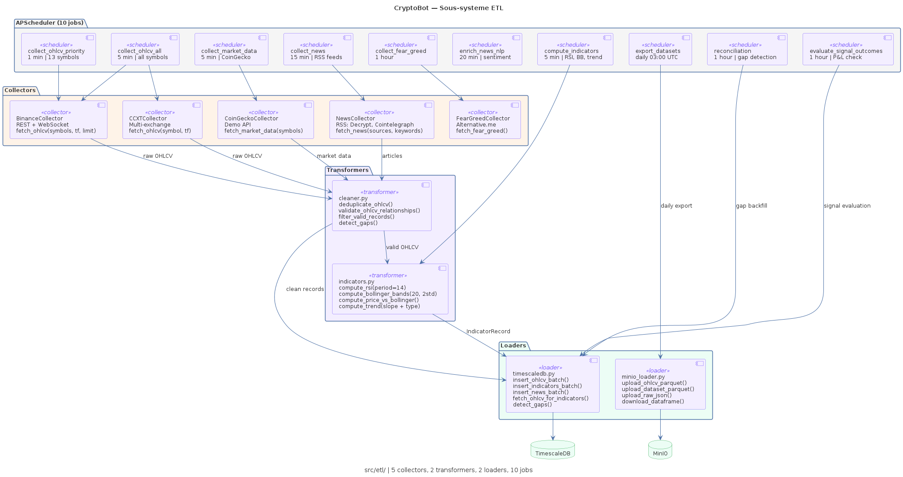

```plantuml
@startuml C02-etl-components
' ============================================================
' CryptoBot — PlantUML Shared Skin & Stereotypes
' ============================================================

' --- Theme clair (lisible GitHub) ---
skinparam backgroundColor white
skinparam defaultFontName "Segoe UI, Helvetica, Arial, sans-serif"
skinparam defaultFontSize 12
skinparam defaultFontColor #333333
skinparam shadowing false
skinparam roundCorner 6

' --- Palette ---
' Bleu:   #4A6FA5
' Orange: #FEF3E8 (fond) / #E8943A (bordure)
' Vert:   #ECFDF5 (fond) / #34A853 (bordure)
' Violet: #F3EEFF (fond) / #7C5CFC (bordure)
' Gris:   #F5F5F5 (fond) / #CCCCCC (bordure)

' --- Component ---
skinparam component {
  BackgroundColor #F3EEFF
  BorderColor #7C5CFC
  FontColor #333333
  ArrowColor #4A6FA5
  StereotypeFontColor #7C5CFC
}

' --- Package ---
skinparam package {
  BackgroundColor #F5F5F5
  BorderColor #4A6FA5
  FontColor #333333
}

' --- Class ---
skinparam class {
  BackgroundColor #ECFDF5
  BorderColor #34A853
  FontColor #333333
  HeaderBackgroundColor #34A853
  HeaderFontColor white
  ArrowColor #4A6FA5
  StereotypeFontColor #7C5CFC
  AttributeFontColor #555555
}

' --- Sequence ---
skinparam sequence {
  ArrowColor #4A6FA5
  ActorBorderColor #7C5CFC
  LifeLineBorderColor #CCCCCC
  LifeLineBackgroundColor #F5F5F5
  ParticipantBorderColor #4A6FA5
  ParticipantBackgroundColor #F3EEFF
  ParticipantFontColor #333333
  BoxBorderColor #CCCCCC
  BoxBackgroundColor #F5F5F5
  DividerBackgroundColor #4A6FA5
  DividerFontColor white
}

' --- Activity ---
skinparam activity {
  BackgroundColor #FEF3E8
  BorderColor #E8943A
  FontColor #333333
  ArrowColor #4A6FA5
  DiamondBackgroundColor #F3EEFF
  DiamondBorderColor #7C5CFC
}

' --- Node (deployment) ---
skinparam node {
  BackgroundColor #F3EEFF
  BorderColor #7C5CFC
  FontColor #333333
}

' --- Database ---
skinparam database {
  BackgroundColor #ECFDF5
  BorderColor #34A853
  FontColor #333333
}

' --- Entity (ER) ---
skinparam entity {
  BackgroundColor white
  BorderColor #4A6FA5
  FontColor #333333
  HeaderBackgroundColor #4A6FA5
  HeaderFontColor white
}

' --- State ---
skinparam state {
  BackgroundColor #FEF3E8
  BorderColor #E8943A
  FontColor #333333
  ArrowColor #4A6FA5
}

' --- Usecase ---
skinparam usecase {
  BackgroundColor #F3EEFF
  BorderColor #7C5CFC
  FontColor #333333
  ArrowColor #4A6FA5
  ActorBorderColor #E8943A
}

' --- Note ---
skinparam note {
  BackgroundColor #FEF3E8
  BorderColor #E8943A
  FontColor #333333
}

' --- Legend ---
skinparam legend {
  BackgroundColor #F5F5F5
  BorderColor #CCCCCC
  FontColor #333333
}

' --- Stereotypes ---
' <<collector>>   ETL data collectors
' <<transformer>> ETL data transformers
' <<loader>>      ETL data loaders
' <<scheduler>>   APScheduler jobs
' <<rule>>        ML rule evaluator
' <<model>>       ML model
' <<router>>      FastAPI router
' <<service>>     FastAPI service
' <<middleware>>   FastAPI middleware
' <<page>>        Streamlit page
' <<component>>   Streamlit/Plotly component
' <<hypertable>>  TimescaleDB hypertable
' <<phase2>>      Phase 2 planned feature


title CryptoBot — Composants ETL V2 (code main)
caption Binance WS+REST | CoinGecko | Alt.me | RSS+VADER+TFIDF

' ============================================================
' External Data Sources
' ============================================================
package "Sources externes" as ext #FEF3E8 {
  [Binance WS\nwss://stream.binance.com\nminiTicker stream] as bws
  [Binance REST\nccxt / BinanceClient\nfetch_ohlcv(symbol, tf, limit)] as brest
  [CoinGecko Demo API\nCoinGeckoClient\nfetch_global_market_data()\nfetch_top_cryptos_by_market_cap()] as cg
  [Alternative.me\nhttps://api.alternative.me/fng\nFear & Greed Index] as altme
  [RSS Feeds (3 sources)\ndecrypt.co | cointelegraph.com\ncryptonews.com] as rss
}

' ============================================================
' Exchange Factory & Clients
' ============================================================
package "ExchangeFactory\nsrc/services/exchange_factory.py" as factory #F5F5F5 {
  [BinanceClient\nexchanges_api/binance_client.py\nfetch_ohlcv() | fetch_ticker()] as binance_cli <<service>>
  [CoinGeckoClient\nexchanges_api/coingecko_client.py\nfetch_global_market_data()\nfetch_top_cryptos_by_market_cap()] as cg_cli <<service>>
  note right of binance_cli
    KrakenClient + CoinbaseClient
    existent dans exchanges_api/
    mais non câblés par aucun
    appelant actif (V3 future)
  end note
}

' ============================================================
' Live Price Cache (WebSocket)
' ============================================================
package "WS Daemon\nsrc/collectors/ws_price_collector.py" as wsdaemon #FEF3E8 {
  [WsPriceCollector\nstart_ws_collector(symbols)\nasync _watch() + auto-reconnect\nping_interval=20s | delay=5s] as ws_coll <<collector>>
  [LivePriceCache\nsrc/services/live_price_cache.py\nSingleton thread-safe\nupdate(symbol, price)] as lpc <<service>>
}

' ============================================================
' Collectors
' ============================================================
package "Collectors" as coll #FEF3E8 {
  [OHLCVCollector\nsrc/collectors/ohlcv_collector.py\nfetch_and_store()\npairs + timeframes | exchange=binance] as ohlcv_coll <<collector>>
  [TickerCollector\nsrc/collectors/ticker_collector.py\nstart_collection() / stop_collection()\nsnapshot_interval=5 min\nTickerCache (max 100/symbol)] as ticker_coll <<collector>>
  [MarketDataCollector\nsrc/collectors/market_data_collector.py\nfetch_and_store() | fetch_top_cryptos()\nfetch_crypto_details()] as md_coll <<collector>>
  [NewsCollector\nsrc/collectors/news_collector.py\nfetch_articles(sources)\nfetch_and_store(db)\nVADER sentiment + TF-IDF keywords] as news_coll <<collector>>
  [FearGreedCollector\nsrc/collectors/fear_greed_collector.py\nfetch() → FearGreedResult\nvalue 0–100 + classification] as fg_coll <<collector>>
  [MarketCache\nsrc/collectors/market_cache.py\nadd_snapshot() | get_latest_snapshot()\nmax 50 snapshots] as mcache <<service>>
}

' ============================================================
' NLP Pipeline (News enrichment)
' ============================================================
package "NLP\nsrc/ml/nlp/" as nlp #F3EEFF {
  [text_mining.py\nextract_keywords(TF-IDF)\nextract_entities()\ndetect_topics(CountVectorizer)] as tm <<transformer>>
  [VADER\nvaderSentiment\nSentimentIntensityAnalyzer\ncompound dans (-1, +1)] as vader <<transformer>>
}

' ============================================================
' ETL Pipeline — OHLCV
' ============================================================
package "OHLCV Pipeline\nsrc/etl/ohlcv_pipeline/" as ohlcv_etl #F3EEFF {
  [OHLCVExtractor\nextractor.py\nextract(symbol, tf, limit)\nmax_retries=3 | backoff 2^n] as ohlcv_ext <<collector>>
  [OHLCVTransformer\ntransformer.py\ntransform(raw_data, symbol, tf)\n→ DataFrame + metadata\n+ DataValidator0HCLV\n+ price_range/change/pct] as ohlcv_tr <<transformer>>
  [OHLCVLoader\nloader.py\nload(df) | load_batch(df_batch)\ntable=ohlcv | batch_size=1000\nSQLAlchemy / db_context] as ohlcv_lo <<loader>>
  [ETLPipelineOHLCV\npipeline_ohlcv.py\nrun_batch(pairs, tf)\nget_summary(results)] as ohlcv_pipe <<service>>
}

' ============================================================
' ETL Pipeline — MarketData
' ============================================================
package "MarketData Pipeline\nsrc/etl/market_data_pipeline/" as md_etl #F3EEFF {
  [MarketDataExtractor\nextractor.py\nextract(symbol) → global_market\nextract_top_cryptos(limit, currency)\nextract_crypto_details(ids)] as md_ext <<collector>>
  [MarketDataTransformer\ntransformer.py\ntransform_global_market()\ntransform_top_cryptos()\ntransform_crypto_details()] as md_tr <<transformer>>
  [MarketDataLoader\nloader.py\nload(snapshot, caps, volumes, dom)\nload_top_cryptos(snapshot, cryptos)\nload_crypto_details(snapshot, details)\nSQLAlchemy ORM bulk_save] as md_lo <<loader>>
  [ETLPipelineMarketData\npipeline_market_data.py\nrun(symbol) | get_summary()] as md_pipe <<service>>
}

' ============================================================
' Data Quality
' ============================================================
package "Quality\nsrc/quality/" as quality #ECFDF5 {
  [DataValidator0HCLV\nvalidator.py\nvalidate_ohlcv_values(df)\nvalidate_dataframe_structure()\ndetect outliers | check timestamps] as validator <<service>>
  note right of validator
    Patito absent du codebase V2.
    Validation via pandas uniquement.
  end note
}

' ============================================================
' Storage
' ============================================================
database "SQLite\n(ohlcv, ticker_snapshots\nglobal_market_*, top_crypto_*\ncrypto_detail_*, news_articles)" as db #ECFDF5

' ============================================================
' Relations — Sources → Clients
' ============================================================
bws --> ws_coll : miniTicker JSON
brest --> binance_cli : CCXT REST
cg --> cg_cli : HTTP/JSON
altme --> fg_coll : HTTP/JSON
rss --> news_coll : feedparser/httpx

' ============================================================
' Relations — Factory → Collectors
' ============================================================
binance_cli --> ohlcv_coll : BinanceClient
binance_cli --> ticker_coll : BinanceClient
cg_cli --> md_coll : CoinGeckoClient

' ============================================================
' Relations — WS Daemon
' ============================================================
ws_coll --> lpc : live_price_cache.update()

' ============================================================
' Relations — Collectors → Pipelines
' ============================================================
ohlcv_coll --> ohlcv_pipe : run_batch(pairs, tf)
md_coll --> md_pipe : run("global_market")

' ============================================================
' Relations — OHLCV Pipeline internals
' ============================================================
ohlcv_pipe --> ohlcv_ext : extract(symbol, tf)
ohlcv_ext --> ohlcv_tr : raw List[List]
ohlcv_tr --> validator : validate_ohlcv_values(df)
ohlcv_tr --> ohlcv_lo : clean DataFrame
ohlcv_lo --> db : INSERT ohlcv (batch)

' ============================================================
' Relations — MarketData Pipeline internals
' ============================================================
md_pipe --> md_ext : extract(symbol)
md_ext --> md_tr : raw dict
md_tr --> md_lo : snapshot + caps/volumes/dom
md_lo --> db : ORM bulk_save

' ============================================================
' Relations — News enrichment
' ============================================================
news_coll --> vader : full_text
news_coll --> tm : full_text
vader --> news_coll : sentiment_score + label
tm --> news_coll : keywords + entities + topics
news_coll --> db : INSERT news_articles

' ============================================================
' Relations — TickerCollector
' ============================================================
ticker_coll --> mcache : (TickerCache in-memory)
ticker_coll --> db : INSERT ticker_snapshots (periodic)

' ============================================================
' Relations — FearGreed
' ============================================================
fg_coll --> db : INSERT fear_greed_index

@enduml
```

## C03-ml-components

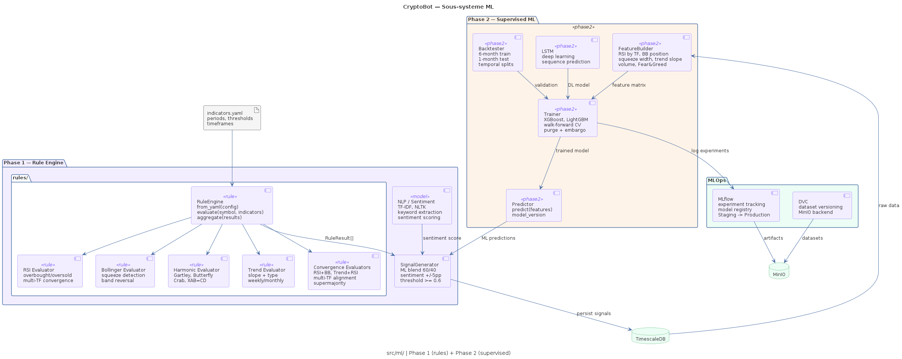

```plantuml
@startuml C03-ml-components
' ============================================================
' CryptoBot — PlantUML Shared Skin & Stereotypes
' ============================================================

' --- Theme clair (lisible GitHub) ---
skinparam backgroundColor white
skinparam defaultFontName "Segoe UI, Helvetica, Arial, sans-serif"
skinparam defaultFontSize 12
skinparam defaultFontColor #333333
skinparam shadowing false
skinparam roundCorner 6

' --- Palette ---
' Bleu:   #4A6FA5
' Orange: #FEF3E8 (fond) / #E8943A (bordure)
' Vert:   #ECFDF5 (fond) / #34A853 (bordure)
' Violet: #F3EEFF (fond) / #7C5CFC (bordure)
' Gris:   #F5F5F5 (fond) / #CCCCCC (bordure)

' --- Component ---
skinparam component {
  BackgroundColor #F3EEFF
  BorderColor #7C5CFC
  FontColor #333333
  ArrowColor #4A6FA5
  StereotypeFontColor #7C5CFC
}

' --- Package ---
skinparam package {
  BackgroundColor #F5F5F5
  BorderColor #4A6FA5
  FontColor #333333
}

' --- Class ---
skinparam class {
  BackgroundColor #ECFDF5
  BorderColor #34A853
  FontColor #333333
  HeaderBackgroundColor #34A853
  HeaderFontColor white
  ArrowColor #4A6FA5
  StereotypeFontColor #7C5CFC
  AttributeFontColor #555555
}

' --- Sequence ---
skinparam sequence {
  ArrowColor #4A6FA5
  ActorBorderColor #7C5CFC
  LifeLineBorderColor #CCCCCC
  LifeLineBackgroundColor #F5F5F5
  ParticipantBorderColor #4A6FA5
  ParticipantBackgroundColor #F3EEFF
  ParticipantFontColor #333333
  BoxBorderColor #CCCCCC
  BoxBackgroundColor #F5F5F5
  DividerBackgroundColor #4A6FA5
  DividerFontColor white
}

' --- Activity ---
skinparam activity {
  BackgroundColor #FEF3E8
  BorderColor #E8943A
  FontColor #333333
  ArrowColor #4A6FA5
  DiamondBackgroundColor #F3EEFF
  DiamondBorderColor #7C5CFC
}

' --- Node (deployment) ---
skinparam node {
  BackgroundColor #F3EEFF
  BorderColor #7C5CFC
  FontColor #333333
}

' --- Database ---
skinparam database {
  BackgroundColor #ECFDF5
  BorderColor #34A853
  FontColor #333333
}

' --- Entity (ER) ---
skinparam entity {
  BackgroundColor white
  BorderColor #4A6FA5
  FontColor #333333
  HeaderBackgroundColor #4A6FA5
  HeaderFontColor white
}

' --- State ---
skinparam state {
  BackgroundColor #FEF3E8
  BorderColor #E8943A
  FontColor #333333
  ArrowColor #4A6FA5
}

' --- Usecase ---
skinparam usecase {
  BackgroundColor #F3EEFF
  BorderColor #7C5CFC
  FontColor #333333
  ArrowColor #4A6FA5
  ActorBorderColor #E8943A
}

' --- Note ---
skinparam note {
  BackgroundColor #FEF3E8
  BorderColor #E8943A
  FontColor #333333
}

' --- Legend ---
skinparam legend {
  BackgroundColor #F5F5F5
  BorderColor #CCCCCC
  FontColor #333333
}

' --- Stereotypes ---
' <<collector>>   ETL data collectors
' <<transformer>> ETL data transformers
' <<loader>>      ETL data loaders
' <<scheduler>>   APScheduler jobs
' <<rule>>        ML rule evaluator
' <<model>>       ML model
' <<router>>      FastAPI router
' <<service>>     FastAPI service
' <<middleware>>   FastAPI middleware
' <<page>>        Streamlit page
' <<component>>   Streamlit/Plotly component
' <<hypertable>>  TimescaleDB hypertable
' <<phase2>>      Phase 2 planned feature


title CryptoBot — Composants ML V2 (code main)
caption Rule engine | Feature builder | Backtester walk-forward | NLP TextMining (sklearn)

' ============================================================
' API Routers
' ============================================================
package "api/routers/" #F5F5F5 {
  [GET /signals\nsymbol, timeframe, limit\nretourne List(SignalResponse)] as r_signals <<router>>
  [GET /ml/backtest\nsymbol, timeframe, model_type\ntrain_window, test_window\nretourne BacktestResponse] as r_ml <<router>>
}

' ============================================================
' Rule Engine — src/analytics/
' ============================================================
package "src/analytics/ — Rule Engine" as p_analytics #F3EEFF {

  package "technical_calculator.py" #white {
    [TechnicalCalculator\ncalculate_rsi(window=14)\ncalculate_macd(fast=12,slow=26,signal=9)\ncalculate_bollinger_bands(window=20,std=2.0)\ncalculate_sma(window=7|20|50)\ncalculate_ema(window=9|21)\nlib: pandas_ta_classic] as tc <<rule>>
  }

  package "technical_signals.py" #white {
    [TechnicalSignals\nmacd_cross(confirm_next_candle)\nget_macd_signals() → {buy, sell}\nrsi_conditions(overbought=70, oversold=30)] as ts <<rule>>
  }

  package "signal_scorer.py" #white {
    [score_candle(close, rsi,\nmacd_line, macd_signal,\nbb_upper, bb_lower,\nsma_20, sma_50,\nmacd_cross_up, macd_cross_down)\n→ (signal, score (-1,+1), reasons)\nRules: RSI oversold/overbought\nMACD cross up/down\nBB band breach\nSMA20>SMA50 trend] as sc <<rule>>
  }
}

' ============================================================
' Feature Engineering — src/ml/feature_engineering/
' ============================================================
package "src/ml/feature_engineering/" as p_feat #F3EEFF {

  [FeatureBuilder\nbuild(df_ohlcv) → df_features\n— Returns: log_return_1, return_4/12/24\n— Volatility: rolling_std_5/10/20\n— Technical: rsi_14, macd/signal/hist\n  bb_position, bb_width\n  sma_7/20/50_ratio, ema_9/21_ratio\n— Candle: hl_spread, body_ratio\n  upper/lower_wick_ratio\n— Volume: volume_ma_ratio, volume_change\n— Temporal: hour, day_of_week\n  day_of_month, month, is_weekend\n~30 features total] as fb

  [DatasetBuilder\nbuild(df_features) → (X, y)\nmode: direction|return\nhorizon: N bougies\ntarget: close(t+N) > close(t)\ntime_series_split(n_splits=5)\ntrain_test_split_temporal(ratio=0.2)\nanti-leakage: no future data] as db
}

' ============================================================
' Models — src/ml/models/
' ============================================================
package "src/ml/models/" as p_models #F3EEFF {

  [BaselineModel\nfit(X_train, y_train)\npredict(X) → labels\npredict_proba(X) → (p0, p1)\ncross_validate(n_splits=5)\nfeature_importances()\nTypes:\n  dummy (most_frequent)\n  logistic_regression\n    (balanced, C=0.1)\n  random_forest\n    (200 trees, max_depth=6)\n  xgboost (optional,\n    300 trees, lr=0.05)\nPipeline: StandardScaler + model] as bm <<model>>

  [ModelEvaluator\nevaluate_folds(fold_results)\ncompare_models({name: results})\nML: accuracy, precision\n    recall, F1\nFinance: win_rate\n  profit_factor\n  sharpe annualisé\n    (sqrt(8760) factor)] as me
}

' ============================================================
' Backtesting — src/ml/backtesting/
' ============================================================
package "src/ml/backtesting/" as p_bt #F3EEFF {

  [Backtester\nwalk_forward(data, strategy)\ntrain_window=180d, test_window=30d\npurge_days=1, embargo_days=1\nMetrics/fold: accuracy, win_rate\n  pnl (log-returns on BUY)\n  sharpe (annualisé √365)\n  profit_factor, max_drawdown\ncompute_metrics() → global summary\ncompare_baseline() vs buy-and-hold] as bktest

  note right of bktest
    Strategy Protocol:
    fit(X, y) + predict(X)
    Graceful fold skip on error
  end note
}

' ============================================================
' NLP — src/ml/nlp/
' ============================================================
package "src/ml/nlp/" as p_nlp #F3EEFF {

  [TextMining\nextract_keywords(text, top_n=8)\n  TF-IDF (ngram 1-2, sublinear_tf)\ncount_term_frequencies(texts, top_n=50)\n  CountVectorizer\nextract_entities(text)\n  → {crypto_symbols, exchanges}\ndetect_topics(text)\n  → regulation|hack|adoption\n    defi|nft|macro|price_action\n    |general\nanalyse_text() pipeline complet\nlib: sklearn TfidfVectorizer\n  + CountVectorizer] as tm <<model>>
}

' ============================================================
' MLOps — src/ml/mlflow_utils.py
' ============================================================
package "src/ml/ — MLOps" as p_mlops #ECFDF5 {

  [mlflow_utils\nlog_experiment(\n  experiment_name, params,\n  metrics, tags, artifact_paths)\nlog_backtest_metrics(\n  experiment_name, symbol,\n  model_version, metrics)\nDegradation gracieuse:\n  warning si serveur absent\n  retourne None (non-bloquant)\nMLFLOW_TRACKING_URI env var] as mlu

  database "MLflow Server\nexperiment tracking\nrun registry" as mlflow_db #ECFDF5
}

' ============================================================
' Storage
' ============================================================
database "SQLite\nohlcv table\n(OHLCV model)" as db_pg #ECFDF5

' ============================================================
' Relations — API Routers
' ============================================================
r_signals --> tc : calcule RSI/MACD/BB/SMA/EMA
r_signals --> ts : macd_cross detection
r_signals --> sc : score_candle()
r_ml --> fb : FeatureBuilder.build()
r_ml --> bm : BaselineModel(model_type)
r_ml --> bktest : Backtester.walk_forward()
r_ml --> mlu : log_backtest_metrics()

' ============================================================
' Relations — Rule Engine
' ============================================================
tc --> ts : DataFrame avec indicateurs
ts --> sc : MACD_cross_up/down flags
tc --> sc : RSI, MACD, BB, SMA values

' ============================================================
' Relations — Feature Engineering
' ============================================================
tc --> fb : calcule_rsi/macd/bbands/sma/ema
db_pg --> fb : OHLCV rows (read)

' ============================================================
' Relations — Models
' ============================================================
fb --> bm : (X, y) dataset (en mémoire)
bm --> me : cross_validate() fold_results
bm --> bktest : implements Strategy Protocol

' ============================================================
' Relations — Backtesting & MLOps
' ============================================================
bktest --> mlu : log_backtest_metrics()
mlu --> mlflow_db : mlflow.log_params/metrics/artifacts

' ============================================================
' Relations — Storage
' ============================================================
db_pg --> r_signals : rows OHLCV
db_pg --> r_ml : rows OHLCV (best exchange)

@enduml
```

## C04-api-components

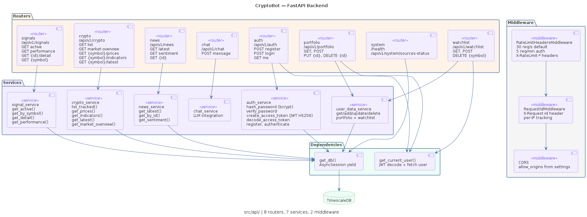

```plantuml
@startuml C04-api-components
' ============================================================
' CryptoBot — PlantUML Shared Skin & Stereotypes
' ============================================================

' --- Theme clair (lisible GitHub) ---
skinparam backgroundColor white
skinparam defaultFontName "Segoe UI, Helvetica, Arial, sans-serif"
skinparam defaultFontSize 12
skinparam defaultFontColor #333333
skinparam shadowing false
skinparam roundCorner 6

' --- Palette ---
' Bleu:   #4A6FA5
' Orange: #FEF3E8 (fond) / #E8943A (bordure)
' Vert:   #ECFDF5 (fond) / #34A853 (bordure)
' Violet: #F3EEFF (fond) / #7C5CFC (bordure)
' Gris:   #F5F5F5 (fond) / #CCCCCC (bordure)

' --- Component ---
skinparam component {
  BackgroundColor #F3EEFF
  BorderColor #7C5CFC
  FontColor #333333
  ArrowColor #4A6FA5
  StereotypeFontColor #7C5CFC
}

' --- Package ---
skinparam package {
  BackgroundColor #F5F5F5
  BorderColor #4A6FA5
  FontColor #333333
}

' --- Class ---
skinparam class {
  BackgroundColor #ECFDF5
  BorderColor #34A853
  FontColor #333333
  HeaderBackgroundColor #34A853
  HeaderFontColor white
  ArrowColor #4A6FA5
  StereotypeFontColor #7C5CFC
  AttributeFontColor #555555
}

' --- Sequence ---
skinparam sequence {
  ArrowColor #4A6FA5
  ActorBorderColor #7C5CFC
  LifeLineBorderColor #CCCCCC
  LifeLineBackgroundColor #F5F5F5
  ParticipantBorderColor #4A6FA5
  ParticipantBackgroundColor #F3EEFF
  ParticipantFontColor #333333
  BoxBorderColor #CCCCCC
  BoxBackgroundColor #F5F5F5
  DividerBackgroundColor #4A6FA5
  DividerFontColor white
}

' --- Activity ---
skinparam activity {
  BackgroundColor #FEF3E8
  BorderColor #E8943A
  FontColor #333333
  ArrowColor #4A6FA5
  DiamondBackgroundColor #F3EEFF
  DiamondBorderColor #7C5CFC
}

' --- Node (deployment) ---
skinparam node {
  BackgroundColor #F3EEFF
  BorderColor #7C5CFC
  FontColor #333333
}

' --- Database ---
skinparam database {
  BackgroundColor #ECFDF5
  BorderColor #34A853
  FontColor #333333
}

' --- Entity (ER) ---
skinparam entity {
  BackgroundColor white
  BorderColor #4A6FA5
  FontColor #333333
  HeaderBackgroundColor #4A6FA5
  HeaderFontColor white
}

' --- State ---
skinparam state {
  BackgroundColor #FEF3E8
  BorderColor #E8943A
  FontColor #333333
  ArrowColor #4A6FA5
}

' --- Usecase ---
skinparam usecase {
  BackgroundColor #F3EEFF
  BorderColor #7C5CFC
  FontColor #333333
  ArrowColor #4A6FA5
  ActorBorderColor #E8943A
}

' --- Note ---
skinparam note {
  BackgroundColor #FEF3E8
  BorderColor #E8943A
  FontColor #333333
}

' --- Legend ---
skinparam legend {
  BackgroundColor #F5F5F5
  BorderColor #CCCCCC
  FontColor #333333
}

' --- Stereotypes ---
' <<collector>>   ETL data collectors
' <<transformer>> ETL data transformers
' <<loader>>      ETL data loaders
' <<scheduler>>   APScheduler jobs
' <<rule>>        ML rule evaluator
' <<model>>       ML model
' <<router>>      FastAPI router
' <<service>>     FastAPI service
' <<middleware>>   FastAPI middleware
' <<page>>        Streamlit page
' <<component>>   Streamlit/Plotly component
' <<hypertable>>  TimescaleDB hypertable
' <<phase2>>      Phase 2 planned feature


title CryptoBot — Composants API V2 (code main)
caption 8 routers FastAPI | Middleware CORS | Pydantic schemas

' ============================================================
' Entry point
' ============================================================
actor "HTTP Client" as client

' ============================================================
' FastAPI Application
' ============================================================
package "FastAPI App (api/main.py)" #F5F5F5 {

  ' --- Middleware ---
  package "Middleware" #FEF3E8 {
    [CORSMiddleware\nallow_origins=*\nallow_methods=*\nallow_headers=*] as cors <<middleware>>
    ' RequestIdMiddleware absent dans api/main.py — CORS only
  }

  ' --- Lifespan ---
  [lifespan()\nstart_ws_collector(pairs)\non startup] as lifespan <<service>>

  ' --- Routers ---
  package "Routers (8)" #FEF3E8 {
    [health\nGET /health\ndb ping + timestamp] as r_health <<router>>

    [market\nGET /market/top\nGET /market/global\nGET /market/ticker\nGET /market/fear-greed\nGET /market/history] as r_market <<router>>

    [ohlcv\nGET /ohlcv\nGET /ohlcv/symbols\nGET /ohlcv/distinct-count\nGET /ohlcv/latest] as r_ohlcv <<router>>

    [signals\nGET /signals\n(SMA/EMA/RSI/MACD/BB\n+ signal scorer)] as r_signals <<router>>

    [news\nGET /news\nGET /news/sources\nGET /news/sentiment] as r_news <<router>>

    [alerts\nPOST /alerts/subscribe\nDELETE /alerts/unsubscribe/{email}] as r_alerts <<router>>

    [ml\nGET /ml/backtest\n(walk-forward\ndummy/logreg/RF/XGB)] as r_ml <<router>>

    [paper_trading\nPOST /paper-trading/portfolios\nGET /paper-trading/portfolios\nGET /paper-trading/portfolios/{id}\nPOST /paper-trading/orders\nPOST /paper-trading/orders/{id}/close\nGET /paper-trading/orders\nGET /paper-trading/live-prices\nGET /paper-trading/live-prices/status] as r_paper <<router>>
  }
}

' ============================================================
' Schemas (Pydantic V2)
' ============================================================
package "Schemas (api/schemas/)" #ECFDF5 {
  [schemas.market\nTopCryptoSnapshotResponse\nGlobalMarketResponse\nTickerResponse] as sch_market
  [schemas.ohlcv\nOHLCVResponse\nSymbolInfo] as sch_ohlcv
  [schemas.signals\nSignalResponse\n(OHLCV + indicators\n+ signal/score/reasons)] as sch_signals
  [schemas.news\nNewsArticleResponse\nNewsSentimentResponse] as sch_news
  [schemas.alerts\nSubscribeRequest\nSubscribeResponse] as sch_alerts
  [schemas.ml\nBacktestResponse\nBacktestFoldResult\nBacktestSummary\nBacktestBaseline] as sch_ml
  [schemas.paper_trading\nPortfolioCreate/Response\nOrderCreate\nTradeResponse\nPortfolioSummary\nPortfolioMetrics] as sch_paper
}

' ============================================================
' Dependencies (api/dependencies.py)
' ============================================================
package "Dependencies" #ECFDF5 {
  [get_db()\nSessionLocal yield\nSQLAlchemy Session] as dep_db
  [engine\ncreate_engine(DATABASE_URL)\nSQLite] as dep_engine
}

' ============================================================
' Services / Analytics
' ============================================================
package "Services & Analytics" #F3EEFF {
  [TechnicalCalculator\nSMA / EMA / RSI\nMACD / Bollinger] as svc_calc <<service>>
  [TechnicalSignals\nmacd_cross()] as svc_signals <<service>>
  [signal_scorer\nscore_candle()] as svc_scorer <<service>>
  [FearGreedCollector\nalternative.me API] as svc_fg <<service>>
  [PaperTrader\ncreate_portfolio()\nopen/close_position()\nget_portfolio_summary()] as svc_paper <<service>>
  [FeatureBuilder\nbuild() → indicators df] as svc_features <<service>>
  [BaselineModel\ndummy/logreg/RF/XGB] as svc_model <<service>>
  [Backtester\nwalk_forward()\ncompute_metrics()\ncompare_baseline()] as svc_backtester <<service>>
  [notifier\nnotify_subscribe_confirmation()\nnotify_unsubscribe_confirmation()] as svc_notifier <<service>>
  [LivePriceCache\nsingleton thread-safe\nupdate() / all_prices()\nall_with_ts()] as svc_cache <<service>>
  [ws_price_collector\nstart_ws_collector(pairs)\nBinance WebSocket] as svc_ws <<service>>
}

' ============================================================
' Storage
' ============================================================
database "SQLite\n(DATABASE_URL)" as db #ECFDF5

' ============================================================
' Relations — entry
' ============================================================
client --> cors
cors --> r_health
cors --> r_market
cors --> r_ohlcv
cors --> r_signals
cors --> r_news
cors --> r_alerts
cors --> r_ml
cors --> r_paper

' lifespan starts WS collector
lifespan --> svc_ws

' ============================================================
' Relations — Routers -> Dependencies
' ============================================================
r_health --> dep_db
r_market --> dep_db
r_ohlcv --> dep_db
r_signals --> dep_db
r_news --> dep_db
r_alerts --> dep_db
r_ml --> dep_db
r_paper --> dep_db

dep_db --> dep_engine
dep_engine --> db

' ============================================================
' Relations — Routers -> Schemas
' ============================================================
r_market ..> sch_market : response_model
r_ohlcv ..> sch_ohlcv : response_model
r_signals ..> sch_signals : response_model
r_news ..> sch_news : response_model
r_alerts ..> sch_alerts : request/response
r_ml ..> sch_ml : response_model
r_paper ..> sch_paper : request/response

' ============================================================
' Relations — Routers -> Services
' ============================================================
r_signals --> svc_calc
r_signals --> svc_signals
r_signals --> svc_scorer
r_market --> svc_fg
r_paper --> svc_paper
r_paper --> svc_cache
r_ml --> svc_features
r_ml --> svc_model
r_ml --> svc_backtester
r_alerts --> svc_notifier
svc_ws --> svc_cache

@enduml
```

## C05-frontend-components

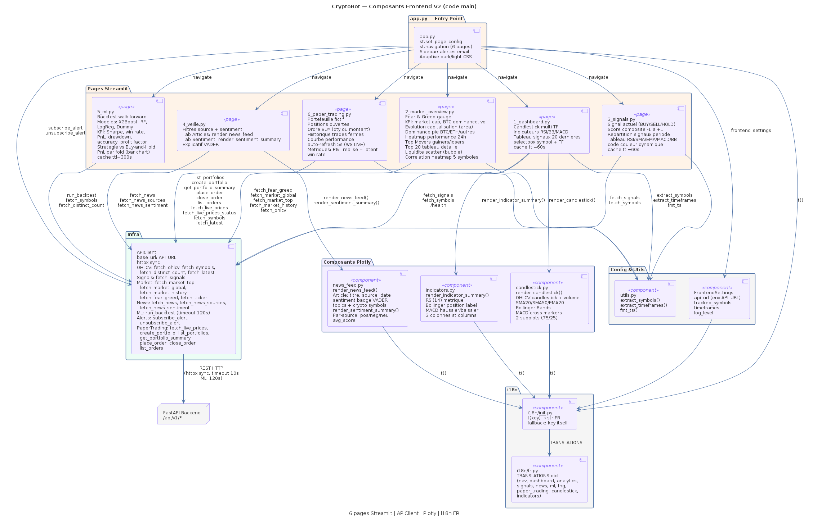

```plantuml
@startuml C05-frontend-components
' ============================================================
' CryptoBot — PlantUML Shared Skin & Stereotypes
' ============================================================

' --- Theme clair (lisible GitHub) ---
skinparam backgroundColor white
skinparam defaultFontName "Segoe UI, Helvetica, Arial, sans-serif"
skinparam defaultFontSize 12
skinparam defaultFontColor #333333
skinparam shadowing false
skinparam roundCorner 6

' --- Palette ---
' Bleu:   #4A6FA5
' Orange: #FEF3E8 (fond) / #E8943A (bordure)
' Vert:   #ECFDF5 (fond) / #34A853 (bordure)
' Violet: #F3EEFF (fond) / #7C5CFC (bordure)
' Gris:   #F5F5F5 (fond) / #CCCCCC (bordure)

' --- Component ---
skinparam component {
  BackgroundColor #F3EEFF
  BorderColor #7C5CFC
  FontColor #333333
  ArrowColor #4A6FA5
  StereotypeFontColor #7C5CFC
}

' --- Package ---
skinparam package {
  BackgroundColor #F5F5F5
  BorderColor #4A6FA5
  FontColor #333333
}

' --- Class ---
skinparam class {
  BackgroundColor #ECFDF5
  BorderColor #34A853
  FontColor #333333
  HeaderBackgroundColor #34A853
  HeaderFontColor white
  ArrowColor #4A6FA5
  StereotypeFontColor #7C5CFC
  AttributeFontColor #555555
}

' --- Sequence ---
skinparam sequence {
  ArrowColor #4A6FA5
  ActorBorderColor #7C5CFC
  LifeLineBorderColor #CCCCCC
  LifeLineBackgroundColor #F5F5F5
  ParticipantBorderColor #4A6FA5
  ParticipantBackgroundColor #F3EEFF
  ParticipantFontColor #333333
  BoxBorderColor #CCCCCC
  BoxBackgroundColor #F5F5F5
  DividerBackgroundColor #4A6FA5
  DividerFontColor white
}

' --- Activity ---
skinparam activity {
  BackgroundColor #FEF3E8
  BorderColor #E8943A
  FontColor #333333
  ArrowColor #4A6FA5
  DiamondBackgroundColor #F3EEFF
  DiamondBorderColor #7C5CFC
}

' --- Node (deployment) ---
skinparam node {
  BackgroundColor #F3EEFF
  BorderColor #7C5CFC
  FontColor #333333
}

' --- Database ---
skinparam database {
  BackgroundColor #ECFDF5
  BorderColor #34A853
  FontColor #333333
}

' --- Entity (ER) ---
skinparam entity {
  BackgroundColor white
  BorderColor #4A6FA5
  FontColor #333333
  HeaderBackgroundColor #4A6FA5
  HeaderFontColor white
}

' --- State ---
skinparam state {
  BackgroundColor #FEF3E8
  BorderColor #E8943A
  FontColor #333333
  ArrowColor #4A6FA5
}

' --- Usecase ---
skinparam usecase {
  BackgroundColor #F3EEFF
  BorderColor #7C5CFC
  FontColor #333333
  ArrowColor #4A6FA5
  ActorBorderColor #E8943A
}

' --- Note ---
skinparam note {
  BackgroundColor #FEF3E8
  BorderColor #E8943A
  FontColor #333333
}

' --- Legend ---
skinparam legend {
  BackgroundColor #F5F5F5
  BorderColor #CCCCCC
  FontColor #333333
}

' --- Stereotypes ---
' <<collector>>   ETL data collectors
' <<transformer>> ETL data transformers
' <<loader>>      ETL data loaders
' <<scheduler>>   APScheduler jobs
' <<rule>>        ML rule evaluator
' <<model>>       ML model
' <<router>>      FastAPI router
' <<service>>     FastAPI service
' <<middleware>>   FastAPI middleware
' <<page>>        Streamlit page
' <<component>>   Streamlit/Plotly component
' <<hypertable>>  TimescaleDB hypertable
' <<phase2>>      Phase 2 planned feature


title CryptoBot — Composants Frontend V2 (code main)
caption 6 pages Streamlit | APIClient | Plotly | i18n FR

' ============================================================
' Entry point
' ============================================================
package "app.py — Entry Point" #FEF3E8 {
  [app.py\nst.set_page_config\nst.navigation (6 pages)\nSidebar: alertes email\nAdaptive dark/light CSS] as app_entry
}

' ============================================================
' Configuration & helpers
' ============================================================
package "Config & Utils" #F5F5F5 {
  [FrontendSettings\napi_url (env API_URL)\ntracked_symbols\ntimeframes\nlog_level] as cfg <<component>>

  [utils.py\nextract_symbols()\nextract_timeframes()\nfmt_ts()] as utils <<component>>
}

' ============================================================
' i18n — FR seulement (pas d'EN dans le code main)
' ============================================================
package "i18n" #F5F5F5 {
  [i18n/fr.py\nTRANSLATIONS dict\n(nav, dashboard, analytics,\nsignals, news, ml, fng,\npaper_trading, candlestick,\nindicators)] as i18n_fr <<component>>

  [i18n/__init__.py\nt(key) → str FR\nfallback: key itself] as i18n_fn <<component>>
}

' ============================================================
' Pages Streamlit
' ============================================================
package "Pages Streamlit" #FEF3E8 {
  [1_dashboard.py\nCandlestick multi-TF\nIndicateurs RSI/BB/MACD\nTableau signaux 20 dernieres\nselectbox symbol + TF\ncache ttl=60s] as p_dash <<page>>

  [2_market_overview.py\nFear & Greed gauge\nKPI: market cap, BTC dominance, vol\nEvolution capitalisation (area)\nDominance pie BTC/ETH/autres\nHeatmap performance 24h\nTop Movers gainers/losers\nTop 20 tableau detaille\nLiquidite scatter (bubble)\nCorrelation heatmap 5 symboles] as p_market <<page>>

  [3_signals.py\nSignal actuel (BUY/SELL/HOLD)\nScore composite -1 a +1\nRepartition signaux periode\nTableau RSI/SMA/EMA/MACD/BB\ncode couleur dynamique\ncache ttl=60s] as p_signals <<page>>

  [4_veille.py\nFiltres source + sentiment\nTab Articles: render_news_feed\nTab Sentiment: render_sentiment_summary\nExplicatif VADER] as p_veille <<page>>

  [5_ml.py\nBacktest walk-forward\nModeles: XGBoost, RF,\nLogReg, Dummy\nKPI: Sharpe, win rate,\nPnL, drawdown,\naccuracy, profit factor\nStrategie vs Buy-and-Hold\nPnL par fold (bar chart)\ncache ttl=300s] as p_ml <<page>>

  [6_paper_trading.py\nPortefeuille fictif\nPositions ouvertes\nOrdre BUY (qty ou montant)\nHistorique trades fermes\nCourbe performance\nauto-refresh 5s (WS LIVE)\nMetriques: P&L realise + latent\nwin rate] as p_pt <<page>>
}

' ============================================================
' Composants Plotly/Streamlit
' ============================================================
package "Composants Plotly" #F3EEFF {
  [candlestick.py\nrender_candlestick()\nOHLCV candlestick + volume\nSMA20/SMA50/EMA20\nBollinger Bands\nMACD cross markers\n2 subplots (75/25)] as c_candle <<component>>

  [indicators.py\nrender_indicator_summary()\nRSI(14) metrique\nBollinger position label\nMACD haussier/baissier\n3 colonnes st.columns] as c_indic <<component>>

  [news_feed.py\nrender_news_feed()\nArticle: titre, source, date\nsentiment badge VADER\ntopics + crypto symbols\nrender_sentiment_summary()\nPar-source: pos/neg/neu\navg_score] as c_news <<component>>
}

' ============================================================
' APIClient
' ============================================================
package "Infra" #ECFDF5 {
  [APIClient\nbase_url: API_URL\nhttpx sync\nOHLCV: fetch_ohlcv, fetch_symbols,\n  fetch_distinct_count, fetch_latest\nSignals: fetch_signals\nMarket: fetch_market_top,\n  fetch_market_global,\n  fetch_market_history,\n  fetch_fear_greed, fetch_ticker\nNews: fetch_news, fetch_news_sources,\n  fetch_news_sentiment\nML: run_backtest (timeout 120s)\nAlerts: subscribe_alert,\n  unsubscribe_alert\nPaperTrading: fetch_live_prices,\n  create_portfolio, list_portfolios,\n  get_portfolio_summary,\n  place_order, close_order,\n  list_orders] as api_client
}

' ============================================================
' Backend FastAPI
' ============================================================
node "FastAPI Backend\n/api/v1/*" as fastapi #F5F5F5

' ============================================================
' Relations — app.py
' ============================================================
app_entry --> p_dash : navigate
app_entry --> p_market : navigate
app_entry --> p_signals : navigate
app_entry --> p_veille : navigate
app_entry --> p_ml : navigate
app_entry --> p_pt : navigate
app_entry --> api_client : subscribe_alert\nunsubscribe_alert
app_entry --> cfg : frontend_settings
app_entry --> i18n_fn : t()

' Config & i18n
cfg --> i18n_fn
i18n_fn --> i18n_fr : TRANSLATIONS

' Pages -> Composants
p_dash --> c_candle : render_candlestick()
p_dash --> c_indic : render_indicator_summary()
p_veille --> c_news : render_news_feed()\nrender_sentiment_summary()

' Pages -> Utils
p_dash --> utils : extract_symbols\nextract_timeframes\nfmt_ts
p_market --> utils
p_signals --> utils
p_pt --> utils

' Pages -> APIClient
p_dash --> api_client : fetch_signals\nfetch_symbols\n/health
p_market --> api_client : fetch_fear_greed\nfetch_market_global\nfetch_market_top\nfetch_market_history\nfetch_ohlcv
p_signals --> api_client : fetch_signals\nfetch_symbols
p_veille --> api_client : fetch_news\nfetch_news_sources\nfetch_news_sentiment
p_ml --> api_client : run_backtest\nfetch_symbols\nfetch_distinct_count
p_pt --> api_client : list_portfolios\ncreate_portfolio\nget_portfolio_summary\nplace_order\nclose_order\nlist_orders\nfetch_live_prices\nfetch_live_prices_status\nfetch_symbols\nfetch_latest

' Composants -> APIClient (via pages, pas en direct sauf import _DARK_LAYOUT)
c_candle --> i18n_fn : t()
c_indic --> i18n_fn : t()
c_news --> i18n_fn : t()

' APIClient -> Backend
api_client --> fastapi : REST HTTP\n(httpx sync, timeout 10s\nML: 120s)

@enduml
```

## C06-ml-backtesting-pipeline

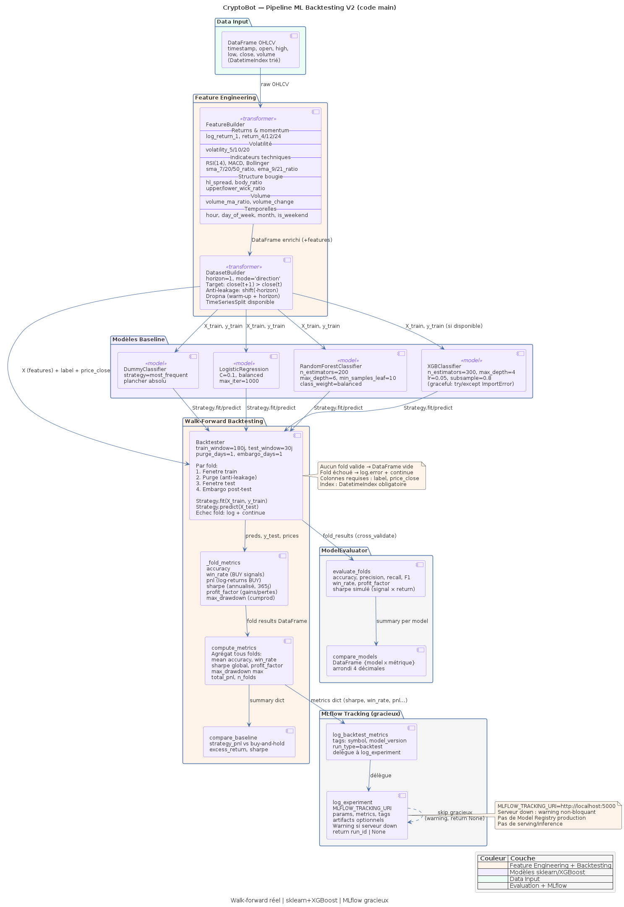

```plantuml
@startuml C06-ml-backtesting-pipeline
' ============================================================
' CryptoBot — PlantUML Shared Skin & Stereotypes
' ============================================================

' --- Theme clair (lisible GitHub) ---
skinparam backgroundColor white
skinparam defaultFontName "Segoe UI, Helvetica, Arial, sans-serif"
skinparam defaultFontSize 12
skinparam defaultFontColor #333333
skinparam shadowing false
skinparam roundCorner 6

' --- Palette ---
' Bleu:   #4A6FA5
' Orange: #FEF3E8 (fond) / #E8943A (bordure)
' Vert:   #ECFDF5 (fond) / #34A853 (bordure)
' Violet: #F3EEFF (fond) / #7C5CFC (bordure)
' Gris:   #F5F5F5 (fond) / #CCCCCC (bordure)

' --- Component ---
skinparam component {
  BackgroundColor #F3EEFF
  BorderColor #7C5CFC
  FontColor #333333
  ArrowColor #4A6FA5
  StereotypeFontColor #7C5CFC
}

' --- Package ---
skinparam package {
  BackgroundColor #F5F5F5
  BorderColor #4A6FA5
  FontColor #333333
}

' --- Class ---
skinparam class {
  BackgroundColor #ECFDF5
  BorderColor #34A853
  FontColor #333333
  HeaderBackgroundColor #34A853
  HeaderFontColor white
  ArrowColor #4A6FA5
  StereotypeFontColor #7C5CFC
  AttributeFontColor #555555
}

' --- Sequence ---
skinparam sequence {
  ArrowColor #4A6FA5
  ActorBorderColor #7C5CFC
  LifeLineBorderColor #CCCCCC
  LifeLineBackgroundColor #F5F5F5
  ParticipantBorderColor #4A6FA5
  ParticipantBackgroundColor #F3EEFF
  ParticipantFontColor #333333
  BoxBorderColor #CCCCCC
  BoxBackgroundColor #F5F5F5
  DividerBackgroundColor #4A6FA5
  DividerFontColor white
}

' --- Activity ---
skinparam activity {
  BackgroundColor #FEF3E8
  BorderColor #E8943A
  FontColor #333333
  ArrowColor #4A6FA5
  DiamondBackgroundColor #F3EEFF
  DiamondBorderColor #7C5CFC
}

' --- Node (deployment) ---
skinparam node {
  BackgroundColor #F3EEFF
  BorderColor #7C5CFC
  FontColor #333333
}

' --- Database ---
skinparam database {
  BackgroundColor #ECFDF5
  BorderColor #34A853
  FontColor #333333
}

' --- Entity (ER) ---
skinparam entity {
  BackgroundColor white
  BorderColor #4A6FA5
  FontColor #333333
  HeaderBackgroundColor #4A6FA5
  HeaderFontColor white
}

' --- State ---
skinparam state {
  BackgroundColor #FEF3E8
  BorderColor #E8943A
  FontColor #333333
  ArrowColor #4A6FA5
}

' --- Usecase ---
skinparam usecase {
  BackgroundColor #F3EEFF
  BorderColor #7C5CFC
  FontColor #333333
  ArrowColor #4A6FA5
  ActorBorderColor #E8943A
}

' --- Note ---
skinparam note {
  BackgroundColor #FEF3E8
  BorderColor #E8943A
  FontColor #333333
}

' --- Legend ---
skinparam legend {
  BackgroundColor #F5F5F5
  BorderColor #CCCCCC
  FontColor #333333
}

' --- Stereotypes ---
' <<collector>>   ETL data collectors
' <<transformer>> ETL data transformers
' <<loader>>      ETL data loaders
' <<scheduler>>   APScheduler jobs
' <<rule>>        ML rule evaluator
' <<model>>       ML model
' <<router>>      FastAPI router
' <<service>>     FastAPI service
' <<middleware>>   FastAPI middleware
' <<page>>        Streamlit page
' <<component>>   Streamlit/Plotly component
' <<hypertable>>  TimescaleDB hypertable
' <<phase2>>      Phase 2 planned feature


title CryptoBot — Pipeline ML Backtesting V2 (code main)
caption Walk-forward réel | sklearn+XGBoost | MLflow gracieux

' ============================================================
' Data Input
' ============================================================
package "Data Input" #ECFDF5 {
  [DataFrame OHLCV\ntimestamp, open, high,\nlow, close, volume\n(DatetimeIndex trié)] as ohlcv
}

' ============================================================
' Feature Engineering
' ============================================================
package "Feature Engineering" #FEF3E8 {
  [FeatureBuilder\n-- Returns & momentum --\nlog_return_1, return_4/12/24\n-- Volatilité --\nvolatility_5/10/20\n-- Indicateurs techniques --\nRSI(14), MACD, Bollinger\nsma_7/20/50_ratio, ema_9/21_ratio\n-- Structure bougie --\nhl_spread, body_ratio\nupper/lower_wick_ratio\n-- Volume --\nvolume_ma_ratio, volume_change\n-- Temporelles --\nhour, day_of_week, month, is_weekend] as feature_builder <<transformer>>

  [DatasetBuilder\nhorizon=1, mode='direction'\nTarget: close(t+1) > close(t)\nAnti-leakage: shift(-horizon)\nDropna (warm-up + horizon)\nTimeSeriesSplit disponible] as dataset_builder <<transformer>>
}

' ============================================================
' Models (sklearn Pipeline: StandardScaler + model)
' ============================================================
package "Modèles Baseline" #F3EEFF {
  [DummyClassifier\nstrategy=most_frequent\nplancher absolu] as dummy <<model>>
  [LogisticRegression\nC=0.1, balanced\nmax_iter=1000] as lr <<model>>
  [RandomForestClassifier\nn_estimators=200\nmax_depth=6, min_samples_leaf=10\nclass_weight=balanced] as rf <<model>>
  [XGBClassifier\nn_estimators=300, max_depth=4\nlr=0.05, subsample=0.8\n(graceful: try/except ImportError)] as xgb <<model>>
}

' ============================================================
' Walk-Forward Backtester
' ============================================================
package "Walk-Forward Backtesting" #FEF3E8 {
  [Backtester\ntrain_window=180j, test_window=30j\npurge_days=1, embargo_days=1\n\nPar fold:\n1. Fenetre train\n2. Purge (anti-leakage)\n3. Fenetre test\n4. Embargo post-test\n\nStrategy.fit(X_train, y_train)\nStrategy.predict(X_test)\nEchec fold: log + continue] as backtester

  [_fold_metrics\naccuracy\nwin_rate (BUY signals)\npnl (log-returns BUY)\nsharpe (annualisé, 365j)\nprofit_factor (gains/pertes)\nmax_drawdown (cumprod)] as fold_metrics

  [compute_metrics\nAgrégat tous folds:\nmean accuracy, win_rate\nsharpe global, profit_factor\nmax_drawdown max\ntotal_pnl, n_folds] as agg_metrics

  [compare_baseline\nstrategy_pnl vs buy-and-hold\nexcess_return, sharpe] as baseline_cmp
}

' ============================================================
' Evaluator (cross-validation complémentaire)
' ============================================================
package "ModelEvaluator" #F5F5F5 {
  [evaluate_folds\naccuracy, precision, recall, F1\nwin_rate, profit_factor\nsharpe simulé (signal × return)] as evaluator
  [compare_models\nDataFrame {model x métrique}\narrondi 4 décimales] as model_compare
}

' ============================================================
' MLflow (gracieux)
' ============================================================
package "MLflow Tracking (gracieux)" #F5F5F5 {
  [log_experiment\nMLFLOW_TRACKING_URI\nparams, metrics, tags\nartifacts optionnels\nWarning si serveur down\nreturn run_id | None] as mlflow_log

  [log_backtest_metrics\ntags: symbol, model_version\nrun_type=backtest\ndelègue à log_experiment] as mlflow_backtest
}

' ============================================================
' Relations
' ============================================================
ohlcv --> feature_builder : raw OHLCV
feature_builder --> dataset_builder : DataFrame enrichi (+features)
dataset_builder --> backtester : X (features) + label + price_close

dataset_builder --> dummy : X_train, y_train
dataset_builder --> lr : X_train, y_train
dataset_builder --> rf : X_train, y_train
dataset_builder --> xgb : X_train, y_train (si disponible)

dummy --> backtester : Strategy.fit/predict
lr --> backtester : Strategy.fit/predict
rf --> backtester : Strategy.fit/predict
xgb --> backtester : Strategy.fit/predict

backtester --> fold_metrics : preds, y_test, prices
fold_metrics --> agg_metrics : fold results DataFrame
agg_metrics --> baseline_cmp : summary dict

backtester --> evaluator : fold_results (cross_validate)
evaluator --> model_compare : summary per model

agg_metrics --> mlflow_backtest : metrics dict (sharpe, win_rate, pnl...)
mlflow_backtest --> mlflow_log : délègue
mlflow_log ..> mlflow_log : skip gracieux\n(warning, return None)

note right of backtester
  Aucun fold valide → DataFrame vide
  Fold échoué → log.error + continue
  Colonnes requises : label, price_close
  Index : DatetimeIndex obligatoire
end note

note right of mlflow_log
  MLFLOW_TRACKING_URI=http://localhost:5000
  Serveur down : warning non-bloquant
  Pas de Model Registry production
  Pas de serving/inference
end note

legend bottom right
  |= Couleur |= Couche |
  | <#FEF3E8> | Feature Engineering + Backtesting |
  | <#F3EEFF> | Modèles sklearn/XGBoost |
  | <#ECFDF5> | Data Input |
  | <#F5F5F5> | Evaluation + MLflow |
endlegend

@enduml
```

## C07-backlog-v3

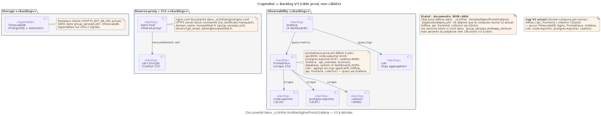

```plantuml
@startuml C07-backlog-v3
' ============================================================
' CryptoBot — PlantUML Shared Skin & Stereotypes
' ============================================================

' --- Theme clair (lisible GitHub) ---
skinparam backgroundColor white
skinparam defaultFontName "Segoe UI, Helvetica, Arial, sans-serif"
skinparam defaultFontSize 12
skinparam defaultFontColor #333333
skinparam shadowing false
skinparam roundCorner 6

' --- Palette ---
' Bleu:   #4A6FA5
' Orange: #FEF3E8 (fond) / #E8943A (bordure)
' Vert:   #ECFDF5 (fond) / #34A853 (bordure)
' Violet: #F3EEFF (fond) / #7C5CFC (bordure)
' Gris:   #F5F5F5 (fond) / #CCCCCC (bordure)

' --- Component ---
skinparam component {
  BackgroundColor #F3EEFF
  BorderColor #7C5CFC
  FontColor #333333
  ArrowColor #4A6FA5
  StereotypeFontColor #7C5CFC
}

' --- Package ---
skinparam package {
  BackgroundColor #F5F5F5
  BorderColor #4A6FA5
  FontColor #333333
}

' --- Class ---
skinparam class {
  BackgroundColor #ECFDF5
  BorderColor #34A853
  FontColor #333333
  HeaderBackgroundColor #34A853
  HeaderFontColor white
  ArrowColor #4A6FA5
  StereotypeFontColor #7C5CFC
  AttributeFontColor #555555
}

' --- Sequence ---
skinparam sequence {
  ArrowColor #4A6FA5
  ActorBorderColor #7C5CFC
  LifeLineBorderColor #CCCCCC
  LifeLineBackgroundColor #F5F5F5
  ParticipantBorderColor #4A6FA5
  ParticipantBackgroundColor #F3EEFF
  ParticipantFontColor #333333
  BoxBorderColor #CCCCCC
  BoxBackgroundColor #F5F5F5
  DividerBackgroundColor #4A6FA5
  DividerFontColor white
}

' --- Activity ---
skinparam activity {
  BackgroundColor #FEF3E8
  BorderColor #E8943A
  FontColor #333333
  ArrowColor #4A6FA5
  DiamondBackgroundColor #F3EEFF
  DiamondBorderColor #7C5CFC
}

' --- Node (deployment) ---
skinparam node {
  BackgroundColor #F3EEFF
  BorderColor #7C5CFC
  FontColor #333333
}

' --- Database ---
skinparam database {
  BackgroundColor #ECFDF5
  BorderColor #34A853
  FontColor #333333
}

' --- Entity (ER) ---
skinparam entity {
  BackgroundColor white
  BorderColor #4A6FA5
  FontColor #333333
  HeaderBackgroundColor #4A6FA5
  HeaderFontColor white
}

' --- State ---
skinparam state {
  BackgroundColor #FEF3E8
  BorderColor #E8943A
  FontColor #333333
  ArrowColor #4A6FA5
}

' --- Usecase ---
skinparam usecase {
  BackgroundColor #F3EEFF
  BorderColor #7C5CFC
  FontColor #333333
  ArrowColor #4A6FA5
  ActorBorderColor #E8943A
}

' --- Note ---
skinparam note {
  BackgroundColor #FEF3E8
  BorderColor #E8943A
  FontColor #333333
}

' --- Legend ---
skinparam legend {
  BackgroundColor #F5F5F5
  BorderColor #CCCCCC
  FontColor #333333
}

' --- Stereotypes ---
' <<collector>>   ETL data collectors
' <<transformer>> ETL data transformers
' <<loader>>      ETL data loaders
' <<scheduler>>   APScheduler jobs
' <<rule>>        ML rule evaluator
' <<model>>       ML model
' <<router>>      FastAPI router
' <<service>>     FastAPI service
' <<middleware>>   FastAPI middleware
' <<page>>        Streamlit page
' <<component>>   Streamlit/Plotly component
' <<hypertable>>  TimescaleDB hypertable
' <<phase2>>      Phase 2 planned feature


title CryptoBot — Backlog V3 (cible prod, non câblée)
caption Documenté dans _v1/infra/ Ansible/Nginx/Prom/Grafana — V3 à décider

' ============================================================
' C07 — Backlog V3 : cibles prod documentées, non câblées
' ============================================================
'
' PIVOT NOTE:
' Ce diagramme REMPLACE le phantom "Phase 2 Roadmap" de la V1
' (LSTM/RL/DriftDetector — OBSOLETE).
' Sujet V2 = court backlog des cibles prod documentées dans
' _v1/infra/ (Ansible/Nginx/Prometheus/Grafana) mais NON
' câblées dans playbooks/deploy.yml ni dans docker-compose.yml
' racine.
' ============================================================

note as N_PIVOT
  **Statut : documenté, NON câblé**
  Cible prod définie dans `_v1/infra/` (Ansible/Nginx/Prom/Grafana).
  `playbooks/deploy.yml` ne déploie que le compose racine V2 actuel
  (mlflow, api, frontend, collector via SQLite).
  Les services listés ici sont dans `group_vars/vps.yml#app_services`
  mais absents du playbook réel. Décisions V3 à venir.
end note

package "Storage <<backlog>>" {
  component "TimescaleDB\n(PostgreSQL + extension)" <<hypertable>> as TSB
  note right of TSB
    Remplace SQLite (CRYPTO_BOT_DB_URL actuel).
    Défini dans group_vars/vps.yml : timescaledb.
    Hypertables sur ohlcv / signals.
  end note
}

package "Reverse-proxy + TLS <<backlog>>" {
  component "Nginx host\n(reverse-proxy)" <<backlog>> as NGX
  component "Let's Encrypt\n(Certbot TLS)" <<backlog>> as LE
  note right of NGX
    nginx.conf documenté dans _v1/infra/nginx/nginx.conf.
    HTTPS server block commenté (ssl_certificate manquant).
    domain_name: monpetitbet.fr (group_vars/vps.yml).
    letsencrypt_email: admin@monpetitbet.fr.
  end note
  NGX --> LE : "renouvellement cert"
}

package "Observability <<backlog>>" {
  component "Prometheus\n(scrape 15s)" <<backlog>> as PROM
  component "Grafana\n(4 dashboards)" <<backlog>> as GRAF
  component "Loki\n(logs aggregation)" <<backlog>> as LOKI
  component "node-exporter\n(:9100)" <<backlog>> as NODE
  component "postgres-exporter\n(:9187)" <<backlog>> as PGEXP
  component "cadvisor\n(:8080)" <<backlog>> as CADV
  note right of PROM
    prometheus.prod.yml définit 4 jobs :
    api:8000, node-exporter:9100,
    postgres-exporter:9187, cadvisor:8080.
    Grafana : api_overview, business,
    database, system (4 dashboards JSON).
    Loki : agrège les logs applicatifs (mlflow,
    api, frontend, collector) — query via Grafana.
  end note
  PROM --> NODE : scrape
  PROM --> PGEXP : scrape
  PROM --> CADV : scrape
  GRAF --> PROM : query metrics
  GRAF --> LOKI : query logs
}


' Gap V2 -> V3 visible : compose racine n'a pas ces services
note as N_GAP
  **Gap V2 actuel** (docker-compose.yml racine) :
  mlflow | api | frontend | collector (SQLite)
  — aucun TimescaleDB, Nginx, Prometheus, Grafana,
  Loki, node-exporter, postgres-exporter, cadvisor.
end note

@enduml
```

## CL01-pydantic-models

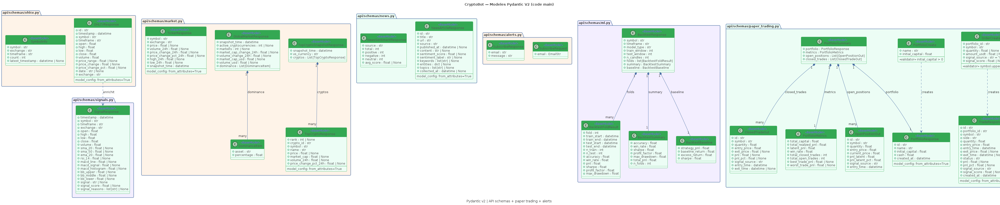

```plantuml
@startuml CL01-pydantic-models
' ============================================================
' CryptoBot — PlantUML Shared Skin & Stereotypes
' ============================================================

' --- Theme clair (lisible GitHub) ---
skinparam backgroundColor white
skinparam defaultFontName "Segoe UI, Helvetica, Arial, sans-serif"
skinparam defaultFontSize 12
skinparam defaultFontColor #333333
skinparam shadowing false
skinparam roundCorner 6

' --- Palette ---
' Bleu:   #4A6FA5
' Orange: #FEF3E8 (fond) / #E8943A (bordure)
' Vert:   #ECFDF5 (fond) / #34A853 (bordure)
' Violet: #F3EEFF (fond) / #7C5CFC (bordure)
' Gris:   #F5F5F5 (fond) / #CCCCCC (bordure)

' --- Component ---
skinparam component {
  BackgroundColor #F3EEFF
  BorderColor #7C5CFC
  FontColor #333333
  ArrowColor #4A6FA5
  StereotypeFontColor #7C5CFC
}

' --- Package ---
skinparam package {
  BackgroundColor #F5F5F5
  BorderColor #4A6FA5
  FontColor #333333
}

' --- Class ---
skinparam class {
  BackgroundColor #ECFDF5
  BorderColor #34A853
  FontColor #333333
  HeaderBackgroundColor #34A853
  HeaderFontColor white
  ArrowColor #4A6FA5
  StereotypeFontColor #7C5CFC
  AttributeFontColor #555555
}

' --- Sequence ---
skinparam sequence {
  ArrowColor #4A6FA5
  ActorBorderColor #7C5CFC
  LifeLineBorderColor #CCCCCC
  LifeLineBackgroundColor #F5F5F5
  ParticipantBorderColor #4A6FA5
  ParticipantBackgroundColor #F3EEFF
  ParticipantFontColor #333333
  BoxBorderColor #CCCCCC
  BoxBackgroundColor #F5F5F5
  DividerBackgroundColor #4A6FA5
  DividerFontColor white
}

' --- Activity ---
skinparam activity {
  BackgroundColor #FEF3E8
  BorderColor #E8943A
  FontColor #333333
  ArrowColor #4A6FA5
  DiamondBackgroundColor #F3EEFF
  DiamondBorderColor #7C5CFC
}

' --- Node (deployment) ---
skinparam node {
  BackgroundColor #F3EEFF
  BorderColor #7C5CFC
  FontColor #333333
}

' --- Database ---
skinparam database {
  BackgroundColor #ECFDF5
  BorderColor #34A853
  FontColor #333333
}

' --- Entity (ER) ---
skinparam entity {
  BackgroundColor white
  BorderColor #4A6FA5
  FontColor #333333
  HeaderBackgroundColor #4A6FA5
  HeaderFontColor white
}

' --- State ---
skinparam state {
  BackgroundColor #FEF3E8
  BorderColor #E8943A
  FontColor #333333
  ArrowColor #4A6FA5
}

' --- Usecase ---
skinparam usecase {
  BackgroundColor #F3EEFF
  BorderColor #7C5CFC
  FontColor #333333
  ArrowColor #4A6FA5
  ActorBorderColor #E8943A
}

' --- Note ---
skinparam note {
  BackgroundColor #FEF3E8
  BorderColor #E8943A
  FontColor #333333
}

' --- Legend ---
skinparam legend {
  BackgroundColor #F5F5F5
  BorderColor #CCCCCC
  FontColor #333333
}

' --- Stereotypes ---
' <<collector>>   ETL data collectors
' <<transformer>> ETL data transformers
' <<loader>>      ETL data loaders
' <<scheduler>>   APScheduler jobs
' <<rule>>        ML rule evaluator
' <<model>>       ML model
' <<router>>      FastAPI router
' <<service>>     FastAPI service
' <<middleware>>   FastAPI middleware
' <<page>>        Streamlit page
' <<component>>   Streamlit/Plotly component
' <<hypertable>>  TimescaleDB hypertable
' <<phase2>>      Phase 2 planned feature


title CryptoBot — Modeles Pydantic V2 (code main)
caption Pydantic v2 | API schemas + paper trading + alerts

' ============================================================
' OHLCV & Market
' ============================================================
package "api/schemas/ohlcv.py" #FEF3E8 {

  class OHLCVResponse <<BaseModel>> {
    + id : str
    + timestamp : datetime
    + symbol : str
    + timeframe : str
    + open : float
    + high : float
    + low : float
    + close : float
    + volume : float
    + price_range : float | None
    + price_change : float | None
    + price_change_pct : float | None
    + date : str | None
    + exchange : str
    --
    model_config: from_attributes=True
  }

  class SymbolInfo <<BaseModel>> {
    + symbol : str
    + exchange : str
    + timeframe : str
    + count : int
    + latest_timestamp : datetime | None
  }
}

' ============================================================
' Market
' ============================================================
package "api/schemas/market.py" #FEF3E8 {

  class TopCryptoResponse <<BaseModel>> {
    + rank : int | None
    + crypto_id : str
    + symbol : str
    + name : str
    + price : float | None
    + market_cap : float | None
    + volume_24h : float | None
    + price_change_pct_24h : float | None
    --
    model_config: from_attributes=True
  }

  class TopCryptoSnapshotResponse <<BaseModel>> {
    + snapshot_time : datetime
    + vs_currency : str
    + cryptos : List[TopCryptoResponse]
  }

  class DominanceItem <<BaseModel>> {
    + asset : str
    + percentage : float
  }

  class GlobalMarketResponse <<BaseModel>> {
    + snapshot_time : datetime
    + active_cryptocurrencies : int | None
    + markets : int | None
    + market_cap_change_24h : float | None
    + volume_change_24h : float | None
    + market_cap_usd : float | None
    + volume_usd : float | None
    + dominance : List[DominanceItem]
  }

  class TickerResponse <<BaseModel>> {
    + symbol : str
    + exchange : str
    + price : float | None
    + volume_24h : float | None
    + price_change_24h : float | None
    + price_change_pct_24h : float | None
    + high_24h : float | None
    + low_24h : float | None
    + snapshot_time : datetime
    --
    model_config: from_attributes=True
  }
}

' ============================================================
' Signals
' ============================================================
package "api/schemas/signals.py" #F3EEFF {

  class SignalResponse <<BaseModel>> {
    + timestamp : datetime
    + symbol : str
    + timeframe : str
    + exchange : str
    + open : float
    + high : float
    + low : float
    + close : float
    + volume : float
    + sma_20 : float | None
    + sma_50 : float | None
    + ema_20 : float | None
    + rsi_14 : float | None
    + macd_line : float | None
    + macd_signal : float | None
    + macd_histogram : float | None
    + bb_upper : float | None
    + bb_middle : float | None
    + bb_lower : float | None
    + signal : str | None
    + signal_score : float | None
    + signal_reasons : list[str] | None
  }
}

' ============================================================
' News
' ============================================================
package "api/schemas/news.py" #ECFDF5 {

  class NewsArticleResponse <<BaseModel>> {
    + id : str
    + title : str
    + url : str
    + source : str
    + published_at : datetime | None
    + content : str | None
    + sentiment_score : float | None
    + sentiment_label : str | None
    + keywords : list[str] | None
    + entities : dict | None
    + topics : list[str] | None
    + collected_at : datetime | None
    --
    model_config: from_attributes=True
  }

  class NewsSentimentResponse <<BaseModel>> {
    + source : str
    + total : int
    + positive : int
    + negative : int
    + neutral : int
    + avg_score : float | None
  }
}

' ============================================================
' Alerts / Subscriptions
' ============================================================
package "api/schemas/alerts.py" #FEF3E8 {

  class SubscribeRequest <<BaseModel>> {
    + email : EmailStr
  }

  class SubscribeResponse <<BaseModel>> {
    + email : str
    + message : str
  }
}

' ============================================================
' ML / Backtesting
' ============================================================
package "api/schemas/ml.py" #F3EEFF {

  class BacktestFoldResult <<BaseModel>> {
    + fold : int
    + train_start : datetime
    + train_end : datetime
    + test_start : datetime
    + test_end : datetime
    + n_train : int
    + n_test : int
    + accuracy : float
    + win_rate : float
    + pnl : float
    + sharpe : float
    + profit_factor : float
    + max_drawdown : float
  }

  class BacktestSummary <<BaseModel>> {
    + accuracy : float
    + win_rate : float
    + sharpe : float
    + profit_factor : float
    + max_drawdown : float
    + total_pnl : float
    + n_folds : int
  }

  class BacktestBaseline <<BaseModel>> {
    + strategy_pnl : float
    + baseline_return : float
    + excess_return : float
    + sharpe : float
  }

  class BacktestResponse <<BaseModel>> {
    + symbol : str
    + timeframe : str
    + model_type : str
    + train_window : int
    + test_window : int
    + n_candles : int
    + folds : list[BacktestFoldResult]
    + summary : BacktestSummary
    + baseline : BacktestBaseline
  }
}

' ============================================================
' Paper Trading
' ============================================================
package "api/schemas/paper_trading.py" #ECFDF5 {

  class PortfolioCreate <<BaseModel>> {
    + name : str
    + initial_capital : float
    --
    <<validator>> initial_capital > 0
  }

  class PortfolioResponse <<BaseModel>> {
    + id : str
    + name : str
    + initial_capital : float
    + cash : float
    + created_at : datetime
    --
    model_config: from_attributes=True
  }

  class OrderCreate <<BaseModel>> {
    + portfolio_id : str
    + symbol : str
    + quantity : float | None
    + amount_usdt : float | None
    + signal_source : str = "manual"
    + signal_score : float | None
    --
    <<validator>> symbol.upper()
  }

  class TradeResponse <<BaseModel>> {
    + id : str
    + portfolio_id : str
    + symbol : str
    + side : str
    + quantity : float
    + entry_price : float
    + entry_time : datetime
    + exit_price : float | None
    + exit_time : datetime | None
    + status : str
    + pnl : float | None
    + pnl_pct : float | None
    + signal_source : str
    + signal_score : float | None
    + created_at : datetime
    --
    model_config: from_attributes=True
  }

  class OpenPositionOut <<BaseModel>> {
    + id : str
    + symbol : str
    + quantity : float
    + entry_price : float
    + current_price : float
    + pnl_latent : float
    + pnl_latent_pct : float
    + signal_source : str
    + entry_time : datetime
  }

  class ClosedTradeOut <<BaseModel>> {
    + id : str
    + symbol : str
    + quantity : float
    + entry_price : float
    + exit_price : float | None
    + pnl : float | None
    + pnl_pct : float | None
    + signal_source : str
    + entry_time : datetime
    + exit_time : datetime | None
  }

  class PortfolioMetrics <<BaseModel>> {
    + total_capital : float
    + total_realized_pnl : float
    + latent_pnl : float
    + win_rate : float
    + total_closed_trades : int
    + total_open_trades : int
    + best_trade_pnl : float | None
    + worst_trade_pnl : float | None
  }

  class PortfolioSummary <<BaseModel>> {
    + portfolio : PortfolioResponse
    + metrics : PortfolioMetrics
    + open_positions : List[OpenPositionOut]
    + closed_trades : List[ClosedTradeOut]
  }
}

' ============================================================
' Relations
' ============================================================
TopCryptoSnapshotResponse "1" *-- "many" TopCryptoResponse : cryptos
GlobalMarketResponse "1" *-- "many" DominanceItem : dominance
BacktestResponse "1" *-- "many" BacktestFoldResult : folds
BacktestResponse "1" *-- "1" BacktestSummary : summary
BacktestResponse "1" *-- "1" BacktestBaseline : baseline
PortfolioSummary "1" *-- "1" PortfolioResponse : portfolio
PortfolioSummary "1" *-- "1" PortfolioMetrics : metrics
PortfolioSummary "1" *-- "many" OpenPositionOut : open_positions
PortfolioSummary "1" *-- "many" ClosedTradeOut : closed_trades
OrderCreate ..> TradeResponse : creates
PortfolioCreate ..> PortfolioResponse : creates
OHLCVResponse ..> SignalResponse : enrichit

@enduml
```

## CL02-orm-models

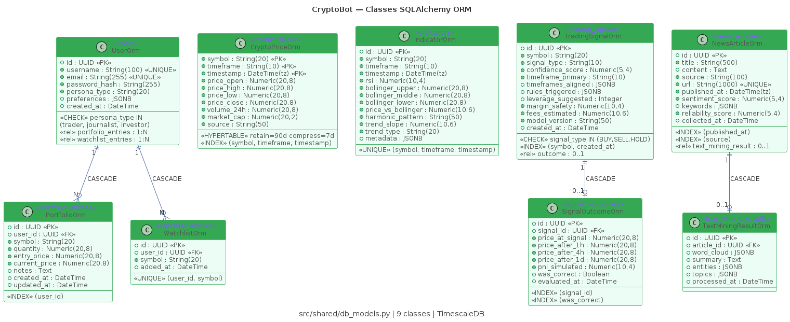

```plantuml
@startuml CL02-orm-models
' ============================================================
' CryptoBot — PlantUML Shared Skin & Stereotypes
' ============================================================

' --- Theme clair (lisible GitHub) ---
skinparam backgroundColor white
skinparam defaultFontName "Segoe UI, Helvetica, Arial, sans-serif"
skinparam defaultFontSize 12
skinparam defaultFontColor #333333
skinparam shadowing false
skinparam roundCorner 6

' --- Palette ---
' Bleu:   #4A6FA5
' Orange: #FEF3E8 (fond) / #E8943A (bordure)
' Vert:   #ECFDF5 (fond) / #34A853 (bordure)
' Violet: #F3EEFF (fond) / #7C5CFC (bordure)
' Gris:   #F5F5F5 (fond) / #CCCCCC (bordure)

' --- Component ---
skinparam component {
  BackgroundColor #F3EEFF
  BorderColor #7C5CFC
  FontColor #333333
  ArrowColor #4A6FA5
  StereotypeFontColor #7C5CFC
}

' --- Package ---
skinparam package {
  BackgroundColor #F5F5F5
  BorderColor #4A6FA5
  FontColor #333333
}

' --- Class ---
skinparam class {
  BackgroundColor #ECFDF5
  BorderColor #34A853
  FontColor #333333
  HeaderBackgroundColor #34A853
  HeaderFontColor white
  ArrowColor #4A6FA5
  StereotypeFontColor #7C5CFC
  AttributeFontColor #555555
}

' --- Sequence ---
skinparam sequence {
  ArrowColor #4A6FA5
  ActorBorderColor #7C5CFC
  LifeLineBorderColor #CCCCCC
  LifeLineBackgroundColor #F5F5F5
  ParticipantBorderColor #4A6FA5
  ParticipantBackgroundColor #F3EEFF
  ParticipantFontColor #333333
  BoxBorderColor #CCCCCC
  BoxBackgroundColor #F5F5F5
  DividerBackgroundColor #4A6FA5
  DividerFontColor white
}

' --- Activity ---
skinparam activity {
  BackgroundColor #FEF3E8
  BorderColor #E8943A
  FontColor #333333
  ArrowColor #4A6FA5
  DiamondBackgroundColor #F3EEFF
  DiamondBorderColor #7C5CFC
}

' --- Node (deployment) ---
skinparam node {
  BackgroundColor #F3EEFF
  BorderColor #7C5CFC
  FontColor #333333
}

' --- Database ---
skinparam database {
  BackgroundColor #ECFDF5
  BorderColor #34A853
  FontColor #333333
}

' --- Entity (ER) ---
skinparam entity {
  BackgroundColor white
  BorderColor #4A6FA5
  FontColor #333333
  HeaderBackgroundColor #4A6FA5
  HeaderFontColor white
}

' --- State ---
skinparam state {
  BackgroundColor #FEF3E8
  BorderColor #E8943A
  FontColor #333333
  ArrowColor #4A6FA5
}

' --- Usecase ---
skinparam usecase {
  BackgroundColor #F3EEFF
  BorderColor #7C5CFC
  FontColor #333333
  ArrowColor #4A6FA5
  ActorBorderColor #E8943A
}

' --- Note ---
skinparam note {
  BackgroundColor #FEF3E8
  BorderColor #E8943A
  FontColor #333333
}

' --- Legend ---
skinparam legend {
  BackgroundColor #F5F5F5
  BorderColor #CCCCCC
  FontColor #333333
}

' --- Stereotypes ---
' <<collector>>   ETL data collectors
' <<transformer>> ETL data transformers
' <<loader>>      ETL data loaders
' <<scheduler>>   APScheduler jobs
' <<rule>>        ML rule evaluator
' <<model>>       ML model
' <<router>>      FastAPI router
' <<service>>     FastAPI service
' <<middleware>>   FastAPI middleware
' <<page>>        Streamlit page
' <<component>>   Streamlit/Plotly component
' <<hypertable>>  TimescaleDB hypertable
' <<phase2>>      Phase 2 planned feature


title CryptoBot — Modèles ORM SQLAlchemy V2 (SQLite)
caption Tables réelles dans src/models/ | SQLite engine

' ============================================================
' Bases SQLAlchemy
' ============================================================

package "SQLAlchemy Bases" <<Frame>> {

  class MarketDataBase <<declarative_base>> {
    ' Base partagée : GlobalMarketSnapshot, GlobalMarketCap,
    ' GlobalMarketVolume, GlobalMarketDominance,
    ' TopCryptoSnapshot, TopCrypto,
    ' CryptoDetailSnapshot, CryptoDetail
  }

  class OHLCVBase <<declarative_base>> {
    ' Base isolée pour OHLCV
  }

  class TickerBase <<declarative_base>> {
    ' Base isolée pour TickerSnapshot
  }

  class PaperTradeBase <<declarative_base>> {
    ' Base isolée pour PaperPortfolio / PaperTrade
  }

  class AlertSubscriberBase <<declarative_base>> {
    ' Base isolée pour AlertSubscriber
  }

  class NewsBase <<declarative_base>> {
    ' Base isolée pour NewsArticle
  }
}

' ============================================================
' Groupe Market Global (MarketDataBase)
' ============================================================

package "Global Market (MarketDataBase)" <<Frame>> {

  class GlobalMarketSnapshot <<table>> {
    + id : Integer [PK, autoincrement]
    --
    timestamp : DateTime [UNIQUE, INDEX]
    active_cryptocurrencies : Integer
    upcoming_icos : Integer
    ongoing_icos : Integer
    ended_icos : Integer
    markets : Integer
    market_cap_change_24h : Float
    volume_change_24h : Float
    created_at : DateTime
    ==
    __tablename__ = "global_market_snapshot"
  }

  class GlobalMarketCap <<table>> {
    + id : Integer [PK]
    --
    snapshot_id : Integer [FK -> global_market_snapshot.id, INDEX]
    currency : String(10) [INDEX]
    value : Float
    ==
    __tablename__ = "global_market_cap"
    idx_marketcap_snapshot_currency(snapshot_id, currency)
  }

  class GlobalMarketVolume <<table>> {
    + id : Integer [PK]
    --
    snapshot_id : Integer [FK -> global_market_snapshot.id, INDEX]
    currency : String(10) [INDEX]
    value : Float
    ==
    __tablename__ = "global_market_volume"
    idx_volume_snapshot_currency(snapshot_id, currency)
  }

  class GlobalMarketDominance <<table>> {
    + id : Integer [PK]
    --
    snapshot_id : Integer [FK -> global_market_snapshot.id, INDEX]
    asset : String(10) [INDEX]
    percentage : Float
    ==
    __tablename__ = "global_market_dominance"
    idx_dominance_snapshot_asset(snapshot_id, asset)
  }
}

' ============================================================
' Groupe Top Crypto (MarketDataBase)
' ============================================================

package "Top Crypto (MarketDataBase)" <<Frame>> {

  class TopCryptoSnapshot <<table>> {
    + id : Integer [PK, autoincrement]
    --
    snapshot_time : DateTime
    vs_currency : String(10)
    ==
    __tablename__ = "top_crypto_snapshot"
  }

  class TopCrypto <<table>> {
    + id : Integer [PK, autoincrement]
    --
    snapshot_id : Integer [FK -> top_crypto_snapshot.id]
    rank : Integer
    crypto_id : String(50)
    symbol : String(20)
    name : String(50)
    market_cap : Float
    price : Float
    volume_24h : Float
    price_change_pct_24h : Float
    ==
    __tablename__ = "top_crypto"
    idx_top_crypto_snapshot_id(snapshot_id)
    idx_top_crypto_rank(rank)
    idx_top_crypto_symbol(symbol)
  }
}

' ============================================================
' Groupe Crypto Detail (MarketDataBase)
' ============================================================

package "Crypto Detail (MarketDataBase)" <<Frame>> {

  class CryptoDetailSnapshot <<table>> {
    + id : Integer [PK, autoincrement]
    --
    snapshot_time : DateTime
    cryptos_count : Integer
    ==
    __tablename__ = "crypto_detail_snapshot"
  }

  class CryptoDetail <<table>> {
    + id : Integer [PK, autoincrement]
    --
    snapshot_id : Integer [FK -> crypto_detail_snapshot.id]
    crypto_id : String(50)
    symbol : String(20)
    name : String(100)
    rank : Integer
    categories : String(500)
    genesis_date : String(20)
    hashing_algorithm : String(100)
    block_time_minutes : Integer
    image_large : String(500)
    image_small : String(500)
    links_homepage : String(1000)
    links_blockchain_site : String(2000)
    links_whitepaper : String(500)
    links_reddit : String(500)
    links_twitter : String(100)
    community_twitter : Integer
    community_reddit : Integer
    community_facebook : Integer
    developer_stars : Integer
    developer_forks : Integer
    developer_subscribers : Integer
    developer_issues : Integer
    developer_pull_requests : Integer
    market_cap_rank : Integer
    market_cap : Float
    total_volume : Float
    high_24h : Float
    low_24h : Float
    price_change_24h : Float
    price_change_pct_24h : Float
    ath_price : Float
    ath_date : String(30)
    ath_change_pct : Float
    atl_price : Float
    atl_date : String(30)
    atl_change_pct : Float
    circulating_supply : Float
    total_supply : Float
    max_supply : Float
    last_updated : DateTime
    ==
    __tablename__ = "crypto_detail"
    idx_crypto_detail_snapshot_id(snapshot_id)
    idx_crypto_detail_crypto_id(crypto_id)
    idx_crypto_detail_symbol(symbol)
    idx_crypto_detail_rank(rank)
  }
}

' ============================================================
' OHLCV (OHLCVBase — base isolée)
' ============================================================

package "OHLCV (OHLCVBase)" <<Frame>> {

  class OHLCV <<table>> {
    + id : String(36) [PK, UUID]
    --
    timestamp : DateTime
    symbol : String(20)
    timeframe : String(10)
    open : Float
    high : Float
    low : Float
    close : Float
    volume : Float
    price_range : Float
    price_change : Float
    price_change_pct : Float
    date : String(10)
    exchange : String(20)
    created_at : DateTime
    updated_at : DateTime
    ==
    __tablename__ = "ohlcv"
    idx_ohlcv_symbol_timeframe(symbol, timeframe)
    idx_ohlcv_timestamp(timestamp)
    idx_ohlcv_symbol_timestamp(symbol, timestamp)
  }
}

' ============================================================
' Ticker (TickerBase — base isolée)
' ============================================================

package "Ticker (TickerBase)" <<Frame>> {

  class TickerSnapshot <<table>> {
    + id : String(36) [PK, UUID]
    --
    snapshot_time : DateTime
    symbol : String(20)
    exchange : String(20)
    price : Float
    volume_24h : Float
    price_change_24h : Float
    price_change_pct_24h : Float
    high_24h : Float
    low_24h : Float
    created_at : DateTime
    ==
    __tablename__ = "ticker_snapshots"
    idx_ticker_snapshot_time(snapshot_time)
    idx_ticker_symbol_time(symbol, snapshot_time)
  }
}

' ============================================================
' Paper Trading (PaperTradeBase — base isolée)
' ============================================================

package "Paper Trading (PaperTradeBase)" <<Frame>> {

  class PaperPortfolio <<table>> {
    + id : String(36) [PK, UUID]
    --
    name : String(100)
    initial_capital : Float
    cash : Float
    created_at : DateTime
    ==
    __tablename__ = "paper_portfolios"
  }

  class PaperTrade <<table>> {
    + id : String(36) [PK, UUID]
    --
    portfolio_id : String(36) [FK -> paper_portfolios.id]
    symbol : String(20)
    side : String(4)
    quantity : Float
    entry_price : Float
    entry_time : DateTime
    exit_price : Float
    exit_time : DateTime
    status : String(6)
    pnl : Float
    pnl_pct : Float
    signal_source : String(50)
    signal_score : Float
    created_at : DateTime
    ==
    __tablename__ = "paper_trades"
    idx_paper_trades_portfolio(portfolio_id)
    idx_paper_trades_status(status)
    idx_paper_trades_symbol(symbol)
  }
}

' ============================================================
' Alertes (AlertSubscriberBase — base isolée)
' ============================================================

package "Alertes (AlertSubscriberBase)" <<Frame>> {

  class AlertSubscriber <<table>> {
    + id : Integer [PK, INDEX]
    --
    email : String [UNIQUE, INDEX]
    active : Boolean
    created_at : DateTime
    ==
    __tablename__ = "alert_subscribers"
  }
}

' ============================================================
' News (NewsBase — base isolée)
' ============================================================

package "News (NewsBase)" <<Frame>> {

  class NewsArticle <<table>> {
    + id : String(36) [PK, UUID]
    --
    title : String(500)
    url : String(1000) [UNIQUE]
    source : String(150)
    published_at : DateTime
    content : Text
    sentiment_score : Float
    sentiment_label : String(20)
    keywords : JSON
    entities : JSON
    topics : JSON
    collected_at : DateTime
    ==
    __tablename__ = "news_articles"
  }
}

' ============================================================
' Relations (Foreign Keys)
' ============================================================

GlobalMarketSnapshot "1" --> "0..*" GlobalMarketCap       : snapshot_id
GlobalMarketSnapshot "1" --> "0..*" GlobalMarketVolume    : snapshot_id
GlobalMarketSnapshot "1" --> "0..*" GlobalMarketDominance : snapshot_id

TopCryptoSnapshot "1" --> "0..*" TopCrypto               : snapshot_id

CryptoDetailSnapshot "1" --> "0..*" CryptoDetail          : snapshot_id

PaperPortfolio "1" --> "0..*" PaperTrade                 : portfolio_id

' ============================================================
' Note moteur SQLite
' ============================================================

note as N_engine
  **SQLite engine** (V2)
  DATABASE_URL = sqlite:///data/processed/crypto_data.db
  connect_args = {"check_same_thread": False}
  4 bases declarative_base() distinctes :
    OHLCVBase · TickerBase · MarketDataBase · PaperTradeBase
  + AlertSubscriberBase + NewsBase (isolées)
  Toutes créées via Base.metadata.create_all(engine)
end note

@enduml
```

## CL03-fastapi-schemas

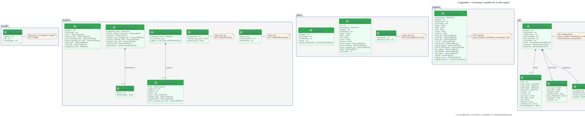

```plantuml
@startuml CL03-fastapi-schemas
' ============================================================
' CryptoBot — PlantUML Shared Skin & Stereotypes
' ============================================================

' --- Theme clair (lisible GitHub) ---
skinparam backgroundColor white
skinparam defaultFontName "Segoe UI, Helvetica, Arial, sans-serif"
skinparam defaultFontSize 12
skinparam defaultFontColor #333333
skinparam shadowing false
skinparam roundCorner 6

' --- Palette ---
' Bleu:   #4A6FA5
' Orange: #FEF3E8 (fond) / #E8943A (bordure)
' Vert:   #ECFDF5 (fond) / #34A853 (bordure)
' Violet: #F3EEFF (fond) / #7C5CFC (bordure)
' Gris:   #F5F5F5 (fond) / #CCCCCC (bordure)

' --- Component ---
skinparam component {
  BackgroundColor #F3EEFF
  BorderColor #7C5CFC
  FontColor #333333
  ArrowColor #4A6FA5
  StereotypeFontColor #7C5CFC
}

' --- Package ---
skinparam package {
  BackgroundColor #F5F5F5
  BorderColor #4A6FA5
  FontColor #333333
}

' --- Class ---
skinparam class {
  BackgroundColor #ECFDF5
  BorderColor #34A853
  FontColor #333333
  HeaderBackgroundColor #34A853
  HeaderFontColor white
  ArrowColor #4A6FA5
  StereotypeFontColor #7C5CFC
  AttributeFontColor #555555
}

' --- Sequence ---
skinparam sequence {
  ArrowColor #4A6FA5
  ActorBorderColor #7C5CFC
  LifeLineBorderColor #CCCCCC
  LifeLineBackgroundColor #F5F5F5
  ParticipantBorderColor #4A6FA5
  ParticipantBackgroundColor #F3EEFF
  ParticipantFontColor #333333
  BoxBorderColor #CCCCCC
  BoxBackgroundColor #F5F5F5
  DividerBackgroundColor #4A6FA5
  DividerFontColor white
}

' --- Activity ---
skinparam activity {
  BackgroundColor #FEF3E8
  BorderColor #E8943A
  FontColor #333333
  ArrowColor #4A6FA5
  DiamondBackgroundColor #F3EEFF
  DiamondBorderColor #7C5CFC
}

' --- Node (deployment) ---
skinparam node {
  BackgroundColor #F3EEFF
  BorderColor #7C5CFC
  FontColor #333333
}

' --- Database ---
skinparam database {
  BackgroundColor #ECFDF5
  BorderColor #34A853
  FontColor #333333
}

' --- Entity (ER) ---
skinparam entity {
  BackgroundColor white
  BorderColor #4A6FA5
  FontColor #333333
  HeaderBackgroundColor #4A6FA5
  HeaderFontColor white
}

' --- State ---
skinparam state {
  BackgroundColor #FEF3E8
  BorderColor #E8943A
  FontColor #333333
  ArrowColor #4A6FA5
}

' --- Usecase ---
skinparam usecase {
  BackgroundColor #F3EEFF
  BorderColor #7C5CFC
  FontColor #333333
  ArrowColor #4A6FA5
  ActorBorderColor #E8943A
}

' --- Note ---
skinparam note {
  BackgroundColor #FEF3E8
  BorderColor #E8943A
  FontColor #333333
}

' --- Legend ---
skinparam legend {
  BackgroundColor #F5F5F5
  BorderColor #CCCCCC
  FontColor #333333
}

' --- Stereotypes ---
' <<collector>>   ETL data collectors
' <<transformer>> ETL data transformers
' <<loader>>      ETL data loaders
' <<scheduler>>   APScheduler jobs
' <<rule>>        ML rule evaluator
' <<model>>       ML model
' <<router>>      FastAPI router
' <<service>>     FastAPI service
' <<middleware>>   FastAPI middleware
' <<page>>        Streamlit page
' <<component>>   Streamlit/Plotly component
' <<hypertable>>  TimescaleDB hypertable
' <<phase2>>      Phase 2 planned feature


title CryptoBot — Schemas FastAPI V2 (code main)
caption ~25 endpoints | 8 routers | Pydantic v2 request/response

' ============================================================
' PACKAGE: health  — GET /health
' ============================================================
package "health" {
  class HealthResponse <<response>> {
    status : str
    db : str
    timestamp : str
  }
  note right of HealthResponse : inline dict, no Pydantic model\nGET /health
}

' ============================================================
' PACKAGE: market  — 5 endpoints
' ============================================================
package "market" {

  class TopCryptoResponse <<response>> {
    rank : Optional[int]
    crypto_id : str
    symbol : str
    name : str
    price : Optional[float]
    market_cap : Optional[float]
    volume_24h : Optional[float]
    price_change_pct_24h : Optional[float]
  }

  class TopCryptoSnapshotResponse <<response>> {
    snapshot_time : datetime
    vs_currency : str
    cryptos : List[TopCryptoResponse]
  }

  class DominanceItem <<response>> {
    asset : str
    percentage : float
  }

  class GlobalMarketResponse <<response>> {
    snapshot_time : datetime
    active_cryptocurrencies : Optional[int]
    markets : Optional[int]
    market_cap_change_24h : Optional[float]
    volume_change_24h : Optional[float]
    market_cap_usd : Optional[float]
    volume_usd : Optional[float]
    dominance : List[DominanceItem]
  }

  class TickerResponse <<response>> {
    symbol : str
    exchange : str
    price : Optional[float]
    volume_24h : Optional[float]
    price_change_24h : Optional[float]
    price_change_pct_24h : Optional[float]
    high_24h : Optional[float]
    low_24h : Optional[float]
    snapshot_time : datetime
  }

  class FearGreedResponse <<response>> {
    value : Any
    classification : str
    timestamp : str
  }
  note right of FearGreedResponse : inline dict\nGET /market/fear-greed

  class MarketHistoryItem <<response>> {
    timestamp : str
    market_cap_usd : float
    volume_usd : float
  }
  note right of MarketHistoryItem : inline dict list\nGET /market/history

  TopCryptoSnapshotResponse *-- "0..*" TopCryptoResponse : cryptos
  GlobalMarketResponse *-- "0..*" DominanceItem : dominance
}

' ============================================================
' PACKAGE: ohlcv  — 4 endpoints
' ============================================================
package "ohlcv" {

  class OHLCVResponse <<response>> {
    id : str
    timestamp : datetime
    symbol : str
    timeframe : str
    open : float
    high : float
    low : float
    close : float
    volume : float
    price_range : Optional[float]
    price_change : Optional[float]
    price_change_pct : Optional[float]
    date : Optional[str]
    exchange : str
  }

  class SymbolInfo <<response>> {
    symbol : str
    exchange : str
    timeframe : str
    count : int
    latest_timestamp : Optional[datetime]
  }

  class DistinctCountItem <<response>> {
    exchange : str
    distinct_count : int
  }
  note right of DistinctCountItem : inline dict list\nGET /ohlcv/distinct-count
}

' ============================================================
' PACKAGE: signals  — 1 endpoint
' ============================================================
package "signals" {

  class SignalResponse <<response>> {
    timestamp : datetime
    symbol : str
    timeframe : str
    exchange : str
    open : float
    high : float
    low : float
    close : float
    volume : float
    sma_20 : Optional[float]
    sma_50 : Optional[float]
    ema_20 : Optional[float]
    rsi_14 : Optional[float]
    macd_line : Optional[float]
    macd_signal : Optional[float]
    macd_histogram : Optional[float]
    bb_upper : Optional[float]
    bb_middle : Optional[float]
    bb_lower : Optional[float]
    signal : Optional[str]
    signal_score : Optional[float]
    signal_reasons : Optional[List[str]]
  }
  note right of SignalResponse : GET /signals\nquery: symbol, timeframe, exchange, limit
}

' ============================================================
' PACKAGE: news  — 3 endpoints
' ============================================================
package "news" {

  class NewsArticleResponse <<response>> {
    id : str
    title : str
    url : str
    source : str
    published_at : Optional[datetime]
    content : Optional[str]
    sentiment_score : Optional[float]
    sentiment_label : Optional[str]
    keywords : Optional[List[str]]
    entities : Optional[dict]
    topics : Optional[List[str]]
    collected_at : Optional[datetime]
  }

  class NewsSentimentResponse <<response>> {
    source : str
    total : int
    positive : int
    negative : int
    neutral : int
    avg_score : Optional[float]
  }
  note bottom of NewsSentimentResponse : GET /news/sentiment\naggregated per source
}

' ============================================================
' PACKAGE: alerts  — 2 endpoints
' ============================================================
package "alerts" {

  class SubscribeRequest <<request>> {
    email : EmailStr
  }

  class SubscribeResponse <<response>> {
    email : str
    message : str
  }

  note bottom of SubscribeRequest : POST /alerts/subscribe\nDELETE /alerts/unsubscribe/{email}
  SubscribeRequest ..> SubscribeResponse : produces
}

' ============================================================
' PACKAGE: ml  — 1 endpoint
' ============================================================
package "ml" {

  class BacktestFoldResult <<response>> {
    fold : int
    train_start : datetime
    train_end : datetime
    test_start : datetime
    test_end : datetime
    n_train : int
    n_test : int
    accuracy : float
    win_rate : float
    pnl : float
    sharpe : float
    profit_factor : float
    max_drawdown : float
  }

  class BacktestSummary <<response>> {
    accuracy : float
    win_rate : float
    sharpe : float
    profit_factor : float
    max_drawdown : float
    total_pnl : float
    n_folds : int
  }

  class BacktestBaseline <<response>> {
    strategy_pnl : float
    baseline_return : float
    excess_return : float
    sharpe : float
  }

  class BacktestResponse <<response>> {
    symbol : str
    timeframe : str
    model_type : str
    train_window : int
    test_window : int
    n_candles : int
    folds : List[BacktestFoldResult]
    summary : BacktestSummary
    baseline : BacktestBaseline
  }
  note right of BacktestResponse : GET /ml/backtest\nquery: symbol, timeframe, model_type\ntrain_window, test_window

  BacktestResponse *-- "0..*" BacktestFoldResult : folds
  BacktestResponse *-- "1" BacktestSummary : summary
  BacktestResponse *-- "1" BacktestBaseline : baseline
}

' ============================================================
' PACKAGE: paper_trading  — 8 endpoints
' ============================================================
package "paper_trading" {

  class PortfolioCreate <<request>> {
    name : str
    initial_capital : float
  }

  class PortfolioResponse <<response>> {
    id : str
    name : str
    initial_capital : float
    cash : float
    created_at : datetime
  }

  class OrderCreate <<request>> {
    portfolio_id : str
    symbol : str
    quantity : Optional[float]
    amount_usdt : Optional[float]
    signal_source : str
    signal_score : Optional[float]
  }

  class TradeResponse <<response>> {
    id : str
    portfolio_id : str
    symbol : str
    side : str
    quantity : float
    entry_price : float
    entry_time : datetime
    exit_price : Optional[float]
    exit_time : Optional[datetime]
    status : str
    pnl : Optional[float]
    pnl_pct : Optional[float]
    signal_source : str
    signal_score : Optional[float]
    created_at : datetime
  }

  class OpenPositionOut <<response>> {
    id : str
    symbol : str
    quantity : float
    entry_price : float
    current_price : float
    pnl_latent : float
    pnl_latent_pct : float
    signal_source : str
    entry_time : datetime
  }

  class ClosedTradeOut <<response>> {
    id : str
    symbol : str
    quantity : float
    entry_price : float
    exit_price : Optional[float]
    pnl : Optional[float]
    pnl_pct : Optional[float]
    signal_source : str
    entry_time : datetime
    exit_time : Optional[datetime]
  }

  class PortfolioMetrics <<response>> {
    total_capital : float
    total_realized_pnl : float
    latent_pnl : float
    win_rate : float
    total_closed_trades : int
    total_open_trades : int
    best_trade_pnl : Optional[float]
    worst_trade_pnl : Optional[float]
  }

  class PortfolioSummary <<response>> {
    portfolio : PortfolioResponse
    metrics : PortfolioMetrics
    open_positions : List[OpenPositionOut]
    closed_trades : List[ClosedTradeOut]
  }

  class LivePricesResponse <<response>> {
    __root__ : Dict[str, float]
  }
  note right of LivePricesResponse : GET /paper-trading/live-prices\ninline Dict[str,float]

  class LivePricesStatus <<response>> {
    connected : bool
    prices : Dict[str, Any]
  }
  note right of LivePricesStatus : GET /paper-trading/live-prices/status\ninline dict

  PortfolioCreate ..> PortfolioResponse : POST /paper-trading/portfolios
  OrderCreate ..> TradeResponse : POST /paper-trading/orders
  PortfolioSummary *-- "1" PortfolioResponse : portfolio
  PortfolioSummary *-- "1" PortfolioMetrics : metrics
  PortfolioSummary *-- "0..*" OpenPositionOut : open_positions
  PortfolioSummary *-- "0..*" ClosedTradeOut : closed_trades
}

@enduml
```

## CL04-ml-evaluators

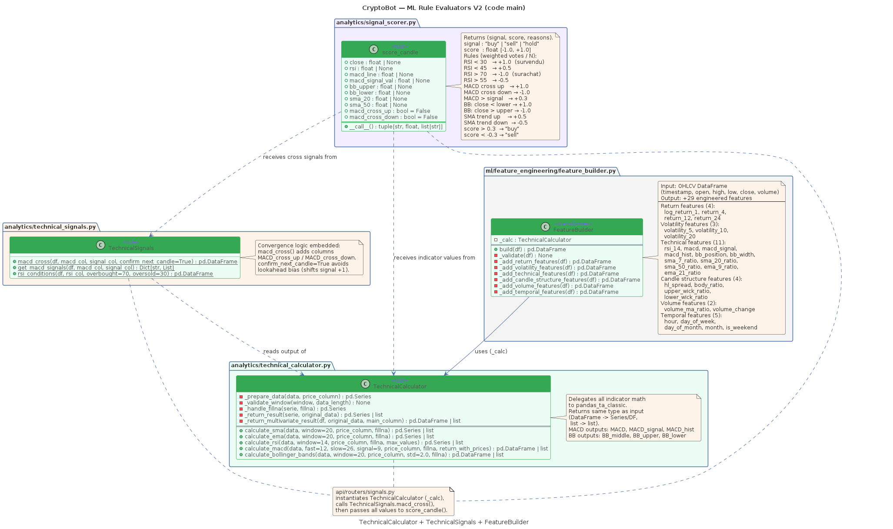

```plantuml
@startuml CL04-ml-evaluators
' ============================================================
' CryptoBot — PlantUML Shared Skin & Stereotypes
' ============================================================

' --- Theme clair (lisible GitHub) ---
skinparam backgroundColor white
skinparam defaultFontName "Segoe UI, Helvetica, Arial, sans-serif"
skinparam defaultFontSize 12
skinparam defaultFontColor #333333
skinparam shadowing false
skinparam roundCorner 6

' --- Palette ---
' Bleu:   #4A6FA5
' Orange: #FEF3E8 (fond) / #E8943A (bordure)
' Vert:   #ECFDF5 (fond) / #34A853 (bordure)
' Violet: #F3EEFF (fond) / #7C5CFC (bordure)
' Gris:   #F5F5F5 (fond) / #CCCCCC (bordure)

' --- Component ---
skinparam component {
  BackgroundColor #F3EEFF
  BorderColor #7C5CFC
  FontColor #333333
  ArrowColor #4A6FA5
  StereotypeFontColor #7C5CFC
}

' --- Package ---
skinparam package {
  BackgroundColor #F5F5F5
  BorderColor #4A6FA5
  FontColor #333333
}

' --- Class ---
skinparam class {
  BackgroundColor #ECFDF5
  BorderColor #34A853
  FontColor #333333
  HeaderBackgroundColor #34A853
  HeaderFontColor white
  ArrowColor #4A6FA5
  StereotypeFontColor #7C5CFC
  AttributeFontColor #555555
}

' --- Sequence ---
skinparam sequence {
  ArrowColor #4A6FA5
  ActorBorderColor #7C5CFC
  LifeLineBorderColor #CCCCCC
  LifeLineBackgroundColor #F5F5F5
  ParticipantBorderColor #4A6FA5
  ParticipantBackgroundColor #F3EEFF
  ParticipantFontColor #333333
  BoxBorderColor #CCCCCC
  BoxBackgroundColor #F5F5F5
  DividerBackgroundColor #4A6FA5
  DividerFontColor white
}

' --- Activity ---
skinparam activity {
  BackgroundColor #FEF3E8
  BorderColor #E8943A
  FontColor #333333
  ArrowColor #4A6FA5
  DiamondBackgroundColor #F3EEFF
  DiamondBorderColor #7C5CFC
}

' --- Node (deployment) ---
skinparam node {
  BackgroundColor #F3EEFF
  BorderColor #7C5CFC
  FontColor #333333
}

' --- Database ---
skinparam database {
  BackgroundColor #ECFDF5
  BorderColor #34A853
  FontColor #333333
}

' --- Entity (ER) ---
skinparam entity {
  BackgroundColor white
  BorderColor #4A6FA5
  FontColor #333333
  HeaderBackgroundColor #4A6FA5
  HeaderFontColor white
}

' --- State ---
skinparam state {
  BackgroundColor #FEF3E8
  BorderColor #E8943A
  FontColor #333333
  ArrowColor #4A6FA5
}

' --- Usecase ---
skinparam usecase {
  BackgroundColor #F3EEFF
  BorderColor #7C5CFC
  FontColor #333333
  ArrowColor #4A6FA5
  ActorBorderColor #E8943A
}

' --- Note ---
skinparam note {
  BackgroundColor #FEF3E8
  BorderColor #E8943A
  FontColor #333333
}

' --- Legend ---
skinparam legend {
  BackgroundColor #F5F5F5
  BorderColor #CCCCCC
  FontColor #333333
}

' --- Stereotypes ---
' <<collector>>   ETL data collectors
' <<transformer>> ETL data transformers
' <<loader>>      ETL data loaders
' <<scheduler>>   APScheduler jobs
' <<rule>>        ML rule evaluator
' <<model>>       ML model
' <<router>>      FastAPI router
' <<service>>     FastAPI service
' <<middleware>>   FastAPI middleware
' <<page>>        Streamlit page
' <<component>>   Streamlit/Plotly component
' <<hypertable>>  TimescaleDB hypertable


title CryptoBot — ML Rule Evaluators V2 (code main)
caption TechnicalCalculator + TechnicalSignals + FeatureBuilder

' ============================================================
' Package: src/analytics/technical_calculator.py
' ============================================================
package "analytics/technical_calculator.py" #ECFDF5 {

  class TechnicalCalculator <<rule>> {
    ' --- Private helpers ---
    - _prepare_data(data, price_column) : pd.Series
    - _validate_window(window, data_length) : None
    - _handle_fillna(serie, fillna) : pd.Series
    - _return_result(serie, original_data) : pd.Series | list
    - _return_multivariate_result(df, original_data, main_column) : pd.DataFrame | list
    ==
    + calculate_sma(data, window=20, price_column, fillna) : pd.Series | list
    + calculate_ema(data, window=20, price_column, fillna) : pd.Series | list
    + calculate_rsi(data, window=14, price_column, fillna, max_values) : pd.Series | list
    + calculate_macd(data, fast=12, slow=26, signal=9, price_column, fillna, return_with_prices) : pd.DataFrame | list
    + calculate_bollinger_bands(data, window=20, price_column, std=2.0, fillna) : pd.DataFrame | list
  }

  note right of TechnicalCalculator
    Delegates all indicator math
    to pandas_ta_classic.
    Returns same type as input
    (DataFrame -> Series/DF,
     list -> list).
    MACD outputs: MACD, MACD_signal, MACD_hist
    BB outputs: BB_middle, BB_upper, BB_lower
  end note
}

' ============================================================
' Package: src/analytics/technical_signals.py
' ============================================================
package "analytics/technical_signals.py" #FEF3E8 {

  class TechnicalSignals <<rule>> {
    {static} + macd_cross(df, macd_col, signal_col, confirm_next_candle=True) : pd.DataFrame
    {static} + get_macd_signals(df, macd_col, signal_col) : Dict[str, List]
    {static} + rsi_conditions(df, rsi_col, overbought=70, oversold=30) : pd.DataFrame
  }

  note right of TechnicalSignals
    Convergence logic embedded:
    macd_cross() adds columns
    MACD_cross_up / MACD_cross_down.
    confirm_next_candle=True avoids
    lookahead bias (shifts signal +1).
  end note
}

' ============================================================
' Package: src/analytics/signal_scorer.py
' ============================================================
package "analytics/signal_scorer.py" #F3EEFF {

  class score_candle <<rule>> {
    ' inputs
    + close : float | None
    + rsi : float | None
    + macd_line : float | None
    + macd_signal_val : float | None
    + bb_upper : float | None
    + bb_lower : float | None
    + sma_20 : float | None
    + sma_50 : float | None
    + macd_cross_up : bool = False
    + macd_cross_down : bool = False
    ==
    + __call__() : tuple[str, float, list[str]]
  }

  note right of score_candle
    Returns (signal, score, reasons).
    signal : "buy" | "sell" | "hold"
    score  : float [-1.0, +1.0]
    Rules (weighted votes / N):
    RSI < 30   → +1.0  (survendu)
    RSI < 45   → +0.5
    RSI > 70   → -1.0  (surachat)
    RSI > 55   → -0.5
    MACD cross up   → +1.0
    MACD cross down → -1.0
    MACD > signal   → +0.3
    BB: close < lower → +1.0
    BB: close > upper → -1.0
    SMA trend up    → +0.5
    SMA trend down  → -0.5
    score > 0.3  → "buy"
    score < -0.3 → "sell"
  end note
}

' ============================================================
' Package: src/ml/feature_engineering/feature_builder.py
' ============================================================
package "ml/feature_engineering/feature_builder.py" #F5F5F5 {

  class FeatureBuilder <<transformer>> {
    - _calc : TechnicalCalculator
    ==
    + build(df) : pd.DataFrame
    - _validate(df) : None
    - _add_return_features(df) : pd.DataFrame
    - _add_volatility_features(df) : pd.DataFrame
    - _add_technical_features(df) : pd.DataFrame
    - _add_candle_structure_features(df) : pd.DataFrame
    - _add_volume_features(df) : pd.DataFrame
    - _add_temporal_features(df) : pd.DataFrame
  }

  note right of FeatureBuilder
    Input: OHLCV DataFrame
    (timestamp, open, high, low, close, volume)
    Output: +29 engineered features
    --
    Return features (4):
      log_return_1, return_4,
      return_12, return_24
    Volatility features (3):
      volatility_5, volatility_10,
      volatility_20
    Technical features (11):
      rsi_14, macd, macd_signal,
      macd_hist, bb_position, bb_width,
      sma_7_ratio, sma_20_ratio,
      sma_50_ratio, ema_9_ratio,
      ema_21_ratio
    Candle structure features (4):
      hl_spread, body_ratio,
      upper_wick_ratio,
      lower_wick_ratio
    Volume features (2):
      volume_ma_ratio, volume_change
    Temporal features (5):
      hour, day_of_week,
      day_of_month, month, is_weekend
  end note
}

' ============================================================
' Relations
' ============================================================
FeatureBuilder --> TechnicalCalculator : uses (_calc)
TechnicalSignals ..> TechnicalCalculator : reads output of
score_candle ..> TechnicalSignals : receives cross signals from
score_candle ..> TechnicalCalculator : receives indicator values from

note as N_router
  api/routers/signals.py
  instantiates TechnicalCalculator (_calc),
  calls TechnicalSignals.macd_cross(),
  then passes all values to score_candle().
end note

TechnicalCalculator .. N_router
TechnicalSignals .. N_router
score_candle .. N_router

@enduml
```

## CL05-exceptions

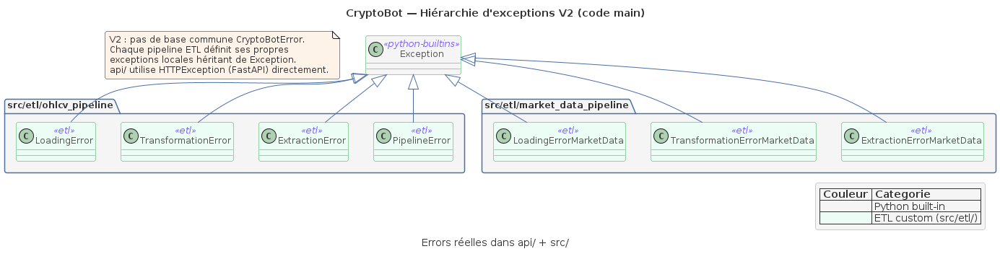

```plantuml
@startuml CL05-exceptions
' ============================================================
' CryptoBot — PlantUML Shared Skin & Stereotypes
' ============================================================

' --- Theme clair (lisible GitHub) ---
skinparam backgroundColor white
skinparam defaultFontName "Segoe UI, Helvetica, Arial, sans-serif"
skinparam defaultFontSize 12
skinparam defaultFontColor #333333
skinparam shadowing false
skinparam roundCorner 6

' --- Palette ---
' Bleu:   #4A6FA5
' Orange: #FEF3E8 (fond) / #E8943A (bordure)
' Vert:   #ECFDF5 (fond) / #34A853 (bordure)
' Violet: #F3EEFF (fond) / #7C5CFC (bordure)
' Gris:   #F5F5F5 (fond) / #CCCCCC (bordure)

' --- Component ---
skinparam component {
  BackgroundColor #F3EEFF
  BorderColor #7C5CFC
  FontColor #333333
  ArrowColor #4A6FA5
  StereotypeFontColor #7C5CFC
}

' --- Package ---
skinparam package {
  BackgroundColor #F5F5F5
  BorderColor #4A6FA5
  FontColor #333333
}

' --- Class ---
skinparam class {
  BackgroundColor #ECFDF5
  BorderColor #34A853
  FontColor #333333
  HeaderBackgroundColor #34A853
  HeaderFontColor white
  ArrowColor #4A6FA5
  StereotypeFontColor #7C5CFC
  AttributeFontColor #555555
}

' --- Sequence ---
skinparam sequence {
  ArrowColor #4A6FA5
  ActorBorderColor #7C5CFC
  LifeLineBorderColor #CCCCCC
  LifeLineBackgroundColor #F5F5F5
  ParticipantBorderColor #4A6FA5
  ParticipantBackgroundColor #F3EEFF
  ParticipantFontColor #333333
  BoxBorderColor #CCCCCC
  BoxBackgroundColor #F5F5F5
  DividerBackgroundColor #4A6FA5
  DividerFontColor white
}

' --- Activity ---
skinparam activity {
  BackgroundColor #FEF3E8
  BorderColor #E8943A
  FontColor #333333
  ArrowColor #4A6FA5
  DiamondBackgroundColor #F3EEFF
  DiamondBorderColor #7C5CFC
}

' --- Node (deployment) ---
skinparam node {
  BackgroundColor #F3EEFF
  BorderColor #7C5CFC
  FontColor #333333
}

' --- Database ---
skinparam database {
  BackgroundColor #ECFDF5
  BorderColor #34A853
  FontColor #333333
}

' --- Entity (ER) ---
skinparam entity {
  BackgroundColor white
  BorderColor #4A6FA5
  FontColor #333333
  HeaderBackgroundColor #4A6FA5
  HeaderFontColor white
}

' --- State ---
skinparam state {
  BackgroundColor #FEF3E8
  BorderColor #E8943A
  FontColor #333333
  ArrowColor #4A6FA5
}

' --- Usecase ---
skinparam usecase {
  BackgroundColor #F3EEFF
  BorderColor #7C5CFC
  FontColor #333333
  ArrowColor #4A6FA5
  ActorBorderColor #E8943A
}

' --- Note ---
skinparam note {
  BackgroundColor #FEF3E8
  BorderColor #E8943A
  FontColor #333333
}

' --- Legend ---
skinparam legend {
  BackgroundColor #F5F5F5
  BorderColor #CCCCCC
  FontColor #333333
}

' --- Stereotypes ---
' <<collector>>   ETL data collectors
' <<transformer>> ETL data transformers
' <<loader>>      ETL data loaders
' <<scheduler>>   APScheduler jobs
' <<rule>>        ML rule evaluator
' <<model>>       ML model
' <<router>>      FastAPI router
' <<service>>     FastAPI service
' <<middleware>>   FastAPI middleware
' <<page>>        Streamlit page
' <<component>>   Streamlit/Plotly component
' <<hypertable>>  TimescaleDB hypertable
' <<phase2>>      Phase 2 planned feature


title CryptoBot — Hiérarchie d'exceptions V2 (code main)
caption Errors réelles dans api/ + src/

' ============================================================
' Note: V2 ne possède pas de shared/exceptions.py.
' Les seules exceptions custom sont dans src/etl/ (7 classes).
' api/ utilise directement HTTPException (FastAPI built-in).
' ============================================================

note as N1
  V2 : pas de base commune CryptoBotError.
  Chaque pipeline ETL définit ses propres
  exceptions locales héritant de Exception.
  api/ utilise HTTPException (FastAPI) directement.
end note

' ============================================================
' Racine Python
' ============================================================
class Exception <<python-builtins>> #F5F5F5 {
}

' ============================================================
' src/etl/ohlcv_pipeline/
' ============================================================
package "src/etl/ohlcv_pipeline" #F5F5F5 {
  class PipelineError <<etl>> #ECFDF5 {
    ' pipeline_ohlcv.py:106
  }
  class ExtractionError <<etl>> #ECFDF5 {
    ' extractor.py:9
  }
  class TransformationError <<etl>> #ECFDF5 {
    ' transformer.py:13
  }
  class LoadingError <<etl>> #ECFDF5 {
    ' loader.py:12
  }
}

' ============================================================
' src/etl/market_data_pipeline/
' ============================================================
package "src/etl/market_data_pipeline" #F5F5F5 {
  class ExtractionErrorMarketData <<etl>> #ECFDF5 {
    ' extractor.py:5
  }
  class TransformationErrorMarketData <<etl>> #ECFDF5 {
    ' transformer.py:15
  }
  class LoadingErrorMarketData <<etl>> #ECFDF5 {
    ' loader.py:15
  }
}

' ============================================================
' Hierarchy
' ============================================================
Exception <|-- PipelineError
Exception <|-- ExtractionError
Exception <|-- TransformationError
Exception <|-- LoadingError

Exception <|-- ExtractionErrorMarketData
Exception <|-- TransformationErrorMarketData
Exception <|-- LoadingErrorMarketData

' ============================================================
' Legend
' ============================================================
legend bottom right
  |= Couleur |= Categorie |
  | <#F5F5F5> | Python built-in |
  | <#ECFDF5> | ETL custom (src/etl/) |
endlegend

@enduml
```

## DP01-docker-compose

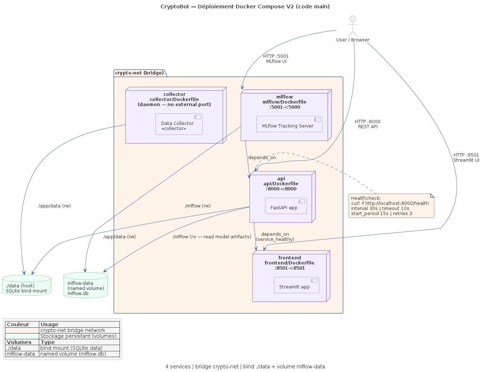

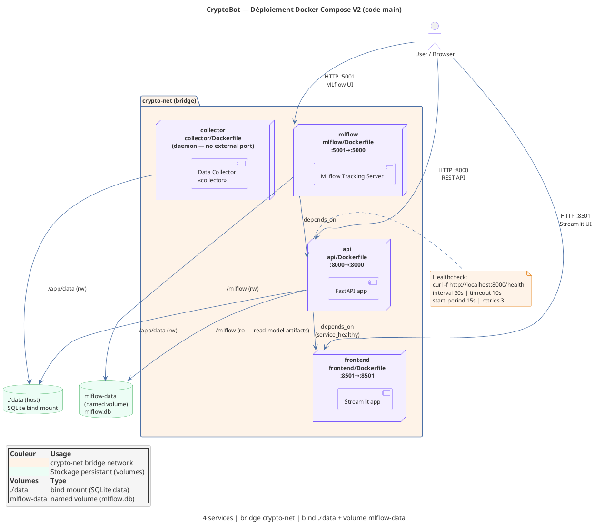
```plantuml
@startuml DP01-docker-compose
' ============================================================
' CryptoBot — PlantUML Shared Skin & Stereotypes
' ============================================================

' --- Theme clair (lisible GitHub) ---
skinparam backgroundColor white
skinparam defaultFontName "Segoe UI, Helvetica, Arial, sans-serif"
skinparam defaultFontSize 12
skinparam defaultFontColor #333333
skinparam shadowing false
skinparam roundCorner 6

' --- Palette ---
' Bleu:   #4A6FA5
' Orange: #FEF3E8 (fond) / #E8943A (bordure)
' Vert:   #ECFDF5 (fond) / #34A853 (bordure)
' Violet: #F3EEFF (fond) / #7C5CFC (bordure)
' Gris:   #F5F5F5 (fond) / #CCCCCC (bordure)

' --- Component ---
skinparam component {
  BackgroundColor #F3EEFF
  BorderColor #7C5CFC
  FontColor #333333
  ArrowColor #4A6FA5
  StereotypeFontColor #7C5CFC
}

' --- Package ---
skinparam package {
  BackgroundColor #F5F5F5
  BorderColor #4A6FA5
  FontColor #333333
}

' --- Class ---
skinparam class {
  BackgroundColor #ECFDF5
  BorderColor #34A853
  FontColor #333333
  HeaderBackgroundColor #34A853
  HeaderFontColor white
  ArrowColor #4A6FA5
  StereotypeFontColor #7C5CFC
  AttributeFontColor #555555
}

' --- Sequence ---
skinparam sequence {
  ArrowColor #4A6FA5
  ActorBorderColor #7C5CFC
  LifeLineBorderColor #CCCCCC
  LifeLineBackgroundColor #F5F5F5
  ParticipantBorderColor #4A6FA5
  ParticipantBackgroundColor #F3EEFF
  ParticipantFontColor #333333
  BoxBorderColor #CCCCCC
  BoxBackgroundColor #F5F5F5
  DividerBackgroundColor #4A6FA5
  DividerFontColor white
}

' --- Activity ---
skinparam activity {
  BackgroundColor #FEF3E8
  BorderColor #E8943A
  FontColor #333333
  ArrowColor #4A6FA5
  DiamondBackgroundColor #F3EEFF
  DiamondBorderColor #7C5CFC
}

' --- Node (deployment) ---
skinparam node {
  BackgroundColor #F3EEFF
  BorderColor #7C5CFC
  FontColor #333333
}

' --- Database ---
skinparam database {
  BackgroundColor #ECFDF5
  BorderColor #34A853
  FontColor #333333
}

' --- Entity (ER) ---
skinparam entity {
  BackgroundColor white
  BorderColor #4A6FA5
  FontColor #333333
  HeaderBackgroundColor #4A6FA5
  HeaderFontColor white
}

' --- State ---
skinparam state {
  BackgroundColor #FEF3E8
  BorderColor #E8943A
  FontColor #333333
  ArrowColor #4A6FA5
}

' --- Usecase ---
skinparam usecase {
  BackgroundColor #F3EEFF
  BorderColor #7C5CFC
  FontColor #333333
  ArrowColor #4A6FA5
  ActorBorderColor #E8943A
}

' --- Note ---
skinparam note {
  BackgroundColor #FEF3E8
  BorderColor #E8943A
  FontColor #333333
}

' --- Legend ---
skinparam legend {
  BackgroundColor #F5F5F5
  BorderColor #CCCCCC
  FontColor #333333
}

' --- Stereotypes ---
' <<collector>>   ETL data collectors
' <<transformer>> ETL data transformers
' <<loader>>      ETL data loaders
' <<scheduler>>   APScheduler jobs
' <<rule>>        ML rule evaluator
' <<model>>       ML model
' <<router>>      FastAPI router
' <<service>>     FastAPI service
' <<middleware>>   FastAPI middleware
' <<page>>        Streamlit page
' <<component>>   Streamlit/Plotly component
' <<hypertable>>  TimescaleDB hypertable
' <<phase2>>      Phase 2 planned feature


title CryptoBot — Déploiement Docker Compose V2 (code main)
caption 4 services | bridge crypto-net | bind ./data + volume mlflow-data

' ============================================================
' Host machine
' ============================================================
actor "User / Browser" as user

' ============================================================
' Bind-mount volume (host side)
' ============================================================
database "./data (host)\nSQLite bind mount" as bind_data #ECFDF5

' ============================================================
' Named volume
' ============================================================
database "mlflow-data\n(named volume)\nmlflow.db" as vol_mlflow #ECFDF5

' ============================================================
' crypto-net bridge network
' ============================================================
package "crypto-net (bridge)" as cnet #FEF3E8 {

  ' --- mlflow ---
  node "mlflow\nmlflow/Dockerfile\n:5001→:5000" as mlflow {
    component "MLflow Tracking Server" as mlflow_svc
  }

  ' --- api ---
  node "api\napi/Dockerfile\n:8000→:8000" as api {
    component "FastAPI app" as api_svc
  }

  ' --- frontend ---
  node "frontend\nfrontend/Dockerfile\n:8501→:8501" as frontend {
    component "Streamlit app" as fe_svc
  }

  ' --- collector ---
  node "collector\ncollector/Dockerfile\n(daemon — no external port)" as collector {
    component "Data Collector\n<<collector>>" as col_svc
  }
}

' ============================================================
' Depends_on chain
' ============================================================
mlflow -[#4A6FA5]-> api    : depends_on
api    -[#4A6FA5]-> frontend : depends_on\n(service_healthy)

' ============================================================
' External access
' ============================================================
user --> mlflow   : HTTP :5001\nMLflow UI
user --> api      : HTTP :8000\nREST API
user --> frontend : HTTP :8501\nStreamlit UI

' ============================================================
' Volume mounts
' ============================================================
mlflow --> vol_mlflow  : /mlflow (rw)
api    --> vol_mlflow  : /mlflow (ro — read model artifacts)
api    --> bind_data   : /app/data (rw)
collector --> bind_data : /app/data (rw)

' ============================================================
' Healthcheck
' ============================================================
note right of api
  Healthcheck:
  curl -f http://localhost:8000/health
  interval 30s | timeout 10s
  start_period 15s | retries 3
end note

' ============================================================
' Legend
' ============================================================
legend bottom left
  |= Couleur    |= Usage                        |
  | <#FEF3E8>   | crypto-net bridge network      |
  | <#ECFDF5>   | Stockage persistant (volumes)  |
  |= Volumes    |= Type                          |
  | ./data      | bind mount (SQLite data)        |
  | mlflow-data | named volume (mlflow.db)        |
endlegend

@enduml
```

## ER01-database-schema

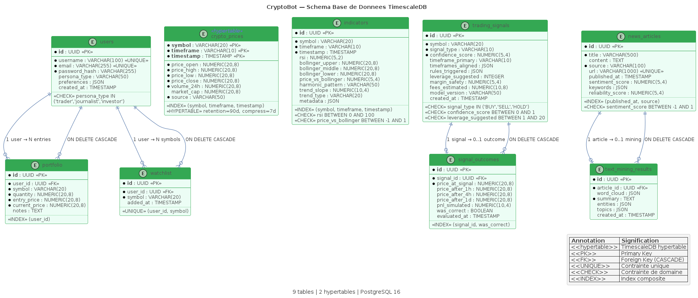

```plantuml
@startuml ER01-database-schema
' ============================================================
' CryptoBot — PlantUML Shared Skin & Stereotypes
' ============================================================

' --- Theme clair (lisible GitHub) ---
skinparam backgroundColor white
skinparam defaultFontName "Segoe UI, Helvetica, Arial, sans-serif"
skinparam defaultFontSize 12
skinparam defaultFontColor #333333
skinparam shadowing false
skinparam roundCorner 6

' --- Palette ---
' Bleu:   #4A6FA5
' Orange: #FEF3E8 (fond) / #E8943A (bordure)
' Vert:   #ECFDF5 (fond) / #34A853 (bordure)
' Violet: #F3EEFF (fond) / #7C5CFC (bordure)
' Gris:   #F5F5F5 (fond) / #CCCCCC (bordure)

' --- Component ---
skinparam component {
  BackgroundColor #F3EEFF
  BorderColor #7C5CFC
  FontColor #333333
  ArrowColor #4A6FA5
  StereotypeFontColor #7C5CFC
}

' --- Package ---
skinparam package {
  BackgroundColor #F5F5F5
  BorderColor #4A6FA5
  FontColor #333333
}

' --- Class ---
skinparam class {
  BackgroundColor #ECFDF5
  BorderColor #34A853
  FontColor #333333
  HeaderBackgroundColor #34A853
  HeaderFontColor white
  ArrowColor #4A6FA5
  StereotypeFontColor #7C5CFC
  AttributeFontColor #555555
}

' --- Sequence ---
skinparam sequence {
  ArrowColor #4A6FA5
  ActorBorderColor #7C5CFC
  LifeLineBorderColor #CCCCCC
  LifeLineBackgroundColor #F5F5F5
  ParticipantBorderColor #4A6FA5
  ParticipantBackgroundColor #F3EEFF
  ParticipantFontColor #333333
  BoxBorderColor #CCCCCC
  BoxBackgroundColor #F5F5F5
  DividerBackgroundColor #4A6FA5
  DividerFontColor white
}

' --- Activity ---
skinparam activity {
  BackgroundColor #FEF3E8
  BorderColor #E8943A
  FontColor #333333
  ArrowColor #4A6FA5
  DiamondBackgroundColor #F3EEFF
  DiamondBorderColor #7C5CFC
}

' --- Node (deployment) ---
skinparam node {
  BackgroundColor #F3EEFF
  BorderColor #7C5CFC
  FontColor #333333
}

' --- Database ---
skinparam database {
  BackgroundColor #ECFDF5
  BorderColor #34A853
  FontColor #333333
}

' --- Entity (ER) ---
skinparam entity {
  BackgroundColor white
  BorderColor #4A6FA5
  FontColor #333333
  HeaderBackgroundColor #4A6FA5
  HeaderFontColor white
}

' --- State ---
skinparam state {
  BackgroundColor #FEF3E8
  BorderColor #E8943A
  FontColor #333333
  ArrowColor #4A6FA5
}

' --- Usecase ---
skinparam usecase {
  BackgroundColor #F3EEFF
  BorderColor #7C5CFC
  FontColor #333333
  ArrowColor #4A6FA5
  ActorBorderColor #E8943A
}

' --- Note ---
skinparam note {
  BackgroundColor #FEF3E8
  BorderColor #E8943A
  FontColor #333333
}

' --- Legend ---
skinparam legend {
  BackgroundColor #F5F5F5
  BorderColor #CCCCCC
  FontColor #333333
}

' --- Stereotypes ---
' <<collector>>   ETL data collectors
' <<transformer>> ETL data transformers
' <<loader>>      ETL data loaders
' <<scheduler>>   APScheduler jobs
' <<rule>>        ML rule evaluator
' <<model>>       ML model
' <<router>>      FastAPI router
' <<service>>     FastAPI service
' <<middleware>>   FastAPI middleware
' <<page>>        Streamlit page
' <<component>>   Streamlit/Plotly component
' <<hypertable>>  TimescaleDB hypertable
' <<phase2>>      Phase 2 planned feature


title CryptoBot — Schéma BD V2 (SQLite, code main)
caption Tables réelles src/models/ | crypto_data.db | pas de TimescaleDB

' ============================================================
' Remarque : schéma géré via Base.metadata.create_all()
' (pas de migrations alembic ni de dossier migrations/)
' Fichier DB : data/processed/crypto_data.db
' Moteur : SQLite + check_same_thread=False
' ============================================================

' ------------------------------------------------------------------
' Groupe 1 : Market global (MarketDataBase)
' ------------------------------------------------------------------

package "Global Market" #F5F5F5 {

  entity "global_market_snapshot" as GMS {
    * id : INTEGER <<PK>>
    --
    * timestamp : DATETIME <<unique, idx>>
    active_cryptocurrencies : INTEGER
    upcoming_icos : INTEGER
    ongoing_icos : INTEGER
    ended_icos : INTEGER
    markets : INTEGER
    market_cap_change_24h : REAL
    volume_change_24h : REAL
    created_at : DATETIME
  }

  entity "global_market_cap" as GMC {
    * id : INTEGER <<PK>>
    --
    * snapshot_id : INTEGER <<FK, idx>>
    * currency : VARCHAR(10) <<idx>>
    * value : REAL
    --
    idx_marketcap_snapshot_currency (snapshot_id, currency)
  }

  entity "global_market_volume" as GMV {
    * id : INTEGER <<PK>>
    --
    * snapshot_id : INTEGER <<FK, idx>>
    * currency : VARCHAR(10) <<idx>>
    * value : REAL
    --
    idx_volume_snapshot_currency (snapshot_id, currency)
  }

  entity "global_market_dominance" as GMD {
    * id : INTEGER <<PK>>
    --
    * snapshot_id : INTEGER <<FK, idx>>
    * asset : VARCHAR(10) <<idx>>
    * percentage : REAL
    --
    idx_dominance_snapshot_asset (snapshot_id, asset)
  }

}

' ------------------------------------------------------------------
' Groupe 2 : Top crypto (MarketDataBase)
' ------------------------------------------------------------------

package "Top Crypto" #F5F5F5 {

  entity "top_crypto_snapshot" as TCS {
    * id : INTEGER <<PK>>
    --
    * snapshot_time : DATETIME
    * vs_currency : VARCHAR(10)
  }

  entity "top_crypto" as TC {
    * id : INTEGER <<PK>>
    --
    * snapshot_id : INTEGER <<FK>>
    rank : INTEGER
    * crypto_id : VARCHAR(50)
    * symbol : VARCHAR(20)
    * name : VARCHAR(50)
    market_cap : REAL
    price : REAL
    volume_24h : REAL
    price_change_pct_24h : REAL
    --
    idx_top_crypto_snapshot_id (snapshot_id)
    idx_top_crypto_rank (rank)
    idx_top_crypto_symbol (symbol)
  }

}

' ------------------------------------------------------------------
' Groupe 3 : Crypto detail (MarketDataBase)
' ------------------------------------------------------------------

package "Crypto Detail" #F5F5F5 {

  entity "crypto_detail_snapshot" as CDS {
    * id : INTEGER <<PK>>
    --
    * snapshot_time : DATETIME
    * cryptos_count : INTEGER
  }

  entity "crypto_detail" as CD {
    * id : INTEGER <<PK>>
    --
    * snapshot_id : INTEGER <<FK>>
    * crypto_id : VARCHAR(50)
    * symbol : VARCHAR(20)
    * name : VARCHAR(100)
    rank : INTEGER
    categories : VARCHAR(500)
    genesis_date : VARCHAR(20)
    hashing_algorithm : VARCHAR(100)
    block_time_minutes : INTEGER
    image_large : VARCHAR(500)
    image_small : VARCHAR(500)
    links_homepage : VARCHAR(1000)
    links_blockchain_site : VARCHAR(2000)
    links_whitepaper : VARCHAR(500)
    links_reddit : VARCHAR(500)
    links_twitter : VARCHAR(100)
    community_twitter : INTEGER
    community_reddit : INTEGER
    community_facebook : INTEGER
    developer_stars : INTEGER
    developer_forks : INTEGER
    developer_subscribers : INTEGER
    developer_issues : INTEGER
    developer_pull_requests : INTEGER
    market_cap_rank : INTEGER
    market_cap : REAL
    total_volume : REAL
    high_24h : REAL
    low_24h : REAL
    price_change_24h : REAL
    price_change_pct_24h : REAL
    ath_price : REAL
    ath_date : VARCHAR(30)
    ath_change_pct : REAL
    atl_price : REAL
    atl_date : VARCHAR(30)
    atl_change_pct : REAL
    circulating_supply : REAL
    total_supply : REAL
    max_supply : REAL
    last_updated : DATETIME
    --
    idx_crypto_detail_snapshot_id (snapshot_id)
    idx_crypto_detail_crypto_id (crypto_id)
    idx_crypto_detail_symbol (symbol)
    idx_crypto_detail_rank (rank)
  }

}

' ------------------------------------------------------------------
' Groupe 4 : OHLCV & Ticker (bases séparées)
' ------------------------------------------------------------------

package "Trading Data" #F5F5F5 {

  entity "ohlcv" as OHLCV {
    * id : VARCHAR(36) <<PK, UUID>>
    --
    * timestamp : DATETIME
    * symbol : VARCHAR(20)
    * timeframe : VARCHAR(10)
    * open : REAL
    * high : REAL
    * low : REAL
    * close : REAL
    * volume : REAL
    price_range : REAL
    price_change : REAL
    price_change_pct : REAL
    date : VARCHAR(10)
    * exchange : VARCHAR(20)
    created_at : DATETIME
    updated_at : DATETIME
    --
    idx_ohlcv_symbol_timeframe (symbol, timeframe)
    idx_ohlcv_timestamp (timestamp)
    idx_ohlcv_symbol_timestamp (symbol, timestamp)
  }

  entity "ticker_snapshots" as TS {
    * id : VARCHAR(36) <<PK, UUID>>
    --
    * snapshot_time : DATETIME
    * symbol : VARCHAR(20)
    * exchange : VARCHAR(20)
    price : REAL
    volume_24h : REAL
    price_change_24h : REAL
    price_change_pct_24h : REAL
    high_24h : REAL
    low_24h : REAL
    created_at : DATETIME
    --
    idx_ticker_snapshot_time (snapshot_time)
    idx_ticker_symbol_time (symbol, snapshot_time)
  }

}

' ------------------------------------------------------------------
' Groupe 5 : Paper trading (Base séparée)
' ------------------------------------------------------------------

package "Paper Trading" #F5F5F5 {

  entity "paper_portfolios" as PP {
    * id : VARCHAR(36) <<PK, UUID>>
    --
    * name : VARCHAR(100)
    * initial_capital : REAL
    * cash : REAL
    created_at : DATETIME
  }

  entity "paper_trades" as PT {
    * id : VARCHAR(36) <<PK, UUID>>
    --
    * portfolio_id : VARCHAR(36) <<FK>>
    * symbol : VARCHAR(20)
    * side : VARCHAR(4)
    * quantity : REAL
    * entry_price : REAL
    * entry_time : DATETIME
    exit_price : REAL
    exit_time : DATETIME
    * status : VARCHAR(6)
    pnl : REAL
    pnl_pct : REAL
    * signal_source : VARCHAR(50)
    signal_score : REAL
    created_at : DATETIME
    --
    idx_paper_trades_portfolio (portfolio_id)
    idx_paper_trades_status (status)
    idx_paper_trades_symbol (symbol)
  }

}

' ------------------------------------------------------------------
' Groupe 6 : News (Base séparée)
' ------------------------------------------------------------------

package "News & NLP" #F5F5F5 {

  entity "news_articles" as NA {
    * id : VARCHAR(36) <<PK, UUID>>
    --
    * title : VARCHAR(500)
    * url : VARCHAR(1000) <<unique>>
    * source : VARCHAR(150)
    published_at : DATETIME
    content : TEXT
    sentiment_score : REAL
    sentiment_label : VARCHAR(20)
    keywords : JSON
    entities : JSON
    topics : JSON
    collected_at : DATETIME
  }

}

' ------------------------------------------------------------------
' Groupe 7 : Alertes (Base séparée)
' ------------------------------------------------------------------

package "Alertes" #F5F5F5 {

  entity "alert_subscribers" as AS {
    * id : INTEGER <<PK>>
    --
    * email : VARCHAR <<unique, idx>>
    * active : BOOLEAN
    * created_at : DATETIME
  }

}

' ------------------------------------------------------------------
' Relations (FK explicites)
' ------------------------------------------------------------------

GMS ||--o{ GMC : "snapshot_id"
GMS ||--o{ GMV : "snapshot_id"
GMS ||--o{ GMD : "snapshot_id"

TCS ||--o{ TC : "snapshot_id"

CDS ||--o{ CD : "snapshot_id"

PP ||--o{ PT : "portfolio_id"

' ------------------------------------------------------------------
' Notes
' ------------------------------------------------------------------

note bottom of GMS
  Base : MarketDataBase
  (declarative_base partagée)
end note

note bottom of OHLCV
  Base : OHLCVBase (declarative_base dédiée)
  Schéma créé via Base.metadata.create_all()
  Pas de migrations/alembic
end note

note bottom of NA
  Base : declarative_base() dédiée
  id = UUID v4 (str)
end note

note bottom of AS
  Base : declarative_base() dédiée
  (alert_subscriber.py)
end note

legend right
  <<PK>>   Clé primaire
  <<FK>>   Clé étrangère
  <<idx>>  Index simple
  *        NOT NULL
  Colonnes sans * = nullable
  UUID = VARCHAR(36) uuid4
  JSON = colonne SQLite TEXT (JSON sérialisé)
  Moteur : SQLite | check_same_thread=False
  Fichier : data/processed/crypto_data.db
  Schéma : Base.metadata.create_all() (pas d'alembic)
endlegend

@enduml
```

## SQ01-health-and-alerts-flow

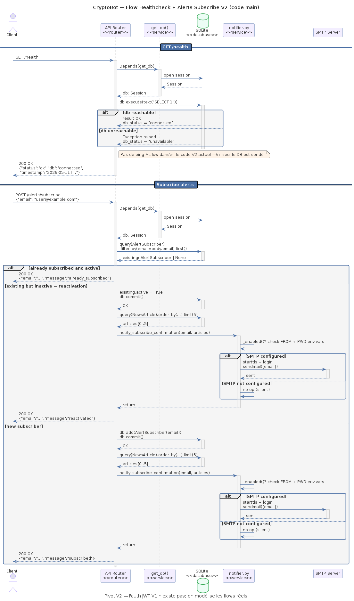

```plantuml
@startuml SQ01-health-and-alerts-flow
' ============================================================
' CryptoBot — PlantUML Shared Skin & Stereotypes
' ============================================================

' --- Theme clair (lisible GitHub) ---
skinparam backgroundColor white
skinparam defaultFontName "Segoe UI, Helvetica, Arial, sans-serif"
skinparam defaultFontSize 12
skinparam defaultFontColor #333333
skinparam shadowing false
skinparam roundCorner 6

' --- Palette ---
' Bleu:   #4A6FA5
' Orange: #FEF3E8 (fond) / #E8943A (bordure)
' Vert:   #ECFDF5 (fond) / #34A853 (bordure)
' Violet: #F3EEFF (fond) / #7C5CFC (bordure)
' Gris:   #F5F5F5 (fond) / #CCCCCC (bordure)

' --- Component ---
skinparam component {
  BackgroundColor #F3EEFF
  BorderColor #7C5CFC
  FontColor #333333
  ArrowColor #4A6FA5
  StereotypeFontColor #7C5CFC
}

' --- Package ---
skinparam package {
  BackgroundColor #F5F5F5
  BorderColor #4A6FA5
  FontColor #333333
}

' --- Class ---
skinparam class {
  BackgroundColor #ECFDF5
  BorderColor #34A853
  FontColor #333333
  HeaderBackgroundColor #34A853
  HeaderFontColor white
  ArrowColor #4A6FA5
  StereotypeFontColor #7C5CFC
  AttributeFontColor #555555
}

' --- Sequence ---
skinparam sequence {
  ArrowColor #4A6FA5
  ActorBorderColor #7C5CFC
  LifeLineBorderColor #CCCCCC
  LifeLineBackgroundColor #F5F5F5
  ParticipantBorderColor #4A6FA5
  ParticipantBackgroundColor #F3EEFF
  ParticipantFontColor #333333
  BoxBorderColor #CCCCCC
  BoxBackgroundColor #F5F5F5
  DividerBackgroundColor #4A6FA5
  DividerFontColor white
}

' --- Activity ---
skinparam activity {
  BackgroundColor #FEF3E8
  BorderColor #E8943A
  FontColor #333333
  ArrowColor #4A6FA5
  DiamondBackgroundColor #F3EEFF
  DiamondBorderColor #7C5CFC
}

' --- Node (deployment) ---
skinparam node {
  BackgroundColor #F3EEFF
  BorderColor #7C5CFC
  FontColor #333333
}

' --- Database ---
skinparam database {
  BackgroundColor #ECFDF5
  BorderColor #34A853
  FontColor #333333
}

' --- Entity (ER) ---
skinparam entity {
  BackgroundColor white
  BorderColor #4A6FA5
  FontColor #333333
  HeaderBackgroundColor #4A6FA5
  HeaderFontColor white
}

' --- State ---
skinparam state {
  BackgroundColor #FEF3E8
  BorderColor #E8943A
  FontColor #333333
  ArrowColor #4A6FA5
}

' --- Usecase ---
skinparam usecase {
  BackgroundColor #F3EEFF
  BorderColor #7C5CFC
  FontColor #333333
  ArrowColor #4A6FA5
  ActorBorderColor #E8943A
}

' --- Note ---
skinparam note {
  BackgroundColor #FEF3E8
  BorderColor #E8943A
  FontColor #333333
}

' --- Legend ---
skinparam legend {
  BackgroundColor #F5F5F5
  BorderColor #CCCCCC
  FontColor #333333
}

' --- Stereotypes ---
' <<collector>>   ETL data collectors
' <<transformer>> ETL data transformers
' <<loader>>      ETL data loaders
' <<scheduler>>   APScheduler jobs
' <<rule>>        ML rule evaluator
' <<model>>       ML model
' <<router>>      FastAPI router
' <<service>>     FastAPI service
' <<middleware>>   FastAPI middleware
' <<page>>        Streamlit page
' <<component>>   Streamlit/Plotly component
' <<hypertable>>  TimescaleDB hypertable
' <<phase2>>      Phase 2 planned feature


title CryptoBot — Flow Healthcheck + Alerts Subscribe V2 (code main)
caption Pivot V2 — l'auth JWT V1 n'existe pas; on modélise les flows réels

' ============================================================
' Participants communs aux deux flows
' ============================================================
actor       Client         as client
participant "API Router\n<<router>>"       as router
participant "get_db()\n<<service>>"        as dep
database    "SQLite\n<<database>>" as db
participant "notifier.py\n<<service>>"     as notifier
participant "SMTP Server"                  as smtp

' ============================================================
' FLOW A — GET /health
' ============================================================
== GET /health ==

client  ->  router   : GET /health
activate router

router  ->  dep      : Depends(get_db)
activate dep
dep     ->  db       : open session
db     -->  dep      : Session
dep    -->  router   : db: Session
deactivate dep

router  ->  db       : db.execute(text("SELECT 1"))
activate db
alt db reachable
    db     -->  router   : result OK\ndb_status = "connected"
else db unreachable
    db     -->  router   : Exception raised\ndb_status = "unavailable"
end
deactivate db

note right of router
  Pas de ping MLflow dans\n  le code V2 actuel —\n  seul le DB est sondé.
end note

router  -->  client  : 200 OK\n{"status":"ok","db":"connected",\n "timestamp":"2026-05-11T..."}
deactivate router

' ============================================================
' FLOW B — POST /alerts/subscribe
' ============================================================
== Subscribe alerts ==

client  ->  router   : POST /alerts/subscribe\n{"email": "user@example.com"}
activate router

router  ->  dep      : Depends(get_db)
activate dep
dep     ->  db       : open session
db     -->  dep      : Session
dep    -->  router   : db: Session
deactivate dep

router  ->  db       : query(AlertSubscriber)\n.filter_by(email=body.email).first()
activate db
db     -->  router   : existing: AlertSubscriber | None
deactivate db

alt already subscribed and active
    router  -->  client  : 200 OK\n{"email":"...","message":"already_subscribed"}

else existing but inactive — reactivation
    router  ->  db       : existing.active = True\ndb.commit()
    activate db
    db     -->  router   : OK
    deactivate db

    router  ->  db       : query(NewsArticle).order_by(...).limit(5)
    activate db
    db     -->  router   : articles[0..5]
    deactivate db

    router  ->  notifier : notify_subscribe_confirmation(email, articles)
    activate notifier
    notifier -> notifier : _enabled()? check FROM + PWD env vars
    alt SMTP configured
        notifier -> smtp : starttls + login\nsendmail([email])
        activate smtp
        smtp   --> notifier : sent
        deactivate smtp
    else SMTP not configured
        notifier -> notifier : no-op (silent)
    end
    notifier --> router  : return
    deactivate notifier

    router  -->  client  : 200 OK\n{"email":"...","message":"reactivated"}

else new subscriber
    router  ->  db       : db.add(AlertSubscriber(email))\ndb.commit()
    activate db
    db     -->  router   : OK
    deactivate db

    router  ->  db       : query(NewsArticle).order_by(...).limit(5)
    activate db
    db     -->  router   : articles[0..5]
    deactivate db

    router  ->  notifier : notify_subscribe_confirmation(email, articles)
    activate notifier
    notifier -> notifier : _enabled()? check FROM + PWD env vars
    alt SMTP configured
        notifier -> smtp : starttls + login\nsendmail([email])
        activate smtp
        smtp   --> notifier : sent
        deactivate smtp
    else SMTP not configured
        notifier -> notifier : no-op (silent)
    end
    notifier --> router  : return
    deactivate notifier

    router  -->  client  : 200 OK\n{"email":"...","message":"subscribed"}
end

deactivate router

@enduml
```

## SQ02-dashboard-data-flow

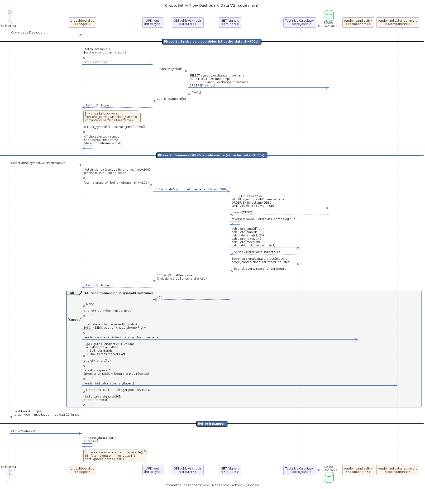

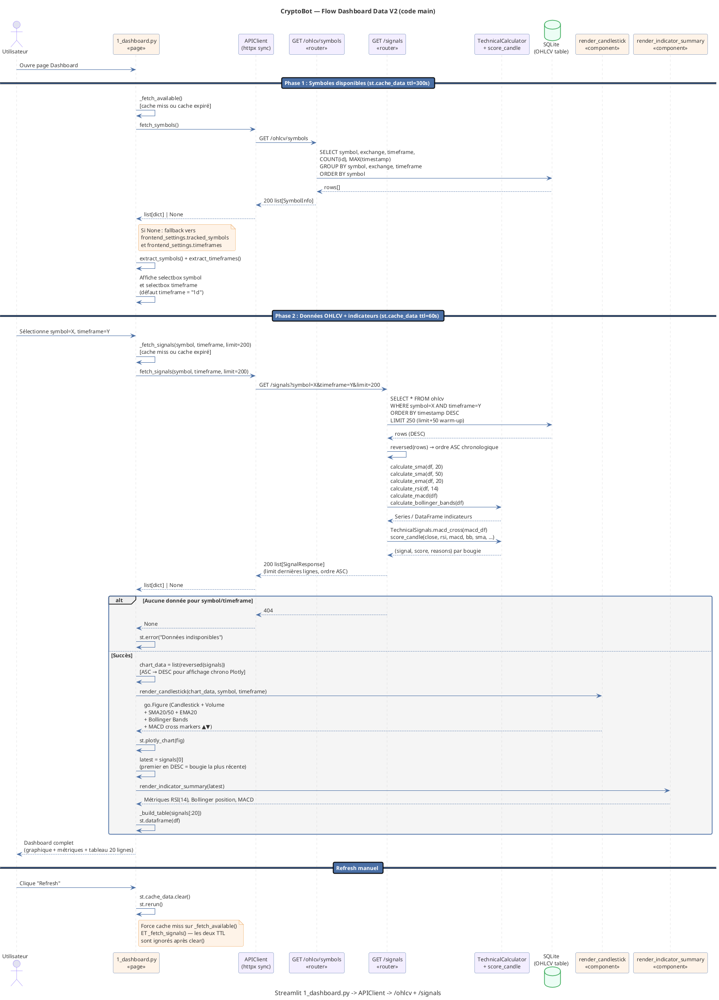
```plantuml
@startuml SQ02-dashboard-data-flow
' ============================================================
' CryptoBot — PlantUML Shared Skin & Stereotypes
' ============================================================

' --- Theme clair (lisible GitHub) ---
skinparam backgroundColor white
skinparam defaultFontName "Segoe UI, Helvetica, Arial, sans-serif"
skinparam defaultFontSize 12
skinparam defaultFontColor #333333
skinparam shadowing false
skinparam roundCorner 6

' --- Palette ---
' Bleu:   #4A6FA5
' Orange: #FEF3E8 (fond) / #E8943A (bordure)
' Vert:   #ECFDF5 (fond) / #34A853 (bordure)
' Violet: #F3EEFF (fond) / #7C5CFC (bordure)
' Gris:   #F5F5F5 (fond) / #CCCCCC (bordure)

' --- Component ---
skinparam component {
  BackgroundColor #F3EEFF
  BorderColor #7C5CFC
  FontColor #333333
  ArrowColor #4A6FA5
  StereotypeFontColor #7C5CFC
}

' --- Package ---
skinparam package {
  BackgroundColor #F5F5F5
  BorderColor #4A6FA5
  FontColor #333333
}

' --- Class ---
skinparam class {
  BackgroundColor #ECFDF5
  BorderColor #34A853
  FontColor #333333
  HeaderBackgroundColor #34A853
  HeaderFontColor white
  ArrowColor #4A6FA5
  StereotypeFontColor #7C5CFC
  AttributeFontColor #555555
}

' --- Sequence ---
skinparam sequence {
  ArrowColor #4A6FA5
  ActorBorderColor #7C5CFC
  LifeLineBorderColor #CCCCCC
  LifeLineBackgroundColor #F5F5F5
  ParticipantBorderColor #4A6FA5
  ParticipantBackgroundColor #F3EEFF
  ParticipantFontColor #333333
  BoxBorderColor #CCCCCC
  BoxBackgroundColor #F5F5F5
  DividerBackgroundColor #4A6FA5
  DividerFontColor white
}

' --- Activity ---
skinparam activity {
  BackgroundColor #FEF3E8
  BorderColor #E8943A
  FontColor #333333
  ArrowColor #4A6FA5
  DiamondBackgroundColor #F3EEFF
  DiamondBorderColor #7C5CFC
}

' --- Node (deployment) ---
skinparam node {
  BackgroundColor #F3EEFF
  BorderColor #7C5CFC
  FontColor #333333
}

' --- Database ---
skinparam database {
  BackgroundColor #ECFDF5
  BorderColor #34A853
  FontColor #333333
}

' --- Entity (ER) ---
skinparam entity {
  BackgroundColor white
  BorderColor #4A6FA5
  FontColor #333333
  HeaderBackgroundColor #4A6FA5
  HeaderFontColor white
}

' --- State ---
skinparam state {
  BackgroundColor #FEF3E8
  BorderColor #E8943A
  FontColor #333333
  ArrowColor #4A6FA5
}

' --- Usecase ---
skinparam usecase {
  BackgroundColor #F3EEFF
  BorderColor #7C5CFC
  FontColor #333333
  ArrowColor #4A6FA5
  ActorBorderColor #E8943A
}

' --- Note ---
skinparam note {
  BackgroundColor #FEF3E8
  BorderColor #E8943A
  FontColor #333333
}

' --- Legend ---
skinparam legend {
  BackgroundColor #F5F5F5
  BorderColor #CCCCCC
  FontColor #333333
}

' --- Stereotypes ---
' <<collector>>   ETL data collectors
' <<transformer>> ETL data transformers
' <<loader>>      ETL data loaders
' <<scheduler>>   APScheduler jobs
' <<rule>>        ML rule evaluator
' <<model>>       ML model
' <<router>>      FastAPI router
' <<service>>     FastAPI service
' <<middleware>>   FastAPI middleware
' <<page>>        Streamlit page
' <<component>>   Streamlit/Plotly component
' <<hypertable>>  TimescaleDB hypertable
' <<phase2>>      Phase 2 planned feature


title CryptoBot — Flow Dashboard Data V2 (code main)
caption Streamlit 1_dashboard.py -> APIClient -> /ohlcv + /signals

actor "Utilisateur" as user
participant "1_dashboard.py\n<<page>>" as dash #FEF3E8
participant "APIClient\n(httpx sync)" as client #F3EEFF
participant "GET /ohlcv/symbols\n<<router>>" as ohlcv_sym #F3EEFF
participant "GET /signals\n<<router>>" as sig_router #F3EEFF
participant "TechnicalCalculator\n+ score_candle" as calc #F3EEFF
database "SQLite\n(OHLCV table)" as db #ECFDF5
participant "render_candlestick\n<<component>>" as chart #FEF3E8
participant "render_indicator_summary\n<<component>>" as indic #FEF3E8

user -> dash : Ouvre page Dashboard

== Phase 1 : Symboles disponibles (st.cache_data ttl=300s) ==

dash -> dash : _fetch_available()\n[cache miss ou cache expiré]
dash -> client : fetch_symbols()
client -> ohlcv_sym : GET /ohlcv/symbols
ohlcv_sym -> db : SELECT symbol, exchange, timeframe,\nCOUNT(id), MAX(timestamp)\nGROUP BY symbol, exchange, timeframe\nORDER BY symbol
db --> ohlcv_sym : rows[]
ohlcv_sym --> client : 200 list[SymbolInfo]
client --> dash : list[dict] | None

note right of dash
  Si None : fallback vers
  frontend_settings.tracked_symbols
  et frontend_settings.timeframes
end note

dash -> dash : extract_symbols() + extract_timeframes()
dash -> dash : Affiche selectbox symbol\net selectbox timeframe\n(défaut timeframe = "1d")

== Phase 2 : Données OHLCV + indicateurs (st.cache_data ttl=60s) ==

user -> dash : Sélectionne symbol=X, timeframe=Y
dash -> dash : _fetch_signals(symbol, timeframe, limit=200)\n[cache miss ou cache expiré]
dash -> client : fetch_signals(symbol, timeframe, limit=200)
client -> sig_router : GET /signals?symbol=X&timeframe=Y&limit=200

sig_router -> db : SELECT * FROM ohlcv\nWHERE symbol=X AND timeframe=Y\nORDER BY timestamp DESC\nLIMIT 250 (limit+50 warm-up)
db --> sig_router : rows (DESC)

sig_router -> sig_router : reversed(rows) → ordre ASC chronologique
sig_router -> calc : calculate_sma(df, 20)\ncalculate_sma(df, 50)\ncalculate_ema(df, 20)\ncalculate_rsi(df, 14)\ncalculate_macd(df)\ncalculate_bollinger_bands(df)
calc --> sig_router : Series / DataFrame indicateurs

sig_router -> calc : TechnicalSignals.macd_cross(macd_df)\nscore_candle(close, rsi, macd, bb, sma, ...)
calc --> sig_router : (signal, score, reasons) par bougie

sig_router --> client : 200 list[SignalResponse]\n(limit dernières lignes, ordre ASC)
client --> dash : list[dict] | None

alt Aucune donnée pour symbol/timeframe
  sig_router --> client : 404
  client --> dash : None
  dash -> dash : st.error("Données indisponibles")
else Succès
  dash -> dash : chart_data = list(reversed(signals))\n[ASC → DESC pour affichage chrono Plotly]
  dash -> chart : render_candlestick(chart_data, symbol, timeframe)
  chart --> dash : go.Figure (Candlestick + Volume\n+ SMA20/50 + EMA20\n+ Bollinger Bands\n+ MACD cross markers ▲▼)
  dash -> dash : st.plotly_chart(fig)

  dash -> dash : latest = signals[0]\n(premier en DESC = bougie la plus récente)
  dash -> indic : render_indicator_summary(latest)
  indic --> dash : Métriques RSI(14), Bollinger position, MACD

  dash -> dash : _build_table(signals[:20])\nst.dataframe(df)
end

dash --> user : Dashboard complet\n(graphique + métriques + tableau 20 lignes)

== Refresh manuel ==

user -> dash : Clique "Refresh"
dash -> dash : st.cache_data.clear()\nst.rerun()
note right of dash
  Force cache miss sur _fetch_available()
  ET _fetch_signals() — les deux TTL
  sont ignorés après clear()
end note

@enduml
```

## SQ03-signal-generation-flow

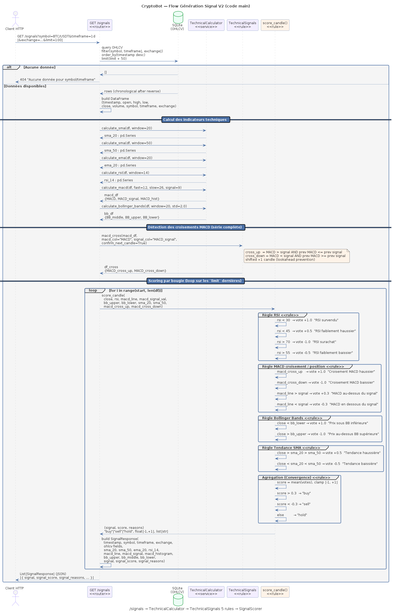

```plantuml
@startuml SQ03-signal-generation-flow
' ============================================================
' CryptoBot — PlantUML Shared Skin & Stereotypes
' ============================================================

' --- Theme clair (lisible GitHub) ---
skinparam backgroundColor white
skinparam defaultFontName "Segoe UI, Helvetica, Arial, sans-serif"
skinparam defaultFontSize 12
skinparam defaultFontColor #333333
skinparam shadowing false
skinparam roundCorner 6

' --- Palette ---
' Bleu:   #4A6FA5
' Orange: #FEF3E8 (fond) / #E8943A (bordure)
' Vert:   #ECFDF5 (fond) / #34A853 (bordure)
' Violet: #F3EEFF (fond) / #7C5CFC (bordure)
' Gris:   #F5F5F5 (fond) / #CCCCCC (bordure)

' --- Component ---
skinparam component {
  BackgroundColor #F3EEFF
  BorderColor #7C5CFC
  FontColor #333333
  ArrowColor #4A6FA5
  StereotypeFontColor #7C5CFC
}

' --- Package ---
skinparam package {
  BackgroundColor #F5F5F5
  BorderColor #4A6FA5
  FontColor #333333
}

' --- Class ---
skinparam class {
  BackgroundColor #ECFDF5
  BorderColor #34A853
  FontColor #333333
  HeaderBackgroundColor #34A853
  HeaderFontColor white
  ArrowColor #4A6FA5
  StereotypeFontColor #7C5CFC
  AttributeFontColor #555555
}

' --- Sequence ---
skinparam sequence {
  ArrowColor #4A6FA5
  ActorBorderColor #7C5CFC
  LifeLineBorderColor #CCCCCC
  LifeLineBackgroundColor #F5F5F5
  ParticipantBorderColor #4A6FA5
  ParticipantBackgroundColor #F3EEFF
  ParticipantFontColor #333333
  BoxBorderColor #CCCCCC
  BoxBackgroundColor #F5F5F5
  DividerBackgroundColor #4A6FA5
  DividerFontColor white
}

' --- Activity ---
skinparam activity {
  BackgroundColor #FEF3E8
  BorderColor #E8943A
  FontColor #333333
  ArrowColor #4A6FA5
  DiamondBackgroundColor #F3EEFF
  DiamondBorderColor #7C5CFC
}

' --- Node (deployment) ---
skinparam node {
  BackgroundColor #F3EEFF
  BorderColor #7C5CFC
  FontColor #333333
}

' --- Database ---
skinparam database {
  BackgroundColor #ECFDF5
  BorderColor #34A853
  FontColor #333333
}

' --- Entity (ER) ---
skinparam entity {
  BackgroundColor white
  BorderColor #4A6FA5
  FontColor #333333
  HeaderBackgroundColor #4A6FA5
  HeaderFontColor white
}

' --- State ---
skinparam state {
  BackgroundColor #FEF3E8
  BorderColor #E8943A
  FontColor #333333
  ArrowColor #4A6FA5
}

' --- Usecase ---
skinparam usecase {
  BackgroundColor #F3EEFF
  BorderColor #7C5CFC
  FontColor #333333
  ArrowColor #4A6FA5
  ActorBorderColor #E8943A
}

' --- Note ---
skinparam note {
  BackgroundColor #FEF3E8
  BorderColor #E8943A
  FontColor #333333
}

' --- Legend ---
skinparam legend {
  BackgroundColor #F5F5F5
  BorderColor #CCCCCC
  FontColor #333333
}

' --- Stereotypes ---
' <<collector>>   ETL data collectors
' <<transformer>> ETL data transformers
' <<loader>>      ETL data loaders
' <<scheduler>>   APScheduler jobs
' <<rule>>        ML rule evaluator
' <<model>>       ML model
' <<router>>      FastAPI router
' <<service>>     FastAPI service
' <<middleware>>   FastAPI middleware
' <<page>>        Streamlit page
' <<component>>   Streamlit/Plotly component
' <<hypertable>>  TimescaleDB hypertable


title CryptoBot — Flow Génération Signal V2 (code main)
caption /signals → TechnicalCalculator → TechnicalSignals 5 rules → SignalScorer

actor "Client HTTP" as client #F5F5F5
participant "GET /signals\n<<router>>" as router #F3EEFF
database "SQLite\n(OHLCV)" as db #ECFDF5
participant "TechnicalCalculator\n<<service>>" as calc #F3EEFF
participant "TechnicalSignals\n<<rule>>" as signals #F3EEFF
participant "score_candle()\n<<rule>>" as scorer #FEF3E8

client -> router : GET /signals?symbol=BTC/USDT&timeframe=1d\n[&exchange=...&limit=100]

router -> db : query OHLCV\nfilter(symbol, timeframe[, exchange])\norder_by(timestamp desc)\nlimit(limit + 50)

alt Aucune donnée
  db --> router : []
  router --> client : 404 "Aucune donnée pour symbol/timeframe"
else Données disponibles
  db --> router : rows (chronological after reverse)

  router -> router : build DataFrame\n(timestamp, open, high, low,\nclose, volume, symbol, timeframe, exchange)

  == Calcul des indicateurs techniques ==

  router -> calc : calculate_sma(df, window=20)
  calc --> router : sma_20 : pd.Series

  router -> calc : calculate_sma(df, window=50)
  calc --> router : sma_50 : pd.Series

  router -> calc : calculate_ema(df, window=20)
  calc --> router : ema_20 : pd.Series

  router -> calc : calculate_rsi(df, window=14)
  calc --> router : rsi_14 : pd.Series

  router -> calc : calculate_macd(df, fast=12, slow=26, signal=9)
  calc --> router : macd_df\n{MACD, MACD_signal, MACD_hist}

  router -> calc : calculate_bollinger_bands(df, window=20, std=2.0)
  calc --> router : bb_df\n{BB_middle, BB_upper, BB_lower}

  == Détection des croisements MACD (série complète) ==

  router -> signals : macd_cross(macd_df,\nmacd_col="MACD", signal_col="MACD_signal",\nconfirm_next_candle=True)
  note right of signals
    cross_up  = MACD > signal AND prev MACD <= prev signal
    cross_down = MACD < signal AND prev MACD >= prev signal
    shifted +1 candle (lookahead prevention)
  end note
  signals --> router : df_cross\n{MACD_cross_up, MACD_cross_down}

  == Scoring par bougie (loop sur les `limit` dernières) ==

  loop for i in range(start, len(df))
    router -> scorer : score_candle(\n  close, rsi, macd_line, macd_signal_val,\n  bb_upper, bb_lower, sma_20, sma_50,\n  macd_cross_up, macd_cross_down)

    group Règle RSI <<rule>>
      scorer -> scorer : rsi < 30  → vote +1.0  "RSI survendu"
      scorer -> scorer : rsi < 45  → vote +0.5  "RSI faiblement haussier"
      scorer -> scorer : rsi > 70  → vote -1.0  "RSI surachat"
      scorer -> scorer : rsi > 55  → vote -0.5  "RSI faiblement baissier"
    end

    group Règle MACD croisement / position <<rule>>
      scorer -> scorer : macd_cross_up   → vote +1.0  "Croisement MACD haussier"
      scorer -> scorer : macd_cross_down → vote -1.0  "Croisement MACD baissier"
      scorer -> scorer : macd_line > signal → vote +0.3  "MACD au-dessus du signal"
      scorer -> scorer : macd_line < signal → vote -0.3  "MACD en dessous du signal"
    end

    group Règle Bollinger Bands <<rule>>
      scorer -> scorer : close < bb_lower → vote +1.0  "Prix sous BB inférieure"
      scorer -> scorer : close > bb_upper → vote -1.0  "Prix au-dessus BB supérieure"
    end

    group Règle Tendance SMA <<rule>>
      scorer -> scorer : close > sma_20 > sma_50 → vote +0.5  "Tendance haussière"
      scorer -> scorer : close < sma_20 < sma_50 → vote -0.5  "Tendance baissière"
    end

    group Agrégation (Convergence) <<rule>>
      scorer -> scorer : score = mean(votes), clamp [-1, +1]
      scorer -> scorer : score > 0.3  → "buy"
      scorer -> scorer : score < -0.3 → "sell"
      scorer -> scorer : else         → "hold"
    end

    scorer --> router : (signal, score, reasons)\n"buy"|"sell"|"hold", float[-1,+1], list[str]

    router -> router : build SignalResponse(\n  timestamp, symbol, timeframe, exchange,\n  ohlcv fields,\n  sma_20, sma_50, ema_20, rsi_14,\n  macd_line, macd_signal, macd_histogram,\n  bb_upper, bb_middle, bb_lower,\n  signal, signal_score, signal_reasons)
  end

  router --> client : List[SignalResponse] (JSON)\n[{ signal, signal_score, signal_reasons, ... }]
end

@enduml
```

## SQ04-paper-trading-order-flow

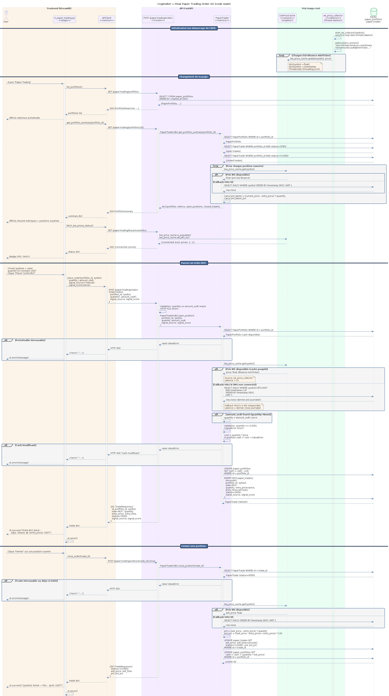

```plantuml
@startuml SQ04-paper-trading-order-flow
' ============================================================
' CryptoBot — PlantUML Shared Skin & Stereotypes
' ============================================================

' --- Theme clair (lisible GitHub) ---
skinparam backgroundColor white
skinparam defaultFontName "Segoe UI, Helvetica, Arial, sans-serif"
skinparam defaultFontSize 12
skinparam defaultFontColor #333333
skinparam shadowing false
skinparam roundCorner 6

' --- Palette ---
' Bleu:   #4A6FA5
' Orange: #FEF3E8 (fond) / #E8943A (bordure)
' Vert:   #ECFDF5 (fond) / #34A853 (bordure)
' Violet: #F3EEFF (fond) / #7C5CFC (bordure)
' Gris:   #F5F5F5 (fond) / #CCCCCC (bordure)

' --- Component ---
skinparam component {
  BackgroundColor #F3EEFF
  BorderColor #7C5CFC
  FontColor #333333
  ArrowColor #4A6FA5
  StereotypeFontColor #7C5CFC
}

' --- Package ---
skinparam package {
  BackgroundColor #F5F5F5
  BorderColor #4A6FA5
  FontColor #333333
}

' --- Class ---
skinparam class {
  BackgroundColor #ECFDF5
  BorderColor #34A853
  FontColor #333333
  HeaderBackgroundColor #34A853
  HeaderFontColor white
  ArrowColor #4A6FA5
  StereotypeFontColor #7C5CFC
  AttributeFontColor #555555
}

' --- Sequence ---
skinparam sequence {
  ArrowColor #4A6FA5
  ActorBorderColor #7C5CFC
  LifeLineBorderColor #CCCCCC
  LifeLineBackgroundColor #F5F5F5
  ParticipantBorderColor #4A6FA5
  ParticipantBackgroundColor #F3EEFF
  ParticipantFontColor #333333
  BoxBorderColor #CCCCCC
  BoxBackgroundColor #F5F5F5
  DividerBackgroundColor #4A6FA5
  DividerFontColor white
}

' --- Activity ---
skinparam activity {
  BackgroundColor #FEF3E8
  BorderColor #E8943A
  FontColor #333333
  ArrowColor #4A6FA5
  DiamondBackgroundColor #F3EEFF
  DiamondBorderColor #7C5CFC
}

' --- Node (deployment) ---
skinparam node {
  BackgroundColor #F3EEFF
  BorderColor #7C5CFC
  FontColor #333333
}

' --- Database ---
skinparam database {
  BackgroundColor #ECFDF5
  BorderColor #34A853
  FontColor #333333
}

' --- Entity (ER) ---
skinparam entity {
  BackgroundColor white
  BorderColor #4A6FA5
  FontColor #333333
  HeaderBackgroundColor #4A6FA5
  HeaderFontColor white
}

' --- State ---
skinparam state {
  BackgroundColor #FEF3E8
  BorderColor #E8943A
  FontColor #333333
  ArrowColor #4A6FA5
}

' --- Usecase ---
skinparam usecase {
  BackgroundColor #F3EEFF
  BorderColor #7C5CFC
  FontColor #333333
  ArrowColor #4A6FA5
  ActorBorderColor #E8943A
}

' --- Note ---
skinparam note {
  BackgroundColor #FEF3E8
  BorderColor #E8943A
  FontColor #333333
}

' --- Legend ---
skinparam legend {
  BackgroundColor #F5F5F5
  BorderColor #CCCCCC
  FontColor #333333
}

' --- Stereotypes ---
' <<collector>>   ETL data collectors
' <<transformer>> ETL data transformers
' <<loader>>      ETL data loaders
' <<scheduler>>   APScheduler jobs
' <<rule>>        ML rule evaluator
' <<model>>       ML model
' <<router>>      FastAPI router
' <<service>>     FastAPI service
' <<middleware>>   FastAPI middleware
' <<page>>        Streamlit page
' <<component>>   Streamlit/Plotly component
' <<hypertable>>  TimescaleDB hypertable
' <<phase2>>      Phase 2 planned feature


title CryptoBot — Flow Paper Trading Order V2 (code main)
caption Pivot V2 — Streamlit → /paper-trading/orders → PaperTrader → live_price_cache

' ============================================================
' Participants
' ============================================================

box "Frontend (Streamlit)" #FEF3E8
  actor User as user
  participant "6_paper_trading.py\n<<page>>" as page
  participant "APIClient\n<<service>>" as client
end box

box "API FastAPI" #F3EEFF
  participant "POST /paper-trading/orders\n<<router>>" as router
  participant "PaperTrader\n<<service>>" as trader
end box

box "Prix temps réel" #ECFDF5
  participant "LivePriceCache\n<<service>>\n(singleton)" as cache
  participant "ws_price_collector\n<<collector>>\n(thread daemon)" as wscol
end box

database "SQLite\npaper_portfolios\npaper_trades" as db

' ============================================================
' Background: WS daemon feeds the cache continuously
' ============================================================

== Initialisation (au démarrage de l'API) ==

wscol -> wscol : start_ws_collector(symbols)\nascyncio loop dans thread daemon
activate wscol #ECFDF5

wscol -> wscol : websockets.connect()\n"wss://stream.binance.com/stream\n?streams=btcusdt@miniTicker,..."

loop Chaque tick Binance miniTicker
  wscol -> cache : live_price_cache.update(symbol, price)
  note right of cache
    dict[symbol → float]
    dict[symbol → timestamp]
    Thread-safe (threading.Lock)
  end note
end

' ============================================================
' Streamlit page load — portfolio selection
' ============================================================

== Chargement de la page ==

user -> page : Ouvre "Paper Trading"
activate page

page -> client : list_portfolios()
client -> router : GET /paper-trading/portfolios
router -> db : SELECT * FROM paper_portfolios\nORDER BY created_at DESC
db --> router : [PaperPortfolio, ...]
router --> client : 200 [PortfolioResponse, ...]
client --> page : portfolios list
page --> user : Affiche sélecteur portefeuille

page -> client : get_portfolio_summary(portfolio_id)
client -> router : GET /paper-trading/portfolios/{id}
activate router
router -> trader : PaperTrader(db).get_portfolio_summary(portfolio_id)
activate trader
trader -> db : SELECT PaperPortfolio WHERE id = portfolio_id
db --> trader : PaperPortfolio
trader -> db : SELECT PaperTrade WHERE portfolio_id AND status='OPEN'
db --> trader : [open trades]
trader -> db : SELECT PaperTrade WHERE portfolio_id AND status='CLOSED'
db --> trader : [closed trades]

loop Pour chaque position ouverte
  trader -> cache : live_price_cache.get(symbol)
  alt Prix WS disponible
    cache --> trader : float (prix live Binance)
  else Fallback OHLCV
    trader -> db : SELECT OHLCV WHERE symbol ORDER BY timestamp DESC LIMIT 1
    db --> trader : row.close
  end
  trader -> trader : Calcul pnl_latent = (current_price - entry_price) * quantity\nCalcul pnl_latent_pct
end

trader --> router : dict{portfolio, metrics, open_positions, closed_trades}
deactivate trader
router --> client : 200 PortfolioSummary
deactivate router
client --> page : summary dict
page --> user : Affiche résumé métriques + positions ouvertes

' ============================================================
' Live price badge
' ============================================================

page -> client : fetch_live_prices_status()
client -> router : GET /paper-trading/live-prices/status
router -> cache : live_price_cache.is_populated\nlive_price_cache.all_with_ts()
cache --> router : {connected: bool, prices: {...}}
router --> client : 200 {connected, prices}
client --> page : status dict
page --> user : Badge LIVE / OHLCV

' ============================================================
' Place order BUY
' ============================================================

== Passer un ordre BUY ==

user -> page : Choisit symbole + saisit\nquantité OU montant USDT\nClique "Placer l'ordre BUY"
activate page

page -> client : place_order(portfolio_id, symbol,\n  quantity | amount_usdt,\n  signal_source="manual",\n  signal_score=None)
activate client

client -> router : POST /paper-trading/orders\nOrderCreate{\n  portfolio_id, symbol,\n  quantity?, amount_usdt?,\n  signal_source, signal_score\n}
activate router

router -> router : Validation: quantity ou amount_usdt requis\n(HTTP 422 sinon)

router -> trader : PaperTrader(db).open_position(\n  portfolio_id, symbol,\n  quantity, amount_usdt,\n  signal_source, signal_score\n)
activate trader

' --- Lookup portfolio ---
trader -> db : SELECT PaperPortfolio WHERE id = portfolio_id
db --> trader : PaperPortfolio (cash disponible)

alt Portefeuille introuvable
  trader --> router : raise ValueError
  router --> client : HTTP 400
  client --> page : {"error": "..."}
  page --> user : st.error(message)
end

' --- Résolution du prix ---
trader -> cache : live_price_cache.get(symbol)

alt Prix WS disponible (cache peuplé)
  cache --> trader : price: float (Binance miniTicker)
  note right of trader
    Source: ws_price_collector
    Latence < 1s
  end note
else Fallback OHLCV (WS non connecté)
  trader -> db : SELECT OHLCV WHERE symbol='BTCUSDT'\n  AND timeframe='1d'\n  ORDER BY timestamp DESC\n  LIMIT 1
  db --> trader : row.close (dernier prix journalier)
  note right of trader
    Fallback OHLCV si WS indisponible
    Latence = dernier close journalier
  end note
end

' --- Calcul quantité si amount_usdt fourni ---
alt amount_usdt fourni (quantity=None)
  trader -> trader : quantity = amount_usdt / price
end

trader -> trader : Validation: quantity >= 0.0001\n(ValueError sinon)

' --- Vérification cash ---
trader -> trader : cost = quantity * price\nSi portfolio.cash < cost → ValueError

alt Cash insuffisant
  trader --> router : raise ValueError
  router --> client : HTTP 400 "Cash insuffisant"
  client --> page : {"error": "..."}
  page --> user : st.error(message)
end

' --- Débit cash + création trade ---
trader -> db : UPDATE paper_portfolios\nSET cash = cash - cost\nWHERE id = portfolio_id

trader -> db : INSERT INTO paper_trades{\n  id=uuid4(),\n  portfolio_id, symbol,\n  side='BUY',\n  quantity, entry_price=price,\n  entry_time=utcnow(),\n  status='OPEN',\n  signal_source, signal_score\n}

db --> trader : PaperTrade (refresh)
deactivate trader

router --> client : 201 TradeResponse{\n  id, portfolio_id, symbol,\n  side='BUY', quantity,\n  entry_price, entry_time,\n  status='OPEN',\n  signal_source, signal_score\n}
deactivate router

client --> page : trade dict
deactivate client

page --> user : st.success("Ordre BUY placé :\n  {qty} {base} @ {entry_price} USDT")
page -> page : st.rerun()
deactivate page

' ============================================================
' Close position
' ============================================================

== Fermer une position ==

user -> page : Clique "Fermer" sur une position ouverte
activate page

page -> client : close_order(trade_id)
client -> router : POST /paper-trading/orders/{trade_id}/close
activate router

router -> trader : PaperTrader(db).close_position(trade_id)
activate trader

trader -> db : SELECT PaperTrade WHERE id = trade_id
db --> trader : PaperTrade (status=OPEN)

alt Trade introuvable ou déjà CLOSED
  trader --> router : raise ValueError
  router --> client : HTTP 400
  client --> page : {"error": "..."}
  page --> user : st.error(message)
end

trader -> cache : live_price_cache.get(symbol)
alt Prix WS disponible
  cache --> trader : exit_price: float
else Fallback OHLCV
  trader -> db : SELECT OHLCV ORDER BY timestamp DESC LIMIT 1
  db --> trader : row.close
end

trader -> trader : pnl = (exit_price - entry_price) * quantity\npnl_pct = ((exit_price - entry_price) / entry_price) * 100

trader -> db : UPDATE paper_trades SET\n  exit_price, exit_time=utcnow(),\n  status='CLOSED', pnl, pnl_pct\nWHERE id = trade_id

trader -> db : UPDATE paper_portfolios SET\n  cash = cash + (quantity * exit_price)\nWHERE id = portfolio_id

db --> trader : commit OK
deactivate trader

router --> client : 200 TradeResponse{\n  status='CLOSED',\n  exit_price, exit_time,\n  pnl, pnl_pct\n}
deactivate router

client --> page : trade dict
page --> user : st.success("{symbol} fermé — P&L : {pnl} USDT")
page -> page : st.rerun()
deactivate page

' ============================================================
' Auto-refresh live prices (badge + courbe)
' ============================================================

== Auto-refresh toutes les 5s (st_autorefresh) ==

page -> client : fetch_live_prices()
client -> router : GET /paper-trading/live-prices
router -> cache : live_price_cache.all_prices()
cache --> router : dict[symbol → float]
router --> client : 200 dict[symbol → float]
client --> page : live_prices dict
page --> user : Mise à jour courbe de performance\n(capital live = cash + Σ qty_i * live_price_i)

deactivate wscol

@enduml
```

## ST01-signal-state

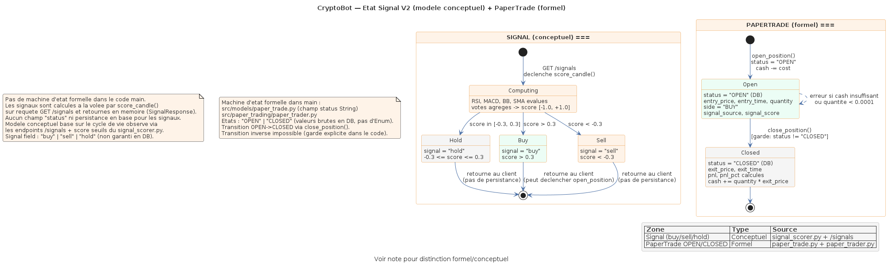

```plantuml
@startuml ST01-signal-state
' ============================================================
' CryptoBot — PlantUML Shared Skin & Stereotypes
' ============================================================

' --- Theme clair (lisible GitHub) ---
skinparam backgroundColor white
skinparam defaultFontName "Segoe UI, Helvetica, Arial, sans-serif"
skinparam defaultFontSize 12
skinparam defaultFontColor #333333
skinparam shadowing false
skinparam roundCorner 6

' --- Palette ---
' Bleu:   #4A6FA5
' Orange: #FEF3E8 (fond) / #E8943A (bordure)
' Vert:   #ECFDF5 (fond) / #34A853 (bordure)
' Violet: #F3EEFF (fond) / #7C5CFC (bordure)
' Gris:   #F5F5F5 (fond) / #CCCCCC (bordure)

' --- Component ---
skinparam component {
  BackgroundColor #F3EEFF
  BorderColor #7C5CFC
  FontColor #333333
  ArrowColor #4A6FA5
  StereotypeFontColor #7C5CFC
}

' --- Package ---
skinparam package {
  BackgroundColor #F5F5F5
  BorderColor #4A6FA5
  FontColor #333333
}

' --- Class ---
skinparam class {
  BackgroundColor #ECFDF5
  BorderColor #34A853
  FontColor #333333
  HeaderBackgroundColor #34A853
  HeaderFontColor white
  ArrowColor #4A6FA5
  StereotypeFontColor #7C5CFC
  AttributeFontColor #555555
}

' --- Sequence ---
skinparam sequence {
  ArrowColor #4A6FA5
  ActorBorderColor #7C5CFC
  LifeLineBorderColor #CCCCCC
  LifeLineBackgroundColor #F5F5F5
  ParticipantBorderColor #4A6FA5
  ParticipantBackgroundColor #F3EEFF
  ParticipantFontColor #333333
  BoxBorderColor #CCCCCC
  BoxBackgroundColor #F5F5F5
  DividerBackgroundColor #4A6FA5
  DividerFontColor white
}

' --- Activity ---
skinparam activity {
  BackgroundColor #FEF3E8
  BorderColor #E8943A
  FontColor #333333
  ArrowColor #4A6FA5
  DiamondBackgroundColor #F3EEFF
  DiamondBorderColor #7C5CFC
}

' --- Node (deployment) ---
skinparam node {
  BackgroundColor #F3EEFF
  BorderColor #7C5CFC
  FontColor #333333
}

' --- Database ---
skinparam database {
  BackgroundColor #ECFDF5
  BorderColor #34A853
  FontColor #333333
}

' --- Entity (ER) ---
skinparam entity {
  BackgroundColor white
  BorderColor #4A6FA5
  FontColor #333333
  HeaderBackgroundColor #4A6FA5
  HeaderFontColor white
}

' --- State ---
skinparam state {
  BackgroundColor #FEF3E8
  BorderColor #E8943A
  FontColor #333333
  ArrowColor #4A6FA5
}

' --- Usecase ---
skinparam usecase {
  BackgroundColor #F3EEFF
  BorderColor #7C5CFC
  FontColor #333333
  ArrowColor #4A6FA5
  ActorBorderColor #E8943A
}

' --- Note ---
skinparam note {
  BackgroundColor #FEF3E8
  BorderColor #E8943A
  FontColor #333333
}

' --- Legend ---
skinparam legend {
  BackgroundColor #F5F5F5
  BorderColor #CCCCCC
  FontColor #333333
}

' --- Stereotypes ---
' <<collector>>   ETL data collectors
' <<transformer>> ETL data transformers
' <<loader>>      ETL data loaders
' <<scheduler>>   APScheduler jobs
' <<rule>>        ML rule evaluator
' <<model>>       ML model
' <<router>>      FastAPI router
' <<service>>     FastAPI service
' <<middleware>>   FastAPI middleware
' <<page>>        Streamlit page
' <<component>>   Streamlit/Plotly component
' <<hypertable>>  TimescaleDB hypertable
' <<phase2>>      Phase 2 planned feature


title CryptoBot — Etat Signal V2 (modele conceptuel) + PaperTrade (formel)
caption Voir note pour distinction formel/conceptuel

' ============================================================
' SECTION A — Signal : modele conceptuel (pas de FSM formelle)
' ============================================================

note as N_conceptual
  Pas de machine d'etat formelle dans le code main.
  Les signaux sont calcules a la volee par score_candle()
  sur requete GET /signals et retournes en memoire (SignalResponse).
  Aucun champ "status" ni persistance en base pour les signaux.
  Modele conceptuel base sur le cycle de vie observe via
  les endpoints /signals + score seuils du signal_scorer.py.
  Signal field : "buy" | "sell" | "hold" (non garanti en DB).
end note

state "=== SIGNAL (conceptuel) ===" as SectionSignal {

  [*] --> Computing : GET /signals\ndeclenche score_candle()

  state "Computing" as Computing #FEF3E8 {
    Computing : RSI, MACD, BB, SMA evalues
    Computing : votes agreges -> score [-1.0, +1.0]
  }

  state "Hold" as Hold #F5F5F5 {
    Hold : signal = "hold"
    Hold : -0.3 <= score <= 0.3
  }

  state "Buy" as Buy #ECFDF5 {
    Buy : signal = "buy"
    Buy : score > 0.3
  }

  state "Sell" as Sell #FEF3E8 {
    Sell : signal = "sell"
    Sell : score < -0.3
  }

  Computing --> Hold   : score in [-0.3, 0.3]
  Computing --> Buy    : score > 0.3
  Computing --> Sell   : score < -0.3

  Hold --> [*] : retourne au client\n(pas de persistance)
  Buy  --> [*] : retourne au client\n(peut declencher open_position)
  Sell --> [*] : retourne au client\n(pas de persistance)
}

' ============================================================
' SECTION B — PaperTrade : machine d'etat FORMELLE (2 etats)
' ============================================================

note as N_formal
  Machine d'etat formelle dans main :
  src/models/paper_trade.py (champ status String)
  src/paper_trading/paper_trader.py
  Etats : "OPEN" | "CLOSED" (valeurs brutes en DB, pas d'Enum).
  Transition OPEN->CLOSED via close_position().
  Transition inverse impossible (garde explicite dans le code).
end note

state "=== PAPERTRADE (formel) ===" as SectionTrade {

  [*] --> Open : open_position()\nstatus = "OPEN"\ncash -= cost

  state "Open" as Open #ECFDF5 {
    Open : status = "OPEN" (DB)
    Open : entry_price, entry_time, quantity
    Open : side = "BUY"
    Open : signal_source, signal_score
  }

  state "Closed" as Closed #F5F5F5 {
    Closed : status = "CLOSED" (DB)
    Closed : exit_price, exit_time
    Closed : pnl, pnl_pct calcules
    Closed : cash += quantity * exit_price
  }

  Open --> Closed : close_position()\n[garde: status != "CLOSED"]
  Closed --> [*]

  Open -[dashed]-> Open : erreur si cash insuffisant\nou quantite < 0.0001
}

legend bottom right
  |= Zone              |= Type       |= Source                          |
  | Signal (buy/sell/hold) | Conceptuel  | signal_scorer.py + /signals      |
  | PaperTrade OPEN/CLOSED | Formel      | paper_trade.py + paper_trader.py |
endlegend

@enduml
```

## UC01-personas-usecases

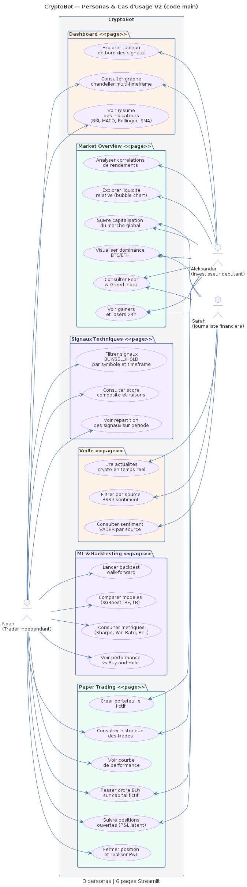

```plantuml
@startuml UC01-personas-usecases
' ============================================================
' CryptoBot — PlantUML Shared Skin & Stereotypes
' ============================================================

' --- Theme clair (lisible GitHub) ---
skinparam backgroundColor white
skinparam defaultFontName "Segoe UI, Helvetica, Arial, sans-serif"
skinparam defaultFontSize 12
skinparam defaultFontColor #333333
skinparam shadowing false
skinparam roundCorner 6

' --- Palette ---
' Bleu:   #4A6FA5
' Orange: #FEF3E8 (fond) / #E8943A (bordure)
' Vert:   #ECFDF5 (fond) / #34A853 (bordure)
' Violet: #F3EEFF (fond) / #7C5CFC (bordure)
' Gris:   #F5F5F5 (fond) / #CCCCCC (bordure)

' --- Component ---
skinparam component {
  BackgroundColor #F3EEFF
  BorderColor #7C5CFC
  FontColor #333333
  ArrowColor #4A6FA5
  StereotypeFontColor #7C5CFC
}

' --- Package ---
skinparam package {
  BackgroundColor #F5F5F5
  BorderColor #4A6FA5
  FontColor #333333
}

' --- Class ---
skinparam class {
  BackgroundColor #ECFDF5
  BorderColor #34A853
  FontColor #333333
  HeaderBackgroundColor #34A853
  HeaderFontColor white
  ArrowColor #4A6FA5
  StereotypeFontColor #7C5CFC
  AttributeFontColor #555555
}

' --- Sequence ---
skinparam sequence {
  ArrowColor #4A6FA5
  ActorBorderColor #7C5CFC
  LifeLineBorderColor #CCCCCC
  LifeLineBackgroundColor #F5F5F5
  ParticipantBorderColor #4A6FA5
  ParticipantBackgroundColor #F3EEFF
  ParticipantFontColor #333333
  BoxBorderColor #CCCCCC
  BoxBackgroundColor #F5F5F5
  DividerBackgroundColor #4A6FA5
  DividerFontColor white
}

' --- Activity ---
skinparam activity {
  BackgroundColor #FEF3E8
  BorderColor #E8943A
  FontColor #333333
  ArrowColor #4A6FA5
  DiamondBackgroundColor #F3EEFF
  DiamondBorderColor #7C5CFC
}

' --- Node (deployment) ---
skinparam node {
  BackgroundColor #F3EEFF
  BorderColor #7C5CFC
  FontColor #333333
}

' --- Database ---
skinparam database {
  BackgroundColor #ECFDF5
  BorderColor #34A853
  FontColor #333333
}

' --- Entity (ER) ---
skinparam entity {
  BackgroundColor white
  BorderColor #4A6FA5
  FontColor #333333
  HeaderBackgroundColor #4A6FA5
  HeaderFontColor white
}

' --- State ---
skinparam state {
  BackgroundColor #FEF3E8
  BorderColor #E8943A
  FontColor #333333
  ArrowColor #4A6FA5
}

' --- Usecase ---
skinparam usecase {
  BackgroundColor #F3EEFF
  BorderColor #7C5CFC
  FontColor #333333
  ArrowColor #4A6FA5
  ActorBorderColor #E8943A
}

' --- Note ---
skinparam note {
  BackgroundColor #FEF3E8
  BorderColor #E8943A
  FontColor #333333
}

' --- Legend ---
skinparam legend {
  BackgroundColor #F5F5F5
  BorderColor #CCCCCC
  FontColor #333333
}

' --- Stereotypes ---
' <<collector>>   ETL data collectors
' <<transformer>> ETL data transformers
' <<loader>>      ETL data loaders
' <<scheduler>>   APScheduler jobs
' <<rule>>        ML rule evaluator
' <<model>>       ML model
' <<router>>      FastAPI router
' <<service>>     FastAPI service
' <<middleware>>   FastAPI middleware
' <<page>>        Streamlit page
' <<component>>   Streamlit/Plotly component
' <<hypertable>>  TimescaleDB hypertable
' <<phase2>>      Phase 2 planned feature


title CryptoBot — Personas & Cas d'usage V2 (code main)
caption 3 personas | 6 pages Streamlit

left to right direction

' ============================================================
' Personas
' ============================================================
actor "Noah\n(Trader independant)" as noah #FEF3E8

' ============================================================
' Use Cases
' ============================================================
rectangle "CryptoBot" #F5F5F5 {

  package "Dashboard <<page>>" #FEF3E8 {
    usecase "Consulter graphe\nchandelier multi-timeframe" as uc_candle
    usecase "Voir resume\ndes indicateurs\n(RSI, MACD, Bollinger, SMA)" as uc_indic
    usecase "Explorer tableau\nde bord des signaux" as uc_dash_signals
  }

  package "Market Overview <<page>>" #ECFDF5 {
    usecase "Suivre capitalisation\ndu marche global" as uc_mcap
    usecase "Visualiser dominance\nBTC/ETH" as uc_dominance
    usecase "Consulter Fear\n& Greed Index" as uc_fng
    usecase "Voir gainers\net losers 24h" as uc_movers
    usecase "Analyser correlations\nde rendements" as uc_corr
    usecase "Explorer liquidite\nrelative (bubble chart)" as uc_liquidity
  }

  package "Signaux Techniques <<page>>" #F3EEFF {
    usecase "Filtrer signaux\nBUY/SELL/HOLD\npar symbole et timeframe" as uc_signals
    usecase "Consulter score\ncomposite et raisons" as uc_score
    usecase "Voir repartition\ndes signaux sur periode" as uc_signal_dist
  }

  package "Veille <<page>>" #FEF3E8 {
    usecase "Lire actualites\ncrypto en temps reel" as uc_news
    usecase "Filtrer par source\nRSS / sentiment" as uc_filter
    usecase "Consulter sentiment\nVADER par source" as uc_sentiment
  }

  package "ML & Backtesting <<page>>" #F3EEFF {
    usecase "Lancer backtest\nwalk-forward" as uc_backtest
    usecase "Comparer modeles\n(XGBoost, RF, LR)" as uc_model_cmp
    usecase "Consulter metriques\n(Sharpe, Win Rate, PnL)" as uc_metrics
    usecase "Voir performance\nvs Buy-and-Hold" as uc_vs_bah
  }

  package "Paper Trading <<page>>" #ECFDF5 {
    usecase "Creer portefeuille\nfictif" as uc_pt_create
    usecase "Passer ordre BUY\nsur capital fictif" as uc_pt_order
    usecase "Suivre positions\nouvertes (P&L latent)" as uc_pt_open
    usecase "Fermer position\net realiser P&L" as uc_pt_close
    usecase "Consulter historique\ndes trades" as uc_pt_history
    usecase "Voir courbe\nde performance" as uc_pt_chart
  }

}

' Personas placés à droite (déclarés après le rectangle)
actor "Sarah\n(Journaliste financiere)" as sarah #F3EEFF
actor "Aleksandar\n(Investisseur debutant)" as aleksandar #ECFDF5

' ============================================================
' Relations — Noah (Trader independant)
' ============================================================
noah --> uc_candle
noah --> uc_indic
noah --> uc_signals
noah --> uc_score
noah --> uc_signal_dist
noah --> uc_backtest
noah --> uc_model_cmp
noah --> uc_metrics
noah --> uc_vs_bah
noah --> uc_pt_order
noah --> uc_pt_open
noah --> uc_pt_close
noah --> uc_pt_history
noah --> uc_pt_chart

' ============================================================
' Relations — Sarah (Journaliste financiere)
' ============================================================
uc_news <-- sarah
uc_filter <-- sarah
uc_sentiment <-- sarah
uc_mcap <-- sarah
uc_dominance <-- sarah
uc_fng <-- sarah
uc_movers <-- sarah

' ============================================================
' Relations — Aleksandar (Investisseur debutant)
' ============================================================
uc_candle <-- aleksandar
uc_dash_signals <-- aleksandar
uc_mcap <-- aleksandar
uc_dominance <-- aleksandar
uc_fng <-- aleksandar
uc_movers <-- aleksandar
uc_corr <-- aleksandar
uc_liquidity <-- aleksandar
uc_pt_create <-- aleksandar
uc_pt_order <-- aleksandar
uc_pt_open <-- aleksandar
uc_pt_history <-- aleksandar

@enduml
```

