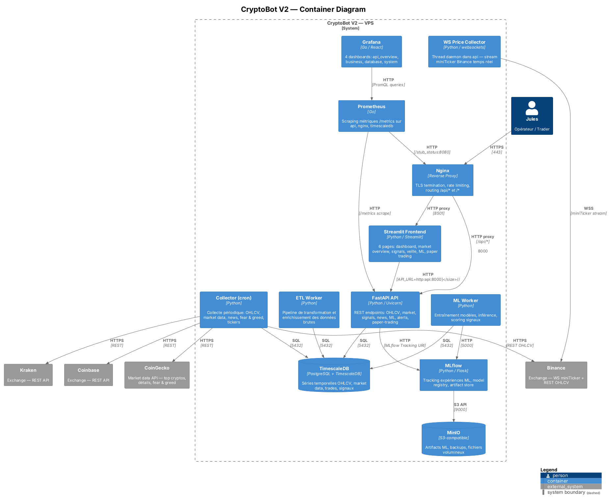
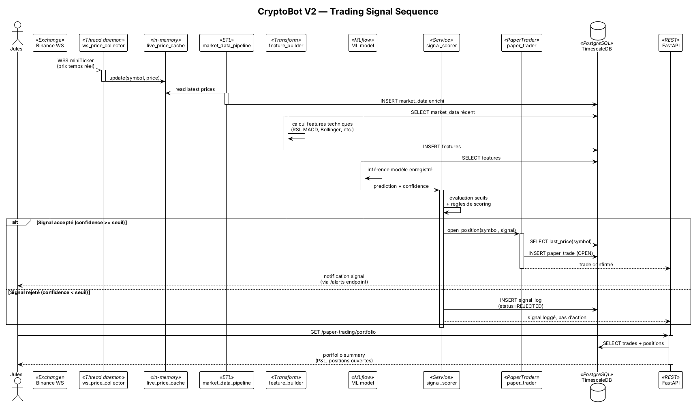

# V2 Architecture Diagrams

> CryptoBot V2 — PlantUML architecture documentation.
> Generated from source: `docker-compose.yml`, `_v1/infra/ansible/group_vars/vps.yml`, `api/`, `src/`, `frontend/`.

---

## 1. Container Diagram (C4)

Vue d'ensemble des containers applicatifs, bases de données, services externes et leurs relations réseau.



---

## 2. Trading Sequence

Flux de données temps réel : du tick WebSocket Binance jusqu'à l'exécution paper trading et la persistance en base.



---

## 3. Deployment Pipeline (Activity)

Pipeline de déploiement V2 sur VPS via GitHub Actions + Ansible. Swimlanes par responsabilité.

```plantuml
@startuml v2_deploy_pipeline
!theme plain
skinparam backgroundColor white
skinparam defaultFontName Inter
skinparam defaultFontSize 12
skinparam ActivityBackgroundColor #FFFFFF
skinparam ActivityBorderColor #333333

title CryptoBot V2 — Deployment Pipeline

|#DDF8DD| GitHub Actions |
|#FFFDE0| Ansible |
|#FFE0E0| VPS |

|GitHub Actions|
start
#90EE90:pre_flight
——
lint, tests, type-check
(ruff + pytest + pyright);

#90EE90:build Docker images
——
tag: v2-<sha>;

#90EE90:push images to registry;

|Ansible|
#90EE90:connect VPS via SSH
——
inventories/production.ini;

#FFFF99:preserve_state
——
backup TimescaleDB volume
backup .env + secrets/
snapshot docker volumes;
note right
  **REVERSIBLE**
  Backup avant toute action
  destructive
end note

#FFFF99:pull_v2
——
rsync project files
(exclude: .git, .env, __pycache__);

#FFFF99:db_migration
——
Alembic upgrade head
(TimescaleDB schema);
note right
  **REVERSIBLE**
  Alembic downgrade si échec
end note

#FFFF99:env_diff_apply
——
Compare .env template vs VPS .env
Apply new keys (preserve existing);

|VPS|
#FF6B6B:graceful_shutdown_v1
——
docker compose down --timeout 30
(drain positions ouvertes);
note right
  **CRITICAL**
  Positions RAM perdues
  si non drainées
end note

#FF6B6B:hot_swap
——
docker compose -f docker-compose.prod.yml up -d
(9 services: timescaledb, minio, mlflow,
api, frontend, etl-worker, ml-worker,
prometheus, grafana);
note right
  **CRITICAL**
  TimescaleDB volume = PRESERVE
  .env = PROTECTED
end note

|Ansible|
#90EE90:post_deploy_checks
——
curl /health (api)
docker ps --filter health=healthy
prometheus targets UP;

if (health OK ?) then (oui)
  #90EE90:commit
  ——
  tag deploy-v2-<date>
  purge old backups;
else (non)
  #FF6B6B:rollback
  ——
  restore TimescaleDB volume
  restore .env
  docker compose up -d (v1 images);
endif

|GitHub Actions|
#90EE90:cleanup
——
notify (webhook/mail)
update deploy log;

stop

@enduml
```

---

## 4. State Ownership Map (Component)

Carte des volumes, fichiers et données en mémoire avec leur politique de rétention lors des déploiements.

```plantuml
@startuml v2_state_ownership
!theme plain
skinparam backgroundColor white
skinparam defaultFontName Inter
skinparam defaultFontSize 12
skinparam componentStyle rectangle

title CryptoBot V2 — State Ownership Map

skinparam component {
    BackgroundColor<<PRESERVE>> #90EE90
    BorderColor<<PRESERVE>> #2E8B57
    BackgroundColor<<PROTECTED>> #FF6B6B
    BorderColor<<PROTECTED>> #CC0000
    BackgroundColor<<TRANSIENT>> #FFB347
    BorderColor<<TRANSIENT>> #CC7A00
}

package "Persistent State — PRESERVE" <<PRESERVE>> {
    component [TimescaleDB volume\n/var/lib/postgresql/data\n——\nOHLCV, market_data, tickers,\nnews_articles, signals,\npaper_trades, portfolios] as tsdb <<PRESERVE>>

    component [MLflow volume\n/mlflow (mlflow-data)\n——\nExpériences, runs,\nmodel registry] as mlflow_vol <<PRESERVE>>

    component [MinIO volume\n/data (minio-data)\n——\nArtifacts ML, backups,\nfichiers volumineux] as minio_vol <<PRESERVE>>

    component [cryptobot_data volume\n./data:/app/data\n——\nSQLite (dev), fichiers CSV,\ncache local] as data_vol <<PRESERVE>>
}

package "Sensitive Config — PROTECTED" <<PROTECTED>> {
    component [/opt/cryptobot/.env\n——\nAPI keys exchanges\n(Binance, Coinbase, Kraken)\nDB credentials, secrets] as env_file <<PROTECTED>>

    component [/opt/cryptobot/secrets/\n——\nTokens, certificats custom,\nclés privées applicatives] as secrets_dir <<PROTECTED>>

    component [TLS Certificates\n/etc/letsencrypt/live/\nmonpetitbet.fr/\n——\nfullchain.pem, privkey.pem] as tls_certs <<PROTECTED>>
}

package "Ephemeral — TRANSIENT" <<TRANSIENT>> {
    component [live_price_cache\n(RAM — dict Python)\n——\nDerniers prix WS Binance\nReconstruit au redémarrage] as price_cache <<TRANSIENT>>

    component [Positions ouvertes\n(RAM — PaperTrader state)\n——\nOrdres pending non persistés\nPerdus si shutdown brutal] as open_positions <<TRANSIENT>>

    component [Prometheus TSDB\n(RAM + WAL)\n——\nMétriques 15j retention\nRecollectées après restart] as prom_data <<TRANSIENT>>

    component [Container logs\n(stdout/stderr)\n——\nRotation Docker json-file\nNon critiques] as logs <<TRANSIENT>>
}

tsdb -[hidden]down- mlflow_vol
env_file -[hidden]down- secrets_dir
price_cache -[hidden]down- open_positions

note bottom of tsdb
  **Ne jamais docker volume rm**
  Backup quotidien 3h AM
  Retention: 30 jours
end note

note bottom of env_file
  **Exclu du rsync deploy**
  Template diff uniquement
  Ne jamais commit en git
end note

note bottom of price_cache
  **Reconstruit en ~5s**
  après reconnexion WS Binance
  Pas de perte fonctionnelle
end note

@enduml
```



---

## Conventions

| Couleur | Signification | Exemples |
|---------|---------------|----------|
| 🟢 Vert (`#90EE90`) | **PRESERVE / SAFE** — Données persistantes, backup obligatoire avant deploy | TimescaleDB volume, MLflow volume, MinIO volume |
| 🔴 Rouge (`#FF6B6B`) | **PROTECTED / CRITICAL** — Ne jamais écraser, jamais commit, diff-only | `.env`, `secrets/`, certs TLS, graceful shutdown |
| 🟠 Orange (`#FFB347`) | **TRANSIENT** — Éphémère, reconstruit automatiquement après redémarrage | `live_price_cache` (RAM), positions ouvertes, Prometheus WAL |
| 🟡 Jaune (`#FFFF99`) | **REVERSIBLE** — Opération annulable via backup/downgrade | `preserve_state`, `db_migration`, `env_diff_apply` |

> **Note domaine** : la config nginx actuelle utilise `monpetitbet.fr` (cf `vps.yml`), tandis que `dtsc-cryptobot.fr` est annoncé. L'arbitrage du domaine définitif est hors scope de ces diagrammes.
