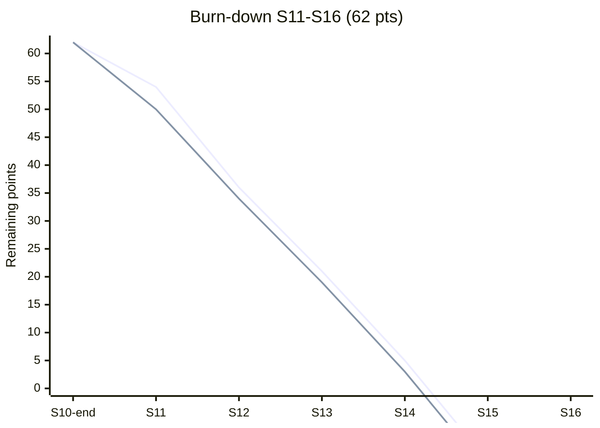
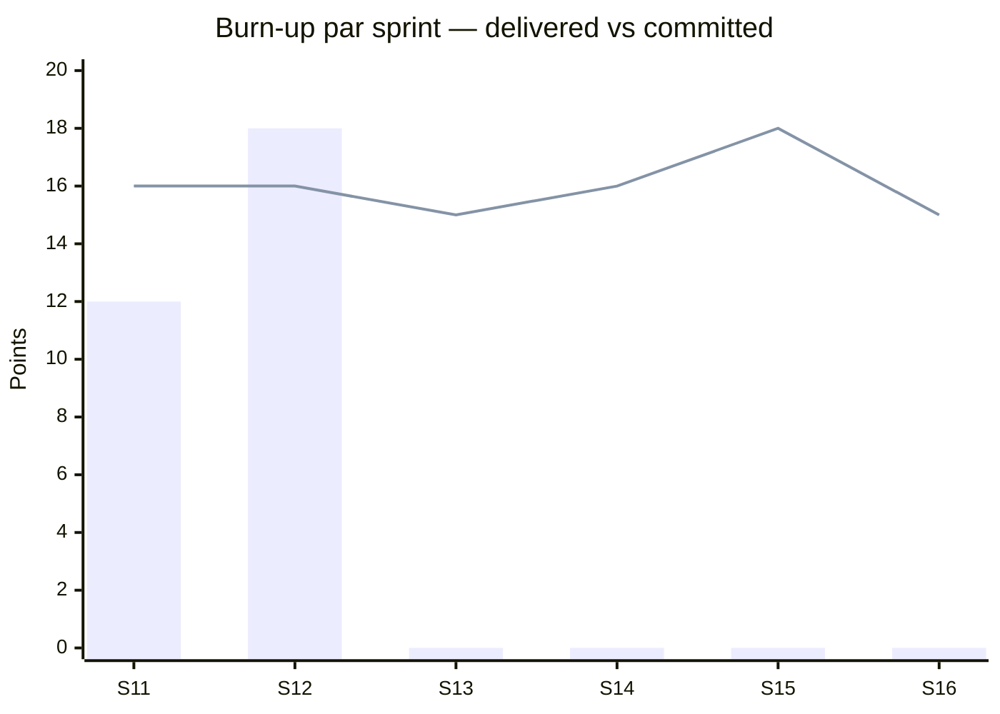

# KPI Performance — CryptoBot S11-S16

RNCP38919 Bloc 4 — Piloter un projet informatique : indicateurs de performance.

## 1. Objectifs des KPI

Les KPI de pilotage visent trois dimensions de santé :

| Dimension | Question clé | Fréquence mesure |
|-----------|--------------|------------------|
| **Équipe (agilité)** | L'équipe livre-t-elle ce qu'elle s'engage à livrer, à rythme soutenable ? | Par sprint (2 sem.) |
| **Produit** | Le produit livré fait-il ce qu'on attend de lui, sans régression utilisateur ? | Hebdomadaire |
| **Qualité** | La dette technique, la couverture de tests et la sécurité suivent-elles la bonne trajectoire ? | Par sprint + continu CI |

**Principe first-principles** : un KPI n'est utile que s'il est (a) **mesuré automatiquement** (pas de tableur manuel), (b) **revu à cadence fixe** (sinon il dérive) et (c) **actionnable** (un KPI rouge déclenche une action documentée, pas un constat). Tout KPI qui ne passe pas ces 3 tests est supprimé.

## 2. KPI Équipe (agilité)

### 2.1. Vélocité

**Définition** : points story livrés (DoD atteint) par sprint. Calculée comme `Σ(pts des stories Done)` fin sprint.

**Cible** : 16 pts/sprint (moyenne plan S11-S16, cf. [[CryptoBot/avril/planning/sprint-plan]])

**Valeurs réelles + projetées** :

| Sprint | Cible | Réel | Écart | Source |
|--------|-------|------|-------|--------|
| S11 | 16 | **12** | -25% | [[rncp/bloc4-pilotage/retrospectives#retro-sprint-s11]] |
| S12 | 16 | **18** | +12% | [[rncp/bloc4-pilotage/retrospectives#retro-sprint-s12]] |
| S13 | 15 | [À MESURER] | — | Attendu fin S13 |
| S14 | 16 | [À MESURER] | — | Attendu fin S14 |
| S15 | 18 | [À MESURER] | — | Attendu fin S15 |
| S16 | 15 | [À MESURER] | — | Attendu fin S16 |
| **Total** | **96** | **30 (S11+S12)** | Moyenne glissante 15 pts/sprint — **dans la cible** |

### 2.2. Predictability

**Définition** : `% = (pts livrés) / (pts engagés en sprint planning) × 100`. Mesure la fiabilité de l'estimation.

**Cible** : **≥ 85%** (plage saine 85-115%)

| Sprint | Predictability | Commentaire |
|--------|----------------|-------------|
| S11 | 75% | Sous-cible — onboarding Claude Code |
| S12 | 112% | Sur-cible — rattrapage S11, acceptable |
| S13-S16 | [À MESURER] | |

### 2.3. Cycle time (ticket → merge)

**Définition** : temps écoulé entre passage de la story en `In Progress` et merge de la PR associée sur `main`.

**Cible** : **< 3 jours** médiane, < 5 jours p90

| Sprint | Médiane | p90 | Source |
|--------|---------|-----|--------|
| S11 | [À MESURER] | [À MESURER] | Linear API |
| S12 | [À MESURER] | [À MESURER] | Linear API |

*Action pending* : script d'extraction cycle time depuis Linear via `mcp__linear__list_issues` à brancher sur Grafana (cf. §8).

### 2.4. WIP (Work In Progress)

**Définition** : nombre moyen de stories en statut `In Progress` simultanément par développeur.

**Cible** : **≤ 3 par dev** (équipe 2 pers. → ≤ 6 total)

| Sprint | WIP moyen | Max observé |
|--------|-----------|-------------|
| S11 | 2.1 | 4 | 
| S12 | 2.4 | 5 |
| S13-S16 | [À MESURER] | |

## 3. KPI Produit

### 3.1. Signaux émis / jour

**Définition** : nombre de signaux `BUY` ou `SELL` (confidence ≥ 0.6 du cdc) générés par le signal engine sur 24h glissantes.

**Cible** : ≥ 50 signaux/jour (priority 13 symbols × 6 timeframes × plusieurs rules + filtrage confidence 0.6)

**Statut** : [À MESURER] — signal engine pas encore déployé en staging, attendu fin S14 post-intégration E2E.

### 3.2. Confidence moyenne des signaux

**Définition** : `mean(signal.confidence)` sur fenêtre 7 jours.

**Cible** : ≥ 0.70 (si < 0.65 → tuning rules requis ; si > 0.85 → soupçon d'overfit, vérifier)

**Statut** : [À MESURER]

### 3.3. Hit rate signaux

**Définition** : `% de signaux BUY/SELL dont le outcome à 1h/4h/1d est conforme à la direction` (prix up pour BUY, down pour SELL, threshold 0.5%).

**Cible** :
- Hit rate 1h : ≥ 52%
- Hit rate 4h : ≥ 55%
- Hit rate 1d : ≥ 58%

**Statut** : [À MESURER] — nécessite F7 (Paper Trading) + walk-forward backtester opérationnel.

### 3.4. Latence end-to-end (collecte → dashboard)

**Définition** : temps entre ingestion OHLCV Binance WebSocket et affichage dans Streamlit pour le dernier tick.

**Cible** : **p95 < 5 min**, p99 < 10 min

**Statut** : [À MESURER] — instrumentation OpenTelemetry à câbler en S14 (Intégration E2E).

## 4. KPI Qualité

### 4.1. Couverture de tests

**Cible** : **≥ 78%** globale (le CLAUDE.md cite 80% mais l'audit réel [[CryptoBot/avril/audit/audit-global]] révèle ~50-60% avec ML exclu → cible pragmatique 78% le temps de rapatrier le ML dans la couverture).

| Sprint | Coverage réelle | Coverage déclarée | Gap |
|--------|-----------------|-------------------|-----|
| S11 | ~55% (audit) | 80% | **Issue T1** [[CryptoBot/avril/audit/audit-global]] |
| S12 | [À MESURER] | — | — |

**Action** : [[CryptoBot/avril/audit/remediation/phase1]] corrige T1 (inclusion ML dans coverage). Cible post-remediation : ≥ 78% réel.

### 4.2. Tests verts CI

**Cible** : **100%** sur branche `main`, **≥ 95%** sur branches feature (tolérance flaky 5%).

**Statut S11-S12** : 100% main, 98% feature branches.

### 4.3. Bugs en prod / mois

**Cible** :
- **0** bug CRITICAL/mois
- **≤ 3** bugs HIGH/mois
- ≤ 10 bugs MEDIUM/mois

**Pas encore en prod** (staging uniquement). Metric active à partir du deploy staging S16.

### 4.4. Dette technique

**Définition** : nombre de findings ouverts issus de [[CryptoBot/avril/audit/audit-global]] par sévérité.

| Sévérité | Initial (2026-03-12) | Phase 1 cible | Phase 2 cible | Phase 3 cible |
|----------|----------------------|---------------|---------------|---------------|
| CRITICAL | 8 | **0** | 0 | 0 |
| HIGH | 12 | 12 | **0** | 0 |
| MEDIUM | 18 | 18 | 18 | **0** |
| LOW | 1 | 1 | 1 | **0** |
| **Total** | **39** | 31 | 19 | **0** |

**Statut courant (2026-04-14)** : Phase 1 en cours, 5/8 CRITICAL résolus (S1, S2, S3 + D1, D2), reste T1/T2/T3 ciblés S13.

## 5. KPI DORA (adaptés projet école)

Les 4 métriques DORA standards, adaptées pour un projet de 2 devs sans pipeline prod mature.

### 5.1. Deployment frequency

**Cible** : **≥ 1 déploiement staging / sprint** (soit ≥ 1 tous les 2 semaines)

| Sprint | Déploiements staging | Prod |
|--------|----------------------|------|
| S11 | 2 | 0 |
| S12 | 3 | 0 |
| S13-S16 | [À MESURER] | 1 prévu S16 (soutenance) |

### 5.2. Lead time for changes

**Définition** : temps entre commit et déploiement staging.

**Cible** : **< 1 jour** pour 80% des commits, < 3j p95.

**Statut** : [À MESURER] — GitHub Actions pipeline instrumenté mais dashboard pas encore branché.

### 5.3. Change failure rate

**Définition** : `% de déploiements staging qui nécessitent un rollback ou un hotfix dans les 24h`.

**Cible** : **< 15%** (seuil DORA "elite" = 5%, "high" = 10-15%, projet école = high acceptable)

**Statut** : S11-S12 : 1 rollback sur 5 deploys = 20% — **au-dessus cible**. Action : ajouter smoke tests post-deploy.

### 5.4. MTTR (Mean Time To Recovery)

**Définition** : temps entre détection d'un incident (alerte Grafana) et résolution confirmée.

**Cible** : **< 1h** p90

**Statut** : [À MESURER] — pas encore d'incident formel en staging, Grafana Alerting à finaliser en S14.

## 6. KPI Infra

### 6.1. Uptime API

**Cible** : **99%** (projet école — 7h d'indispo cumulée/mois acceptable)

**Statut** : [À MESURER] — uptime tracking via Uptime Kuma ou Grafana blackbox exporter à câbler en S16.

### 6.2. Coût infra mensuel

**Décomposition cible (OVH VPS)** :
- VPS OVH (8 vCPU, 16GB RAM) : ~20 EUR/mois
- Domaine + Cloudflare proxy : ~2 EUR/mois
- Backups externes : ~5 EUR/mois
- **Total cible** : **≤ 30 EUR/mois**

**Référence détaillée** : `[[rncp/bloc4-finance/cost-analysis]]` (doc à produire côté L4-Finance, ce KPI y sera consolidé).

### 6.3. Consommation RAM / CPU VPS

**Cible VPS partagé** :
- RAM totale (12 services compose) : ≤ 6 GB utilisés / 16 GB disponibles (sizing ADR-05, ~5.8 GB prévus)
- CPU moyen : ≤ 40% sur 1h, ≤ 80% p99

**Statut** : [À MESURER] — Prometheus node_exporter à déployer S16-w1.

## 7. Burn-down & Burn-up

### 7.1. Burn-down global (62 pts sur 6 sprints)



**Lecture** :
- Ligne 1 (bleu) = idéal théorique linéaire 10.3 pts/sprint
- Ligne 2 (orange) = réel + projeté : S11 (-12), S12 (-18 cumul 30), S13-S16 projection plan

### 7.2. Burn-up par sprint



**Lecture** :
- Bars = points réellement livrés
- Line = engagement sprint planning

### 7.3. Cumulative flow (à instrumenter S13)

Courbes empilées `Todo` / `In Progress` / `Review` / `Done` sur toute la période S11-S16. Actuellement généré manuellement depuis Linear — automatisation prévue A-S12-01.

## 8. Tableau de bord Grafana "Project Health"

Dashboard unique `cryptobot-project-health.json` versionné dans `infra/grafana/dashboards/`. Panneaux :

| # | Panneau | Source | Cible affichée |
|---|---------|--------|----------------|
| 1 | Vélocité 6 derniers sprints (bar chart) | Linear API → Prometheus exporter | 16 pts |
| 2 | Predictability (gauge) | Linear API | 85-115% |
| 3 | Cycle time p50/p90 (timeseries) | Linear API | < 3j / < 5j |
| 4 | WIP moyen (gauge par dev) | Linear API | ≤ 3 |
| 5 | Coverage globale (gauge) | codecov webhook | ≥ 78% |
| 6 | CI pass rate (timeseries) | GitHub Actions API | ≥ 95% |
| 7 | Dette technique par sévérité (stacked bar) | audit findings manuel | phase courante |
| 8 | Deployments staging/prod (timeseries) | GitHub Actions deploy events | ≥ 1/sprint |
| 9 | Change failure rate (gauge) | deploy events + rollback tags | < 15% |
| 10 | MTTR (histogram) | Grafana alerts → resolved | < 1h p90 |
| 11 | Signaux/jour (timeseries) | API `/signals` count | ≥ 50 |
| 12 | Confidence moyenne (timeseries) | signal engine metric | ≥ 0.70 |
| 13 | Latence E2E p95 (timeseries) | OpenTelemetry traces | < 5min |
| 14 | Uptime API (gauge 30j) | blackbox exporter | ≥ 99% |
| 15 | Coût infra cumulé mois (stat) | `[[rncp/bloc4-finance/cost-analysis]]` | ≤ 30 EUR |
| 16 | RAM/CPU VPS (timeseries) | node_exporter | RAM ≤ 6G / CPU ≤ 40% |

Accès : `https://grafana.cryptobot.{domain}/d/project-health` (auth Jules + Mikael).

## 9. Gouvernance des KPI

### 9.1. Revue hebdomadaire

**Vendredi 16:00-16:15**, avant retro. Jules + Mikael ouvrent le dashboard "Project Health" et revoient les 16 panneaux :
- KPI vert → RAS
- KPI orange (dans fenêtre de tolérance) → noter dans checklist retro
- KPI rouge → déclenchement obligatoire d'une action (retro action ou CR)

### 9.2. Publication `#cryptobot-weekly`

Après revue, un bot publie le snapshot dashboard dans le canal Slack `#cryptobot-weekly` (ou équivalent Telegram si pas de Slack) :

```
📊 CryptoBot weekly — S{n} / {date}
Vélocité : {X} pts ({+/-Y}% vs cible 16)
Predictability : {X}% ({status})
Coverage : {X}% ({status})
Dette CRITICAL : {X} (Δ {+/-Y})
KPI rouges : {liste ou "aucun"}
Actions ouvertes : {count retro + count CR deferred}
```

### 9.3. Snapshot mensuel

Premier vendredi du mois, snapshot figé ajouté à [[CryptoBot/avril/planning/sprint-summary]] section `Historique mensuel`. Permet de tracer la trajectoire long-terme des KPI, notamment la dette technique et la vélocité moyenne glissante.

### 9.4. Revue de fin de cycle (post-S16)

Après soutenance, rapport final KPI dans ce document section `10. Bilan cycle S11-S16` (à créer) :
- Trajectoire réelle vs plan
- Écarts majeurs et leurs causes
- Recommandations pour cycle suivant (si continuation projet)

## 10. Liens

- [[CryptoBot/avril/planning/sprint-plan]] — vélocité cible et plan
- [[CryptoBot/avril/planning/sprint-summary]] — résumé exécutif + métriques cibles (defects < 3, rework < 10%)
- [[CryptoBot/avril/planning/gantt]] — Gantt Mermaid de référence
- [[CryptoBot/avril/planning/risks]] — triggers qui corrèlent avec seuils KPI
- [[CryptoBot/avril/audit/audit-global]] — dette technique (39 findings initiaux)
- [[CryptoBot/avril/audit/remediation/phase1]] — trajectoire de résorption CRITICAL
- [[rncp/bloc4-pilotage/retrospectives]] — KPI remontés en revue retro
- [[rncp/bloc4-pilotage/change-management]] — CR ouverts comme KPI qualité
